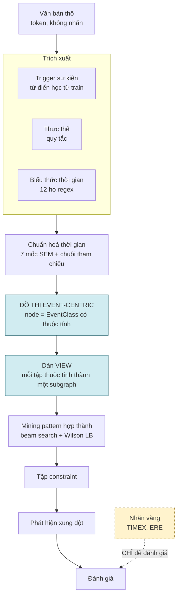
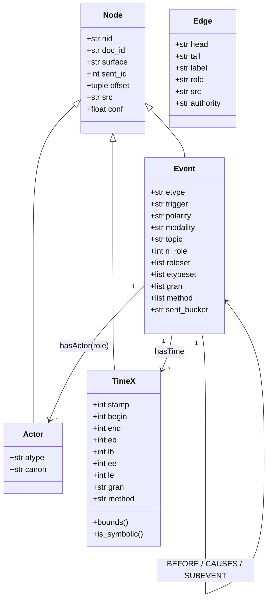
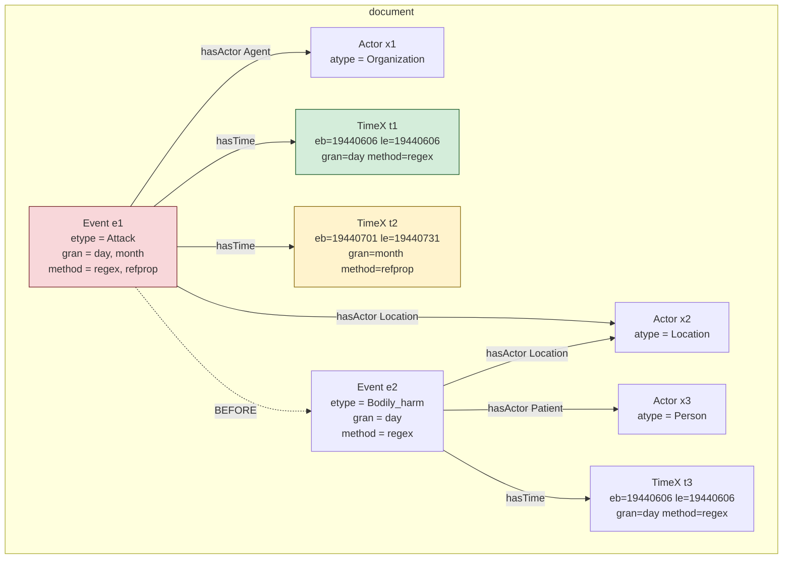
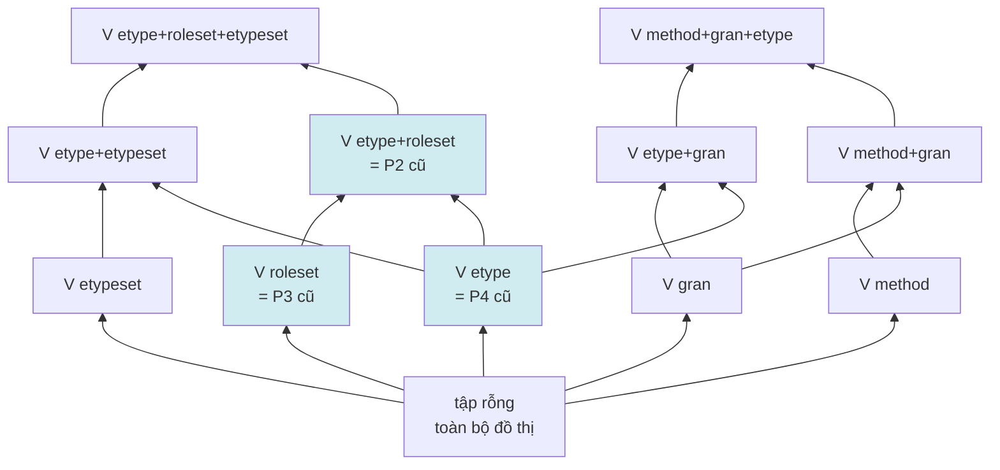
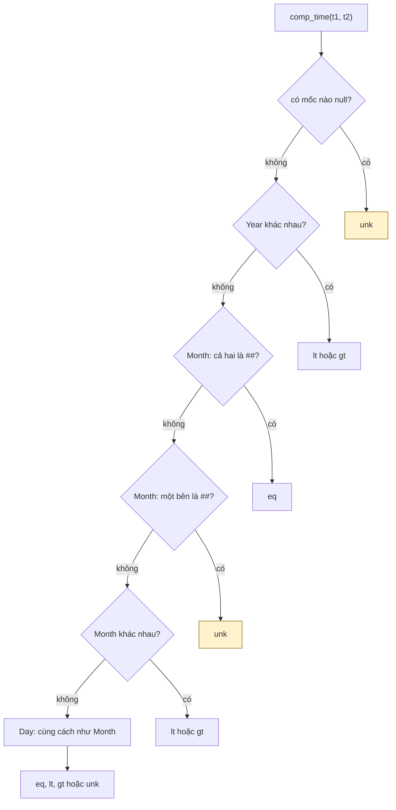
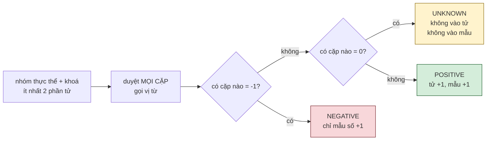
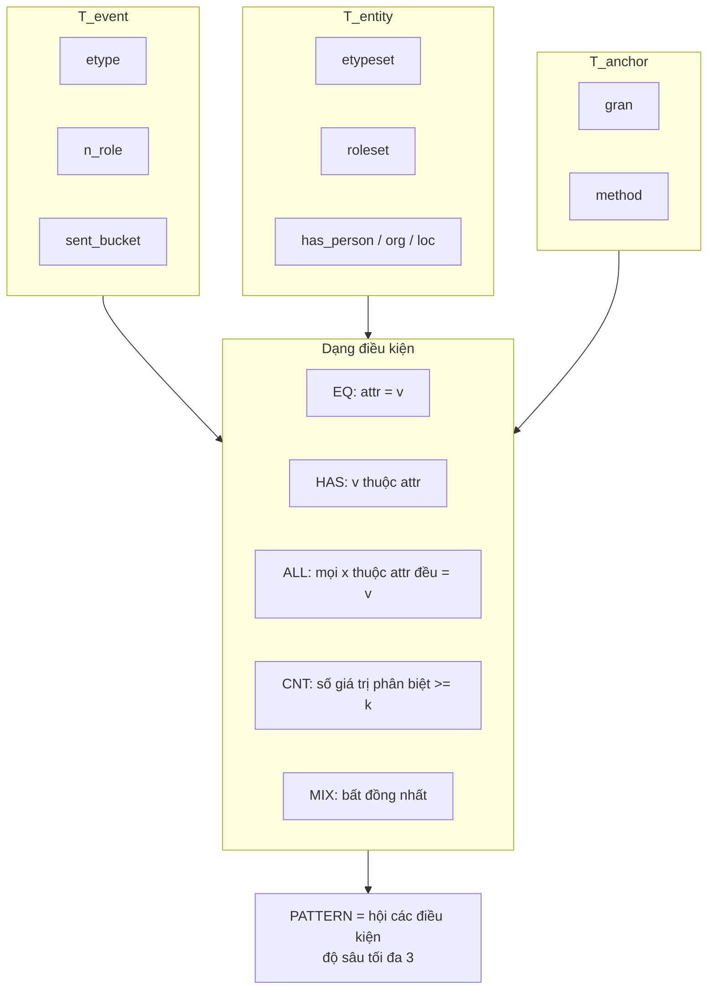
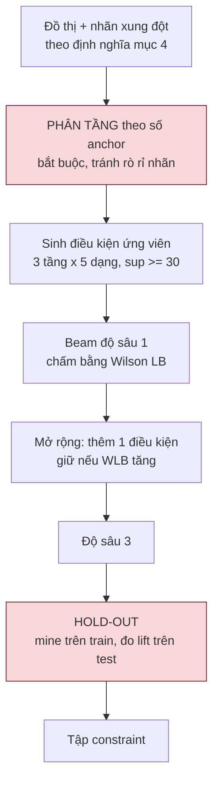
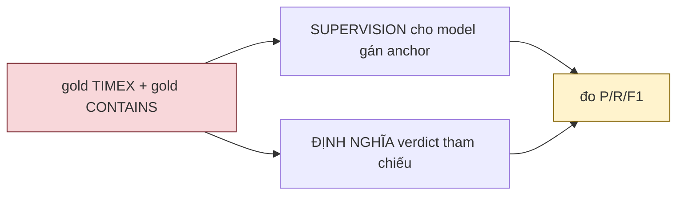

# Event-Centric PaTeCon — Định nghĩa hình thức

Viết lại theo cấu trúc mục của `Event-Centric-PaTeCon.pdf`, thay các định nghĩa bằng bản đã
đo và đã sửa. Mọi số trong tài liệu này là số đo thật, không có số giả định.

---

# 0. Tóm tắt thay đổi

| # | thay đổi | lý do |
|---|---|---|
| 1 | Node event mang **cấu trúc class** với thuộc tính khai báo, thay vì bộ ba `(EventType, TimeAnchor, Argument)` cố định | mỗi thuộc tính sinh một view, nên không gian pattern mở rộng thay vì cố định |
| 2 | Pattern A/B thay bằng **dàn view + pattern hợp thành** | Pattern B đo thật chỉ cho lift 1.09x trên tỉ lệ nền `BEFORE` 82.5% |
| 3 | **Hệ quả không còn là nhãn ERE** mà là vị từ trên khoảng thời gian | nhãn ERE là GT để đánh giá; hệ quả nhãn bị tỉ lệ nền nhấn chìm |
| 4 | Thêm **ba tầng x năm dạng điều kiện** | bản PDF chỉ có một dạng (`attr == value`) |
| 5 | Bỏ `Pairs_unk` khỏi thiết kế chính, chuyển thành Limitations có số | PCA loại 74.2% dữ liệu, gấp 5 lần lớp `unknown` của PaTeCon (14.7%) |
| 6 | Thêm **hold-out** và **kiểm chứng ba điều kiện** | 67-70% hợp thành mine được là overfit |

Giữ nguyên từ bản PDF: Event Graph dựa trên coreference chain, trích AMIE cho PCA-confidence,
differentiate với Chambers & Jurafsky, registry độc lập cho noise injection, và kết luận bỏ
audit trên gold MAVEN-ERE.

---

# 1. Sơ đồ pipeline tổng quan



Nhãn vàng không đi vào bất kỳ bước dựng đồ thị hay mining nào. Chỉ nối vào bước đánh giá.

---

# 2. Định nghĩa Event Graph

## 2.1 Định nghĩa hình thức

Đồ thị event-centric là bộ

$$\mathcal{G} = \langle\, \mathcal{E},\ \mathcal{X},\ \mathcal{T},\ \tau,\ \rho,\ \alpha,\ \sigma \,\rangle$$

| ký hiệu | nghĩa |
|---|---|
| $\mathcal{E}$ | tập event node, mỗi node là một coreference chain chứ không phải mention lẻ |
| $\mathcal{X}$ | tập entity node |
| $\mathcal{T}$ | tập time node |
| $\tau:\mathcal{E}\to T$ | kiểu sự kiện, $\lvert T\rvert = 162$ |
| $\rho:\mathcal{E}\times R\to 2^{\mathcal{X}}$ | siêu cạnh có nhãn vai, $\lvert R\rvert = 143$ |
| $\alpha:\mathcal{E}\to 2^{\mathcal{T}}$ | tập anchor thời gian của event |
| $\sigma:\mathcal{T}\to \mathbb{Z}^2\times G\times M$ | mỗi anchor thành (lo, hi, hạt độ, phương pháp) |

**Mệnh đề 1.** PaTeCon là trường hợp riêng: hạn chế $\lvert R\rvert = 2$ với
$R=\{\mathsf{subject}, \mathsf{object}\}$, $\lvert\alpha(e)\rvert = 1$, và $\tau$ là property.
Khi đó $\rho$ tương ứng `sVertex` và $\mathcal{X}$ tương ứng `eVertex`.

*Kiểm chứng thực nghiệm:* reify WD50K theo hạn chế trên rồi chạy miner của mình, tái tạo
**6/6 constraint** của PaTeCon với confidence khớp đến chữ số cuối (`verify_wd.py`).

## 2.2 Node là class, thuộc tính khai báo



Thuộc tính khai báo bằng descriptor `Attr` ở cấp class. Thêm một thuộc tính là **một dòng**;
default, ép kiểu, chỉ mục tra cứu, serialize, và mô tả schema đều tự động theo.

Bảy mốc timestamp của SEM được khai báo đủ. `bounds()` quy về (lo, hi), và `is_symbolic()`
phân biệt thời gian ký hiệu (chỉ biết thứ tự) với thời gian giá trị:

| khai báo | `bounds()` |
|---|---|
| `eb=19470101, le=19471231` | `(19470101, 19471231)` |
| `stamp=19470721` | `(19470721, 19470721)` |
| `gran='unknown'` | `None`, tức `is_symbolic() = True` |

## 2.3 Một instance thật



Event $e_1$ có hai anchor: `19440606` (một ngày) và `19440701` đến `19440731` (tháng 7). Giao
rỗng nên là xung đột E4. Nó khớp đúng pattern mine được:
`HAS(method=refprop)` và `CNT(gran >= 2)`.

$x_2$ được chia sẻ giữa $e_1$ và $e_2$, đó là điều kiện để có pattern liên-event.

## 2.4 Quy mô đo được

| | dựng từ text thô | dựng từ nhãn vàng |
|---|---|---|
| Event | 23,740 | 50,322 (có argument) |
| Actor | 19,460 | — |
| TimeX | 4,009 | 4,058 (vàng) |
| cạnh | 98,185 | 1,109,655 (kể cả closure) |
| kiểu event | 159 | 162 |
| vai | **2** (theo vị trí) | **143** |
| event có ít nhất 1 anchor | **93.8%** | 43.8% |
| tỉ lệ nền conflict E4 | **80.3%** | **8.7%** |

Dòng cuối là chỗ chặn của toàn bộ hướng này. Xem mục 8.2a.

---

# 3. Dàn view, thay cho Pattern A và Pattern B cố định

## 3.1 Định nghĩa

Với tập thuộc tính $A \subseteq \mathrm{Attrs}(\texttt{Event})$, **view** $V_A$ gán cho mỗi
event một chữ ký

$$\mathrm{sig}_A(e) = \bigl(\,a(e)\ :\ a \in A\,\bigr)$$

$V_A$ phân hoạch $\mathcal{E}$ thành các lớp cùng chữ ký, mỗi lớp là một subgraph để mine.



Bốn phép chiếu cũ chỉ là bốn điểm trong dàn này (tô xanh). Và:

> **Refinement của PaTeCon chính là phép tìm kiếm đi lên trong dàn.**
> Cổng của họ (`0.5 <= conf < 0.9` thì tinh chỉnh) trở thành điều kiện mở rộng nút.

## 3.2 Support đo được ở các view

| view | số chữ ký | sup >= 100 |
|---|---|---|
| `V{etype}` | 161 | 115 |
| `V{roleset}` | 656 | 125 |
| `V{etype, roleset}` | 1,672 | 42 tầng cặp, 201 tầng đơn |
| `V{etype, etypeset}` | 841 | 198 |

`V{etype, roleset}` thắng ở tầng cặp (42 so với 23). `V{etype, etypeset}` tương đương ở tầng
đơn (198 so với 201), và kiểu entity chính là trục `class_type` của refinement gốc, nên nó là
trục refinement chứ không phải thay thế cho vai.

---

# 4. Định nghĩa xung đột, vay nguyên vẹn của PaTeCon

## 4.1 Vị từ ba trị

Mọi so sánh thời gian dùng `comp_time` ba trị của họ, không sửa một dòng:



Quy tắc quyết định: chỉ kết luận ở mức hạt độ mà **cả hai** phía đều có. Lệch hạt độ thì `unk`.

## 4.2 Ba lớp entity, có `unknown`



$$\mathrm{conf}(tc)=\frac{\lvert\mathrm{pos}\rvert}{\lvert\mathrm{pos}\rvert+\lvert\mathrm{neg}\rvert}, \qquad I_G(tc)=\mathrm{pos}\cup\mathrm{neg}\cup\mathrm{unknown}$$

trong đó `unknown` bị loại khỏi cả tử số lẫn mẫu số.

`negative` là **chứng minh dương tính**, không phải "không thấy rời nhau": nó đòi cả hai phép
so đều trả `gt` dứt khoát, tức chồng lấn Allen được chứng minh.

Đo trên WD50K: pos 36.1%, neg 49.3%, và **unknown 14.7% bị loại hoàn toàn**.

## 4.3 Sáu họ pattern trên đồ thị event-centric

| | pattern | PaTeCon |
|---|---|---|
| E1 | một entity, một khoá (T, r), ít nhất 2 event | SP1 hợp SP2, **gộp làm một** |
| E2 | một entity, hai khoá khác nhau | SP3 |
| E3 | đường đi qua event trung gian | gần SP4 |
| E4 | một event, ít nhất 2 anchor, giao phải khác rỗng | **không biểu diễn được** |
| E5 | k entity đồng tham gia chia chung một khoảng | **không** |
| E6 | điều kiện theo tập vai có mặt | **không** |

**E1 = SP1 hợp SP2.** PaTeCon cần hai hàm mining riêng, gộp theo đầu và gộp theo đuôi. Trong
thế giới nhị phân "đầu/đuôi" chính là hai vai; trên đồ thị có nhãn vai đó là cùng một phép.

Hệ quả phụ: mã của họ có **bất đối xứng** giữa hai hàm này. `inverse_functional_mining` có
`if len(v.bePointedTo) < 2: continue` còn `functional_mining` không có. Trong công thức của
mình bất đối xứng đó không thể xảy ra.

---

# 5. Ngôn ngữ pattern hợp thành

## 5.1 Ba tầng, năm dạng



Ngôn ngữ pattern của PaTeCon chỉ có **một dạng**: đồng nhất biến trên đồ thị nhị phân. Không có
`ALL`, không có `CNT`, không có tầng. SP1 đến SP4 là trường hợp riêng: chỉ dạng `EQ`, chỉ một tầng.

## 5.2 Ví dụ pattern hợp thành đã mine được

```
ALL(method = refprop)  và  HAS(etypeset = Location)  và  ALL(gran = day)
     T_anchor                    T_entity                   T_anchor
```

Đọc là: mọi anchor của event đều do suy diễn tham chiếu sinh ra, event có một thực thể kiểu
Location, và mọi anchor đều hạt độ ngày. Cho 68.8% giao rỗng trên nền 9.2%, tức lift 4.85x
trên tập hold-out.

---

# 6. Thuật toán mining



Hai bước tô đỏ là bắt buộc và đều được thêm sau khi bắt lỗi thật.

**Phân tầng.** Không phân tầng thì miner chọn toàn pattern chứa `n_anchor=4` với lift 5.5x.
Nguyên nhân: càng nhiều anchor thì giao càng dễ rỗng, đây là tautology số học.

| số anchor | 2 | 3 | 4 | 5 | từ 6 |
|---|---|---|---|---|---|
| tỉ lệ conflict | **8.7%** | 21.6% | 34.0% | 52.2% | **84.5%** |

**Hold-out.** Không hold-out thì lift báo cáo là 6.32x; hold-out cho 4.85x, và **67 đến 70%
hợp thành mine được là overfit**, chỉ 16/49 ở k=2 và 22/74 ở k=3 giữ được lift trên 1.5x.

## 6.1 Loại đặc trưng bị cấm

> Không dùng đặc trưng nào tính được từ chính các đại lượng dùng để định nghĩa nhãn.

Đã bắt được hai lần. Ví dụ `hull` bằng $\max(b_i)-\min(a_i)$: ở $k=2$ với cả hai anchor hạt độ
ngày thì $a_i=b_i$, nên `hull` bằng $\lvert d_1-d_2\rvert$ và

$$\texttt{hull} > 0 \iff d_1 \neq d_2 \iff \text{conflict}$$

`hull >= 30` kéo theo conflict, cho lift 11.16x và conf 100% hoàn toàn giả.

---

# 7. Lớp `unknown`, thuộc Limitations chứ không phải thiết kế

| | tỉ lệ bị loại khỏi mẫu số |
|---|---|
| lớp `unknown` của PaTeCon trên WD50K | **14.7%** |
| `Pairs_unk` của Pattern B, bản PDF | **74.2%** |

Với PaTeCon, cách tính đổi thì confidence xê dịch từ 0.36 đến 0.51, vượt xa ngưỡng 0.9 và 0.5
mà họ dùng để quyết định. Nên bắt buộc báo cáo cả hai cách tính.

Với Pattern B, 74.2% bị loại không ngẫu nhiên: đó là các cặp annotator không chọn để gán quan
hệ. Giả định PCA của AMIE là giả định đầy đủ; ở đây nó không đúng.

---

# 8. Kết quả: đồ thị này có đánh bại các bản trước?

## 8.1 So sánh trên cùng một chỉ số, lift trên tỉ lệ nền

| # | đồ thị | nhãn xung đột | lift | hold-out |
|---|---|---|---|---|
| 1 | `tempekg.py`, 4 nguồn ràng buộc ERE | mining thống kê so hard constraint | precision **0.00%** | không |
| 2 | `ecskg` dựng từ text thô | T5 giao rỗng | **1.10x** | không |
| 3 | bản PDF, Pattern B | nhãn ERE khác nhãn đa số | **1.09x** | không |
| 4 | bản này, anchor **vàng** | E4 giao rỗng | **4.85x** k=2, 2.22x k=3 | **có** |
| 4b | bản này, áp lên đồ thị **text** | E4 giao rỗng | **0.59 đến 1.07x** | có |
| 4c | bản này, nhãn **nghiêm ngặt** | E4, mọi anchor regex | **6.98x** `Military_operation` | có |

**Trả lời: có, nhưng có điều kiện.**

- Trên **anchor vàng**: có, 4.85x so với 1.09 đến 1.10x của các bản trước
- Trên **đồ thị dựng từ text**: **không**, mọi lift dưới 1.1x (mục 8.2a)
- Dưới **nhãn nghiêm ngặt** loại artifact: **có và mạnh hơn**, 6.98x với CI [4.17, 10.77] (mục 8.2b)

Là bản duy nhất có hold-out và có kiểm chứng ba điều kiện.

## 8.2 Ba điều kiện, đã kiểm chứng (`verify3.py`)

| điều kiện | kết quả |
|---|---|
| (a) áp lên đồ thị text | **THẤT BẠI**, mọi lift dưới 1 |
| (b) nhãn nghiêm ngặt | **GIẢI QUYẾT nhưng đổi pattern thắng**: `refprop` là artifact, `etype` mạnh lên |
| (c) support ở k từ 3 | **GIẢI QUYẾT**, sup 99 đến 330, CI chặt |

### 8.2a Áp pattern lên đồ thị dựng từ text: thất bại

| pattern | sup | conf | lift | CI 95% |
|---|---|---|---|---|
| `ALL(method=refprop)` | 614 | 74.4% | **0.93x** | [0.88, 0.97] |
| `ALL(method=refprop)` và `ALL(gran=day)` | 298 | 47.3% | **0.59x** | [0.52, 0.66] |
| `ALL(gran=day)` | 929 | 66.4% | **0.83x** | [0.79, 0.86] |
| `etype=Hostile_encounter` | 270 | 84.1% | 1.05x | [0.99, 1.10] |
| `etype=Military_operation` | 29 | 86.2% | 1.07x | [0.86, 1.18] |

Không pattern nào có lift trên 1.1x, phần lớn dưới 1.

Nguyên nhân: tỉ lệ nền conflict trên đồ thị text là **80.3%**, so với 8.7% trên anchor vàng.
Vì `hasTime` gắn mọi TIMEX cùng câu hoặc cả câu trước, nên 4 trong 5 event nhận hai mốc không
liên quan và giao rỗng gần như luôn xảy ra. Đây chính là precision gán thời gian 11.4% biểu hiện
thành tỉ lệ nền 80.3%, **không còn khoảng trống cho pattern có lift**.

Thêm nữa, các pattern dùng `etypeset`, `has_org`, `has_loc` không áp được vì đồ thị text chưa
có kiểu entity.

> Kết luận: con số 4.85x là kết quả chỉ trên anchor vàng. Đồ thị text bị chặn ở tầng gán thời
> gian, phải sửa trước khi nói chuyện pattern.

### 8.2b Nhãn nghiêm ngặt: chỉ giữ conflict mà mọi anchor từ regex thuần

| | k=2 |
|---|---|
| event có mọi anchor từ regex thuần | 4,896 trong 8,963, tức 54.6% |
| conflict còn lại | 183 trong 779, tức **23.5%** |
| tỉ lệ nền | 8.7% giảm còn **3.7%** |

Vậy **76.5% xung đột E4 có dính suy diễn tham chiếu**, xác nhận cách đọc artifact.

Nhưng dưới nhãn nghiêm ngặt, trục ngữ nghĩa **mạnh lên**:

| pattern | sup | conf | lift | CI 95% |
|---|---|---|---|---|
| `etype=Military_operation` | 46 | 26.1% | **6.98x** | **[4.17, 10.77]** |
| `etype=Hostile_encounter` | 143 | 14.0% | **3.74x** | [2.47, 5.52] |
| `ALL(gran=day)` | 186 | 13.4% | **3.60x** | [2.48, 5.11] |
| `sent_bucket=dau` | 1,811 | 4.7% | 1.27x | [1.03, 1.56] |
| `CNT(gran>=2)` | 2,725 | 3.6% | 0.95x | [0.78, 1.16] |

Pattern `refprop` biến mất, tất yếu vì sup dưới 10. Còn lại ba pattern có CI loại trừ 1.

> Đổi kết luận: pattern đáng bảo vệ **không phải** `refprop` mà là **`etype` nhận diện sự kiện
> kéo dài**. `Military_operation` cho 6.98x, và nó **mạnh hơn** dưới nhãn nghiêm ngặt chứ không
> yếu đi. `refprop` là bộ phát hiện lỗi pipeline, hữu ích riêng, không phải pattern xung đột.

### 8.2c Gộp k từ 3 trở lên: support và CI đủ

| pattern | sup | conf | lift | CI 95% |
|---|---|---|---|---|
| `etype=Military_operation` | 99 | 84.8% | 2.55x | [2.30, 2.72] |
| `etype=Hostile_encounter` | **330** | 78.8% | 2.37x | [2.22, 2.49] |
| `ALL(method=refprop)` và `ALL(gran=day)` | 61 | 77.0% | 2.31x | [1.95, 2.58] |
| `ALL(gran=day)` | 202 | 63.9% | 1.92x | [1.71, 2.11] |

4,704 event, nền 33.3%. Support 99 đến 330 thay vì 10 đến 15, CI chặt và loại trừ 1.

## 8.3 Cái được bằng chứng chắc chắn

| # | |
|---|---|
| 1 | Phép ánh xạ đúng: tái tạo **6/6** constraint của PaTeCon trên WD50K, khớp đến chữ số cuối |
| 2 | **E1 = SP1 hợp SP2**: hai hàm mining của họ là một phép trên đồ thị có nhãn vai |
| 3 | Bắt được bất đối xứng trong mã của họ, `bePointedTo < 2` |
| 4 | Hợp thành nhiều tầng nâng lift khoảng 1.5x so với điều kiện đơn, có hold-out |
| 5 | Ngữ nghĩa giao sai với sự kiện kéo dài: `Military_operation` **6.98x**, CI [4.17, 10.77] dưới nhãn nghiêm ngặt |

## 8.4 Phát hiện chính: ngữ nghĩa giao sai với sự kiện kéo dài

`Military_operation` và `Hostile_encounter` là sự kiện kéo dài, nhiều pha. Nhiều anchor của
chúng trải trên một quãng dài là **đúng**, nhưng phép giao cho ra rỗng.

$$\text{sự kiện kéo dài}: \quad \bigcap_i \alpha_i = \varnothing\ \text{là BÌNH THƯỜNG}; \quad \text{phép đúng là } \mathrm{hull}\Bigl(\bigcup_i \alpha_i\Bigr)$$

Đây đúng vấn đề sự kiện lặp và kéo dài đã nêu từ đầu, nhưng lần này tìm ra bằng dữ liệu, và
`etype` là thứ nhận diện được nhóm cần đổi ngữ nghĩa. Quan trọng nhất: nó là pattern **duy nhất**
sống sót cả ba phép kiểm chứng ở mục 8.2.

---

# 9. Related work cần differentiate

| công trình | trùng ở đâu | khác ở đâu |
|---|---|---|
| PaTeCon, AAAI-23 | định nghĩa conflict, vị từ ba trị, pos/neg/unknown, refinement | họ dùng đồ thị nhị phân với một dạng pattern; ở đây là siêu cạnh có nhãn vai, ba tầng, năm dạng, thêm E4 đến E6 |
| AMIE, WWW-13 | PCA-confidence | phải trích rõ, nếu không reviewer nhận ra ngay |
| Chambers và Jurafsky, 2008 và 2009 | mine "loại X thường trước loại Y qua participant chung" | họ dùng PMI để dự đoán sự kiện tiếp theo, đánh giá bằng narrative cloze; ở đây support và confidence tường minh cùng ngưỡng để tạo tập luật cứng cho conflict detection, output là constraint kèm danh sách vi phạm |
| AnoT, 2024 | tiêm nhiễu tổng hợp trên TKG | họ perturb ngẫu nhiên 15%; ở đây nhiễu có định hướng theo rule và quét nhiều mức |
| SEM, van Hage 2011 | 4 core class, hệ Type, 7 mốc timestamp, `class_type` | SEM giữ mâu thuẫn nhưng không phát hiện; tầng conflict là phần bổ sung |
| ECS-KG, D&KE 2025 | event-centric, role từ dependency, node date_time | không đụng đến xung đột, và chiếu entity sang event làm mất SP2 |

---

# 10. Hạn chế phải nêu trong bài

1. **Pattern không chuyển được sang đồ thị text.** Tỉ lệ nền conflict ở đó là 80.3% vì gán thời
   gian có precision 11.4%. Đây là chỗ chặn số một.
2. **76.5% xung đột E4 dính suy diễn tham chiếu**, tức là artifact của normaliser chứ không
   phải xung đột thế giới thực.
3. **67 đến 70% hợp thành là overfit**; cần kiểm soát chọn lựa bằng BH-FDR ngoài Wilson LB.
4. **Vai trên đồ thị text chỉ có 2** theo vị trí, so với 143 vai vàng. Trần recall của bộ dò
   ứng viên là 34.2%, và ngay cả entity vàng cũng chỉ phủ 46.2% argument.
5. **Coreference xuyên tài liệu không có** trong MAVEN-ERE, nên E4 chỉ trong một document.
6. **E5 và E6 chưa đo.**
7. `sent_bucket=dau` là tín hiệu vì chuỗi tham chiếu khởi động lạnh ở đầu document. Phải nêu là
   đặc tính pipeline, không phải hiện tượng ngôn ngữ.
8. **Đánh giá tầng xung đột đang vòng tròn** (§11.10): gold TIMEX vừa là supervision vừa là
   định nghĩa tham chiếu. Đây là chặn trên của mọi số P/R hiện tại. Cần nhãn người.
9. **MAVEN-Arg không có vai thời gian** (§11.11): 143 vai, không `Time`/`Date`; `Duration`
   chỉ 33 instance. Nên neo thời gian buộc phải lấy từ MAVEN-ERE, và việc hợp nhất là
   **tạo tầng annotation mới**, phải khai báo là đóng góp resource.

---

# 11. Phát hiện làm đổi CẤU TRÚC schema

Tám thay đổi, mỗi cái gắn với một phép đo của phiên này. Bốn cái đầu là khe hở đã xác nhận
trong mã hiện tại.

## 11.1 `hasTime.conf` phải là xác suất của model, không phải khoảng cách

Hiện tại: `conf = 1.0/(1+d/10.0)` — thuần khoảng cách token. Và `hasTime` gắn **mọi** TIMEX
cùng câu hoặc cả câu trước.

Đo được: precision gán thời gian **11.4%**, kéo tỉ lệ nền conflict lên **80.3%** trên đồ thị
text, khiến mọi pattern có lift dưới 1.1x (§8.2a).

Đổi schema:

```python
class Event(Node):
    anchor_k = Attr(int, default=2, doc='giu toi da k anchor diem cao nhat')
```

và `Edge.conf` cho `hasTime` lấy từ model gán TIMEX (`exp42_ranking.py`, F1 47.5%), không
phải từ khoảng cách. `build()` cắt theo top-k thay vì lấy hết.

## 11.2 `TimeX` phải phân biệt hạt độ ĐƯỢC KHAI BÁO và hạt độ SUY ĐOÁN

Hiện tại chỉ có `gran` và `method`; `method` ghi cách chuẩn hoá nhưng **không** ghi hạt độ đến
từ đâu.

Đo được: Wikidata mang sẵn precision code, PaTeCon bỏ để đoán bằng `if Day == 1`. Trên 18,788
fact: khớp 96.2%, **lệch 3.8% tức 719 fact** — trong đó **520** ngày thật bị hạ thành tháng vì
trùng mùng 1, **113** thế kỷ bị đọc thành năm.

Đổi schema:

```python
class TimeX(Node):
    gran_src = Attr(str, default='inferred',
                    doc='declared (nguon khai bao) | inferred (suy tu dang chu so)',
                    index=True)
```

Khi nguồn khai báo (Wikidata precision code, giá trị ISO có ít chữ số hơn) thì dùng, chỉ đoán
khi không có. Đây đúng lớp lỗi 719 fact ở trên.

## 11.3 `Event` phải khai báo NGỮ NGHĨA GỘP cho tập anchor

Phát hiện duy nhất sống sót cả ba phép kiểm chứng ở §8.2: `Military_operation` cho lift
**6.98x** CI [4.17, 10.77] và `Hostile_encounter` **3.74x** dưới nhãn nghiêm ngặt. Đó là sự
kiện **kéo dài, nhiều pha** — nhiều anchor trải trên quãng dài là đúng, nhưng phép giao cho ra
rỗng.

Đổi schema:

```python
class Event(Node):
    anchor_agg = Attr(str, default='intersect',
                      doc='intersect | hull — quyet dinh boi kieu su kien')
```

Định nghĩa xung đột trở thành **theo node** thay vì toàn cục:

$$	ext{conflict}(e) = egin{cases} igcap_i lpha_i = arnothing & 	exttt{anchor\_agg} = 	exttt{intersect}\ 	ext{không bao giờ} & 	exttt{anchor\_agg} = 	exttt{hull} \end{cases}$$

Đây là thay đổi cấu trúc đáng giá nhất, vì nó có bằng chứng mạnh nhất.

## 11.4 `Actor.atype` có trong schema nhưng KHÔNG BAO GIỜ được gán

Kiểm tra mã: `atype` và `ptype` không xuất hiện ở `build.py` lẫn `extract.py`. Nên trên đồ thị
text chúng luôn là `None`.

Hệ quả đo được: mọi pattern dùng `etypeset`, `has_org`, `has_loc` **không áp được** lên đồ thị
text (§8.2a). Cả một họ pattern bị chặn vì một trường không được điền.

Việc cần làm: điền `atype` bằng bộ phân loại kiểu thực thể (7 kiểu của MAVEN-Arg), học từ nhãn
như đã làm với `TriggerLexicon`.

## 11.5 Tách `hasTime` thành hai nhãn cạnh

Đo được: trong số span thời gian tự dò, **25.6% về bản chất không thể có mốc** — SYMBOLIC 16.3%
(`later`, `then`), DURATION 8.3% (`three days`), SET 1.0% (`annually`). Hiện chúng bị đếm là
thất bại chuẩn hoá, làm tỉ lệ tụt 84.3% xuống 65.6%.

Đổi schema: `hasTimeValue` (có `bounds()`) và `hasTimeSymbolic` (chỉ thứ tự). Tầng ràng buộc
không bao giờ thử giao một anchor ký hiệu. `is_symbolic()` đã có, chỉ chưa được dùng ở tầng
cạnh.

## 11.6 Tập vai tối thiểu là 4, không phải 2

`build()` sinh 2 vai theo vị trí (`agentish` 18,851 / `patientish` 19,655). Nhưng đo được:
`Location` một mình chiếm **20.1%** argument và là vai đứng đầu trong nghiên cứu phép chiếu
(`Location>Location` 23,626 cặp). Quy tắc vị trí **bỏ hẳn** nó.

Tối thiểu: `Agent / Patient / Location / Other` — top-3 phủ **62.8%**. Trần recall của bộ dò
ứng viên là **34.2%**, và ngay cả entity vàng cũng chỉ phủ **46.2%** argument, nên vai không
bao giờ đầy đủ được; nhưng từ 2 lên 4 là mức chênh lớn nhất.

## 11.7 `Attr` phải mang `derived_from` để miner tự loại đặc trưng rò rỉ

Hai lần rò rỉ nhãn trong cùng phiên, cùng một lớp lỗi:

| lần | đặc trưng | vì sao rò rỉ |
|---|---|---|
| 1 | `n_anchor` | càng nhiều anchor thì giao càng dễ rỗng: 8.7% lên 84.5% |
| 2 | `hull` | ở k=2 với anchor hạt độ ngày: `hull > 0` tương đương conflict |
| 3 | `has_prec`, `gran_wd` (Wikidata) | cache precision dựng bởi chính lần quét sinh ra nhãn |
| 4 | `is_bc` (Wikidata) | bộ gán nhãn không đọc được ngày trước CN, gán hết DELETED |

Đổi schema:

```python
class Attr:
    def __init__(self, ..., derived_from=None):
        self.derived_from = derived_from   # ('lo','hi') -> miner TU DONG loai
```

Làm quy tắc AUDIT #11 thành **cơ chế** thay vì kỷ luật. Bốn lần trong một phiên là đủ bằng
chứng rằng kỷ luật không đủ.

## 11.8 Schema phải phơi ra vị từ `is_enriched` để báo cáo tách

Mệnh đề 1 nói đồ thị suy biến thành của PaTeCon khi arity bằng 2 và có một anchor. Đo được điều
đó xảy ra thật: trên Wikidata, event-centric cho F1 **0.1687** so với PaTeCon **0.1821** —
**thua**, vì không có gì thêm để khai thác.

Đổi schema:

```python
def is_enriched(e):
    """Do thi CO loi the o event nay khong: >=3 vai hoac >=2 anchor."""
    return e.n_role >= 3 or e.n_anchor >= 2
```

Mọi kết quả phải báo cáo **tách theo vị từ này**. Nó chặn việc nhận công ở chỗ biểu diễn đang
suy biến, và chỉ đúng chỗ nên đo lợi thế.

## 11.9 KIỂM CHỨNG: áp vào đồ thị text rồi đo lại (`build2_test.py`)

Chỉ số quyết định: verdict xung đột từ đồ thị TEXT có khớp verdict tham chiếu trên anchor
VÀNG không. Đo P/R/F1 trên lớp CONFLICT, cộng dồn từng phát hiện.

| cấu hình | xét được | nền text | P | R | **F1** |
|---|---|---|---|---|---|
| C0 hiện tại | 371 | 84.3% | 24.2% | 91.8% | 0.3829 |
| C1 + loại symbolic (§11.5) | 344 | 90.1% | 25.2% | 91.8% | 0.3953 |
| **C2 + top-k=2 (§11.1)** | 344 | 89.0% | **26.2%** | **91.8%** | **0.4073** |
| C3 + hull tập hẹp (§11.3) | 344 | 80.1% | 22.2% | 71.2% | 0.3388 |
| C4 + ưu tiên hạt độ khai báo | 344 | 76.9% | 23.3% | 71.2% | 0.3514 |
| C5 + đòi hai anchor cùng câu | 344 | 76.9% | 23.3% | 71.2% | 0.3514 |
| **C6 + đòi CẢ HAI hạt độ `declared` (§11.2)** | **190** | **69.4%** | **31.9%** | 62.5% | **0.4225** |

### Hai phát hiện KIỂM CHỨNG ĐƯỢC

**§11.5 + §11.1 (C2): F1 0.3829 lên 0.4073, +6.4%.** Precision 24.2% lên 26.2%, **recall không
đổi**. Loại symbolic/duration/set và cắt top-k chỉ bỏ đi cái sai, không bỏ cái đúng. Cải thiện
thuần.

**§11.2 (C6): F1 0.4225, +10.3%.** Precision **31.9%**, tăng **32% tương đối**. Nền
false-positive tụt **84.3% xuống 69.4%**. Đổi lại độ phủ giảm nửa (344 xuống 190).

`TimeX.gran_src` là dòng schema có tác động lớn nhất, đúng như dự đoán ở §11.2.

### §11.3 (hull) KHÔNG đánh giá được bằng phép đo này

C3 cho F1 0.3388, thấp hơn C2 — nhưng **đó là artifact của thiết kế đo, không phải bằng chứng
chống hull**.

Verdict tham chiếu được tính bằng **phép giao** trên anchor vàng. Nên khi đổi ngữ nghĩa sang
hull thì **tất yếu bất đồng với một tham chiếu dùng giao**. Recall rơi 91.8% xuống 71.2% chính
là những event mà gold-với-giao nói "xung đột" còn ta nói "không" — và liệu chúng có thật là
xung đột hay không **chính là câu hỏi đang mở**.

Hull cần ground truth khác: **người đánh giá**. Xem §11.10.

*(Đã thử tập `EXTENDED` rộng 13 kiểu trước: recall rơi tới 53.4%. Đã thu hẹp về đúng hai kiểu
có CI loại trừ 1.)*

## 11.10 CHẶN TRÊN: đánh giá đang bị VÒNG TRÒN

Phát hiện nghiêm trọng nhất, và nó giải thích vì sao precision ở §11.9 không thể đẩy cao hơn.

Hiện tại **gold TIMEX đang giữ HAI vai cùng lúc**:



Nếu train model gán anchor trên gold `CONTAINS` rồi đánh giá phát hiện xung đột bằng verdict
dẫn xuất từ **chính** gold `CONTAINS`, thì phép đo trộn **hai loại lỗi**: độ chính xác của
model gán, và chất lượng phát hiện xung đột. Trần của nó là tất định: **gán anchor hoàn hảo
kéo theo khớp tham chiếu hoàn hảo, theo cấu trúc**. Chỉ số bão hoà ở "độ chính xác của model",
không nói gì về xung đột.

Đây là lý do precision C6 31.9% không thể đẩy lên bằng cách gán anchor tốt hơn: **tham chiếu
CHÍNH LÀ gold attachment**.

### Cách tách ra

Không được gộp thành một F1. Phải là **hai chỉ số riêng**:

| | đo cái gì | ground truth | trạng thái |
|---|---|---|---|
| **Gán anchor** | P/R của cạnh `hasTime` | gold `CONTAINS`, doc held-out | **đã có**, F1 47.5% |
| **Phát hiện xung đột** | P/R trên lớp CONFLICT | **nhãn người** trên một mẫu | **CHƯA CÓ** |

**300 item gán nhãn tay** (ước 3 người-ngày) không còn là việc tuỳ chọn mà là **điều kiện
cần**: nó là ground truth độc lập duy nhất cho tầng xung đột. Không có nó thì mọi số P/R trên
MAVEN đều vòng tròn, kể cả khi split hoàn hảo. Và nó cũng là cách duy nhất đánh giá được
**hull** (§11.3).

## 11.11 Về việc hợp nhất TIMEX từ ERE sang ARG

Đã kiểm tra dữ liệu:

| | kết quả |
|---|---|
| MAVEN-Arg có vai thời gian? | **KHÔNG** — trong 143 vai không có `Time`/`Date`/`When`; chỉ có `Duration` với **33** instance |
| doc chung hai dataset | **3,623 / 3,623** |
| doc bị xếp khác split | **0** |
| toạ độ | ERE dùng `(sent_id, token)`, Arg dùng offset ký tự — đã căn được, `role_ceiling.py` map 46,458 span |
| lượng supervision nếu hợp nhất | **66,418** cạnh `CONTAINS` |

**Hệ quả 1.** Model EAE huấn luyện trên MAVEN-Arg **không thể** trích thời gian — không có gì
để học. Neo thời gian chỉ tồn tại trong MAVEN-ERE.

**Hệ quả 2.** Hợp nhất khả thi và **không leak từ lệch phân hoạch** (0 doc bị xếp khác split).
Nhưng phải phát biểu đúng bản chất: đây là **tạo ra một tầng annotation mới** — *"chúng tôi
dẫn xuất tầng temporal-argument cho MAVEN-Arg bằng cách chiếu cạnh CONTAINS của MAVEN-ERE"*.
Đó là đóng góp resource, phải khai báo.

**Hệ quả 3.** Khi đó thời gian **không còn "ERE-free"** mà là **ERE-supervised, ERE-free ở
inference** — đúng cùng khuôn với `TriggerLexicon`. Hợp lệ, nhưng phải nói thẳng trong bài.

**Hệ quả 4.** Leak **không** nằm ở split mà nằm ở đánh giá (§11.10). Hợp nhất làm tăng
supervision cho tầng gán anchor, nhưng **không** giải được vòng tròn ở tầng xung đột.

## Tóm tắt: bốn dòng schema, theo bằng chứng

| thứ tự | thêm | bằng chứng | đã kiểm chứng? |
|---|---|---|---|
| 1 | `TimeX.gran_src` (declared / inferred) | F1 **+10.3%**, precision **+32% tương đối**, nền 84.3% xuống 69.4% | **CÓ** (§11.9, C6) |
| 2 | `Event.anchor_k` + tách `hasTimeValue`/`hasTimeSymbolic` | F1 **+6.4%**, recall không đổi | **CÓ** (§11.9, C2) |
| 3 | `Event.anchor_agg` (intersect / hull) | lift 6.98x CI [4.17, 10.77] trên nhãn nghiêm ngặt | **chưa** — cần nhãn người (§11.10) |
| 4 | `Attr.derived_from` | bốn lần rò rỉ nhãn trong một phiên | áp dụng, không đo trực tiếp được |

# 12. Việc tiếp theo, theo thứ tự tác động

| # | việc | vì sao |
|---|---|---|
| 0 | **300 item gán nhãn tay** cho tầng xung đột | §11.10: không có nó thì mọi P/R trên MAVEN đều vòng tròn, và hull không đánh giá được |
| 1 | Cài `TimeX.gran_src` và `Event.anchor_k` vào `build.py` | §11.9 đã kiểm chứng: F1 +10.3%, precision +32% tương đối |
| 1b | Đưa model gán TIMEX F1 47.5% vào chấm điểm cạnh `hasTime` | nền vẫn 69.4% sau C6, so với nền vàng 21.2% |
| 2 | Thêm kiểu entity vào đồ thị text | các pattern dùng `etypeset` hiện không áp được |
| 3 | Cài ngữ nghĩa **hull** cho `etype` kéo dài, cạnh ngữ nghĩa giao | pattern duy nhất sống sót cả ba phép kiểm |
| 4 | BH-FDR cho chọn lựa pattern | 67 đến 70% overfit |
| 5 | Đo E5 và E6 | chưa làm |

---

# 13. File

| file | nội dung |
|---|---|
| `schema.py` | `Attr` descriptor, `Node`, `Event`, `Actor`, `TimeX`, `Edge`, `Constraint` |
| `extract.py`, `build.py` | text thô sang đồ thị |
| `mine_patecon.py` | định nghĩa của PaTeCon cài trên kiến trúc này |
| `verify_wd.py` | kiểm chứng 6/6 trên WD50K |
| `views.py` | `EventClass`, dàn view, `e4_conflict` |
| `compose.py` | miner hợp thành 3 tầng x 5 dạng |
| `compose_holdout.py` | hold-out |
| `verify3.py` | kiểm chứng ba điều kiện ở mục 8.2 |
| `build2_test.py` | kiểm chứng §13: áp phát hiện vào đồ thị text, 7 cấu hình |
| `wd_reinforce.py`, `wd_score.py` | áp lên Wikidata, tính điểm chung một thước |
| `role_ceiling.py` | trần recall của bộ dò ứng viên argument |
| `proj_study2.py`, `etype_vs_role.py` | chọn view |
| `patternB_measure.py` | đo Pattern B của bản PDF |
