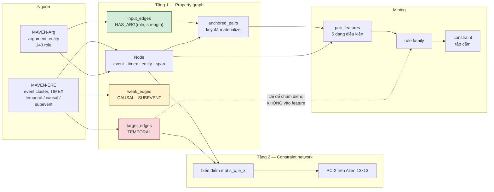
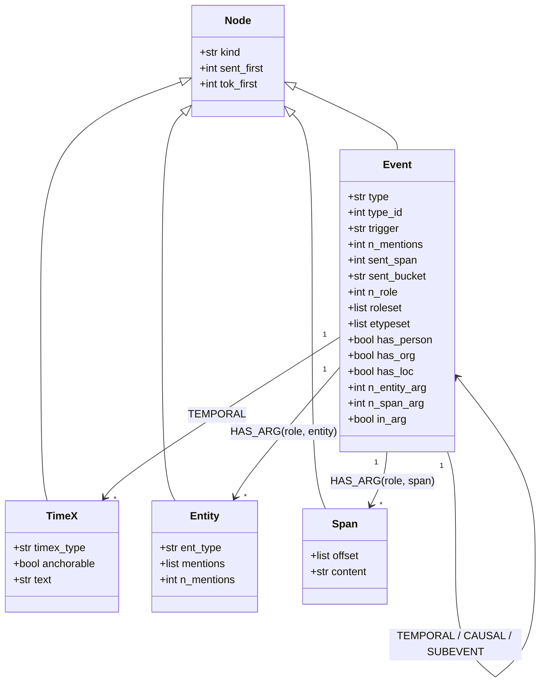
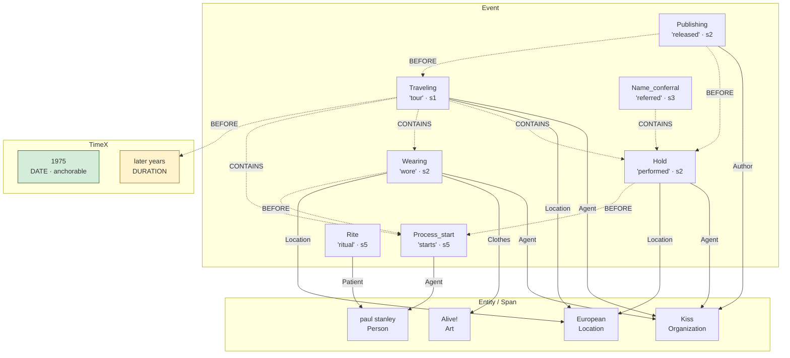
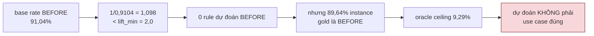

# Kiến trúc KG event-centric và bộ rule

> Tài liệu kiến trúc. Mọi con số đến từ lần chạy thật trên `MAVEN_ERE/train.jsonl`
> (2.913 document) và `valid.jsonl` (710 document), không ước lượng.
> Code: `tempekg_kg/`. Quyết định định nghĩa: `report/DEFINITIONS.md`.
> Thiết kế OOP gốc: `tempekg_exp/ecskg/FORMAL.md`.

---

## 0. Ba đóng góp và trạng thái hiện tại

| # | Đóng góp | Trạng thái |
|---|---|---|
| 1 | Event-centric KG để lưu trữ | **Xong**, 9/9 bất biến đạt |
| 2 | Mine rule từ train, giấu nhãn valid rồi dự đoán | **ĐÓNG** — 257 luật, macro-F1 **25,60%** vs hằng số 15,78% |
| 3-A | Audit *wrong-edge*: rule nói R, KG ghi S ≠ R | **Đang làm** — luật bậc cao cho P@k 61,76%, repair@k 93,53% |
| 3-B | Audit *missing-edge*: rule nói R, KG không có cạnh | Closure proposer: R 89,3%, F1 gấp 118× baseline |

Kết luận hiện tại: **rule khai phá từ KG thắng predictor hằng số 9,82 điểm macro-F1**, và
thắng cả softmax regression trên cùng đặc trưng (25,60% vs 20,07%) với 70 lần ít tham số hơn.
Phần cải thiện nằm ở nhóm không-BEFORE: F1 29,53% → 37,12%.

> **Đính chính so với bản trước.** Mục này từng ghi C2 "kết quả âm" và mục 11 từng ghi oracle
> ceiling 9,29%. Cả hai đo dưới chế độ `lift_min=2`, ở đó không rule nào phát ra được BEFORE
> theo định nghĩa. Bỏ ràng buộc đó và chuẩn hoá điểm theo base rate của nhãn (`max-norm`) thì
> kết luận đảo ngược. Xem `report/BAI1_C2_FINAL.md`.

**Ba tầng thuật ngữ** (chốt để viết bài nhất quán):

| Tầng | Là gì | Ví dụ |
|---|---|---|
| **Motif** | cấu trúc đồ thị thuần | `A --role--> X <--role-- B` |
| **Pattern** | motif + thuộc tính | `+ A.type=Motion, B.type=Process_end` |
| **Rule** | pattern + ngữ nghĩa thống kê | `→ allowed={BEFORE}, n=16, wlb` |
| **Constraint** | rule ở dạng phủ định | `→ forbidden={CONTAINS, OVERLAP…}` |
| **Audit finding** | constraint bị vi phạm trên KG | `(a,b) observed=CONTAINS ∈ forbidden` |

Tài liệu liên quan: `BAI1_TONG_QUAN.md` (giới thiệu cho người mới), `BAI1_C2_FINAL.md` (báo
cáo kỹ thuật Bài 1), `RULESET.md` (bộ rule là gì), `LUAT_BAC_CAO.md` (khảo sát bậc 3/4/5),
`THUAT_NGU.md` (thuật ngữ), `STATUS.md` (trạng thái từng phase), `KG_BUILD.md` (cách dựng KG),
`DEFINITIONS.md` (các định nghĩa đã chốt).

---

## 1. Pipeline tổng quan



Ba lớp cạnh tách **vật lý**, không phải theo quy ước. Đỏ là thứ đang audit, không bao giờ
vào feature. Vàng là tiên nghiệm yếu — dùng được nhưng **không phải bằng chứng độc lập**
(95,2% cặp PRECONDITION đã có nhãn temporal). Xanh là input hợp lệ.

---

## 2. Tại sao phải hai tầng

Bảng pairwise **không thể** phát hiện mâu thuẫn ba biến:

```
BEFORE(a,b) ∧ BEFORE(b,c) ∧ ENDS-ON(a,c)
```

Từng cặp hợp lệ. Cả ba thì tuỳ mapping: dưới `ENDS-ON = {m}` là bất khả thoả, dưới
`ENDS-ON = {b,m}` (đã chốt) thì không. Vòng research trước sinh ra 7 "mâu thuẫn cứng"
hoàn toàn từ cơ chế này, và chúng biến mất khi sửa mapping.

`constraint_net.py --self-test` tái lập **cả hai chiều** để hồi quy không lặp lại:

```
PASS  composition table (brute-forced, 13x13)
PASS  3-variable contradiction detected under ENDS-ON={m}
PASS  3-variable consistency under ENDS-ON={b,m}   <- mapping đã chốt
PASS  BEFORE cycle detected
```

| Tầng | Biểu diễn | Trả lời |
|---|---|---|
| 1. Property graph | node/edge có nhãn | pattern này xuất hiện bao nhiêu lần |
| 2. Constraint network | biến điểm mút + bất đẳng thức | tập nhãn này có thoả được không |

Tầng 1 lưu đĩa. Tầng 2 sinh theo yêu cầu, **lười** — đã đo 300/300 document nhất quán trên
gold, nên chạy hết là lãng phí.

---

## 3. Ánh xạ Allen

| MAVEN | Allen | Bất đẳng thức |
|---|---|---|
| BEFORE | `{b}` | `e_a < s_b` |
| CONTAINS | `{di}` | `s_a < s_b ∧ e_b < e_a` |
| OVERLAP | `{o}` | `s_a < s_b < e_a < e_b` |
| SIMULTANEOUS | `{e}` | `s_a = s_b ∧ e_a = e_b` |
| BEGINS-ON | `{s, si, e}` | `s_a = s_b` |
| ENDS-ON | `{b, m}` | `e_a ≤ s_b` |

**Kiểm chứng chéo:** paper MAVEN-ERE Appendix B Table 11 có đúng 21 luật transitivity. Tôi
chạy từng luật qua bảng composition sinh brute force: **21/21 sound, 19/21 exact**. Bảng
composition sinh từ liệt kê interval nguyên, hoàn toàn không biết paper viết gì — hai nguồn
độc lập khớp nhau là bằng chứng mạnh rằng mapping đúng.

Bảng của paper **thiếu 15 ô**, và không ô nào vô dụng. Năm ô ép ra nhãn duy nhất, toàn bộ
nhánh `ENDS-ON ∘ *` bị bỏ trống:

| Composition bị paper bỏ | Ép ra |
|---|---|
| `OVERLAP ∘ ENDS-ON` | BEFORE |
| `ENDS-ON ∘ BEFORE` | BEFORE |
| `ENDS-ON ∘ CONTAINS` | BEFORE |
| `ENDS-ON ∘ ENDS-ON` | BEFORE |
| `ENDS-ON ∘ BEGINS-ON` | ENDS-ON |

Nên dùng Allen 13×13 đầy đủ, không dùng bảng 6×6 của paper làm engine.

---

## 4. Schema node



Tám thuộc tính in đậm bên dưới là **bổ sung của vòng này**. KG trước không có cái nào, và
đó là lý do rule của nó yếu — FORMAL.md §3 đã đo `roleset` và `etypeset` là hai trục mạnh nhất.

| Thuộc tính | Nguồn | Vì sao không rò rỉ |
|---|---|---|
| `roleset` | MAVEN-Arg `argument` keys | không đọc `temporal_relations` |
| `etypeset` | entity type của argument | như trên |
| `n_role` | `len(roleset)` | như trên |
| `has_person/org/loc` | `etypeset` | như trên |
| `n_entity_arg`, `n_span_arg` | đếm filler | như trên |
| `sent_bucket` | `sent_first` | vị trí văn bản, không phải nhãn |

---

## 5. Census — KG đã dựng

| | train | valid |
|---|---:|---:|
| Document | 2.913 | 710 |
| Node event (cluster) | 67.984 | 16.301 |
| Node entity | 55.421 | 13.176 |
| Node span | 71.485 | 17.963 |
| Node timex | 16.688 | 4.139 |
| `input_edges` | 188.584 | 44.966 |
| `weak_edges` | 45.509 | 12.524 |
| `target_edges` | 792.395 | 188.924 |
| `anchored_pairs` | 244.687 | 57.925 |
| Kích thước | 217,7 MB | 55,4 MB |
| Thời gian build | 5,5 s | 1,4 s |

Vài con số định hình mọi quyết định sau:

| Sự kiện | Số đo |
|---|---|
| Event cluster là singleton | **96,4%** (65.510/67.984) |
| Cluster span nhiều câu | 3,4% |
| Argument filler **không có** `entity_id` | **59,6%** (113.597/190.479) |
| Anchored pair chỉ tồn tại nhờ span node | **31,3%** |
| TIMEX là DATE (có toạ độ được) | 79,9% |
| Cặp EV-EV có nhãn **chung anchor** | **25,8%** — 74,2% không chung gì |
| Cặp EV-EV chưa có nhãn | 588.654 / 1.072.158 = **54,9%** |

Hai con số quyết định thiết kế: **96,4% singleton** làm tranh cãi "cluster hay mention" trở
nên vô nghĩa với gần hết dữ liệu; **59,6% filler không có entity_id** buộc phải có span node,
nếu bỏ thì mất 31,3% không gian pattern.

---

## 6. Phân bố nhãn

| Quan hệ | train | Tỉ lệ | Trên riêng EV-EV |
|---|---:|---:|---:|
| BEFORE | 683.581 | 86,26% | **91,04%** |
| CONTAINS | 95.933 | 12,11% | 7,43% |
| OVERLAP | 6.376 | 0,80% | 0,60% |
| SIMULTANEOUS | 5.821 | 0,73% | 0,86% |
| BEGINS-ON | 403 | 0,05% | ~0,04% |
| ENDS-ON | 281 | 0,04% | ~0,02% |

Theo loại cặp node:

| | Tỉ lệ | BEFORE | CONTAINS |
|---|---:|---:|---:|
| EV-EV | 61,0% | 91,0% | 7,4% |
| EV-TX | 33,1% | 78,6% | 20,0% |
| TX-TX | 5,9% | 79,8% | 16,4% |

**Base rate 91% BEFORE là ràng buộc chi phối toàn bộ phần mining.** Confidence thô vô dụng
ở mức đó; mọi xếp hạng phải dùng lift.

---

## 7. Ví dụ xuyên suốt — document "Alive! Tour"

Chọn một document thật, nhỏ đủ để vẽ hết: `e5b5bf720b9e4ee491f5d7c49fd26331`.

### 7.1. Văn bản gốc

```
[0] The Alive!
[1] Tour was a concert tour by Kiss, in support of their 1975 live album "Alive!".
[2] At the time of the European leg of the tour the "Destroyer" album was already
    released and the band performed songs from that album, but they wore the "Alive"
    costumes and had the "Alive" stage show.
[3] At the time, the tour was referred to under the headline "Kiss tour", not "Alive!
[4] Tour" or "Destroyer Tour".
[5] At the Cobo Hall show, Paul Stanley starts his guitar smashing ritual after
    "Let Me Go, Rock 'n' Roll", until it was eventually done after "Rock and Roll
    All Nite" in later years.
```

### 7.2. Node rút ra được

| id | kind | type | trigger | câu | roleset | etypeset |
|---|---|---|---|---:|---|---|
| `8ce7a079` | event | Traveling | tour | 1 | Agent, Location | Location, Organization |
| `fa1ff462` | event | Publishing | released | 2 | Author, Category | Organization |
| `dc66ef0f` | event | Hold | performed | 2 | Agent, Content, Location | Location, Organization |
| `4951303a` | event | Wearing | wore | 2 | Agent, Clothes, Location | Art, Location, Organization |
| `f3368872` | event | Name_conferral | referred | 3 | New_name, Patient | — |
| `ef9f33de` | event | Process_start | starts | 5 | Agent, Location, Patient | Person |
| `60fe5ddf` | event | Rite | ritual | 5 | Content, Location, Patient | Person |

| id | kind | timex_type | anchorable | text |
|---|---|---|---|---|
| `b5c76a10` | timex | DATE | **có** | 1975 |
| `79843ae3` | timex | DURATION | không | later years |

| id | kind | ent_type | mentions |
|---|---|---|---|
| `4e1087ca` | entity | Organization | Kiss, band, Kiss |
| `71018dce` | entity | Art | Destroyer, album |
| `68046fab` | entity | Art | Alive!, Alive |
| `61706f30` | entity | Person | paul stanley |
| `3c7301cf` | entity | Location | European |

Cộng **6 span node** cho các filler không được coref hoá (ví dụ `"songs from that album"`).

### 7.3. Đồ thị tầng 1



Nét liền là `input_edges` (detector thấy). Nét đứt là `target_edges` (đang audit, **không**
vào feature). Document này có 18 input, 23 target, 5 weak, 8 anchored pair.

### 7.4. Một cặp, từ đồ thị đến feature

Lấy cặp `Traveling --CONTAINS--> Hold`:

```
anchor chung: Kiss (Organization) qua (Agent, Agent)
              European (Location) qua (Location, Location)
```

Feature sinh ra — **không đọc nhãn**:

| Scalar | Giá trị |
|---|---|
| `type_pair` | (Traveling, Hold) |
| `order` | fwd |
| `sdist` | 1 |
| `bucket_a` / `bucket_b` | early / early |
| `nrole_a` / `nrole_b` | 2 / 3 |
| `shares_anchor` | True |
| `has_org_a` / `has_loc_a` | True / True |

| Set | Giá trị |
|---|---|
| `roleset_a` | {Agent, Location} |
| `roleset_b` | {Agent, Content, Location} |
| `roleset_shared` | {Agent, Location} |
| `etypeset_shared` | {Location, Organization} |
| `anchor_roles` | {(Agent,Agent), (Location,Location)} |

Từ đó sinh **56 điều kiện ứng viên**: 19 EQ, 15 HAS, 15 CNT, 7 MIX.

### 7.5. Tầng 2 cho document này

```
biến:  s_T,e_T  s_P,e_P  s_H,e_H  s_W,e_W  s_N,e_N  s_S,e_S  s_R,e_R

T CONTAINS H  →  s_T < s_H ∧ e_H < e_T
P BEFORE T    →  e_P < s_T
W BEFORE S    →  e_W < s_S
...
PC-2 → CONSISTENT
```

---

## 8. Ngôn ngữ rule — năm dạng điều kiện

FORMAL.md §5.1. Miner cũ chỉ có **EQ**; đó là nguyên nhân chính khiến rule yếu.

| Dạng | Nghĩa | Ví dụ thật từ cặp ở §7.4 |
|---|---|---|
| **EQ** | `attr = v` | `EQ(type_a=Traveling)` |
| **HAS** | `v ∈ attr` | `HAS(roleset_b=Content)` |
| **ALL** | `attr = {v}`, đúng một phần tử | `ALL(etypeset_a=Person)` |
| **CNT** | `\|attr\| ≥ k` | `CNT(roleset_shared>=2)` |
| **MIX** | `\|attr\| ≥ 2`, bất đồng nhất | `MIX(roleset_a)` |

Pattern = **hội** các điều kiện, độ sâu ≤ 3.

Đo trên 60.345 cặp EV-EV: trung bình **40,9 điều kiện/cặp** (min 26, max 83). Tần suất dùng:

| Dạng | Số lần |
|---|---:|
| EQ | 1.146.555 |
| CNT | 621.710 |
| HAS | 459.811 |
| MIX | 136.879 |
| ALL | 105.234 |

Thuộc tính sinh nhiều điều kiện nhất — xác nhận chẩn đoán KG cũ thiếu đúng chỗ:

| Thuộc tính | Số điều kiện |
|---|---:|
| `roleset_a` | 334.895 |
| `roleset_b` | 325.012 |
| `roleset_shared` | 163.795 |
| `etypeset_a` | 159.965 |
| `etypeset_b` | 146.779 |

---

## 9. Kết quả mining

> **Mục này là lịch sử.** Bảng bên dưới là lần chạy beam search depth-3 đầu tiên. Bộ rule
> đang dùng là `rules/final/rules_rx_c70.json` (257 luật), qua bốn cổng lọc thống kê và một
> bước xác nhận độc lập — xem mục 9.2.

```bash
python mine_compositional.py --depth 3 --beam 250 --no-weak
```

| | depth 1 | **depth 3** |
|---|---:|---:|
| Rule | 916 | **16.254** |
| Phủ valid | 70,1% | **95,3%** |
| Precision | 10,36% | 8,15% |
| Oracle ceiling | 11,26% | 9,29% |
| Rule precision ≥0,50 trên valid | 8 | **138** |

Pattern hợp thành cho rule mạnh hơn hẳn — **138 so với 8**:

| Precision hold-out | n | Rule |
|---:|---:|---|
| 100,0% | 10 | `EQ(bucket_a=lead) ∧ EQ(type_a=Military_operation) ∧ HAS(roleset_b=Patient)` → CONTAINS |
| 94,1% | 17 | `EQ(bucket_a=lead) ∧ EQ(type_a=Competition) ∧ HAS(roleset_b=Location)` → CONTAINS |
| 89,3% | 28 | `EQ(bucket_a=lead) ∧ EQ(type_a=Military_operation) ∧ EQ(type_b=Attack)` → CONTAINS |
| 85,4% | 48 | `EQ(bucket_a=lead) ∧ EQ(type_b=Cause_change_of_strength) ∧ HAS(roleset_a=Loss)` → CONTAINS |

Hai quan sát:

`roleset`/`etypeset` — hai trục vừa thêm — xuất hiện trong hầu hết rule mạnh.

`bucket_a=lead` xuất hiện khắp nơi: **sự kiện ở câu đầu bài thường bao trùm sự kiện sau**.
Đó là quy luật diễn ngôn thật, không phải artifact.

### 9.1. Đánh giá hold-out

Nhãn valid bị giấu trong suốt quá trình mine và match.

| | |
|---|---|
| Instance valid | 109.929 |
| Khớp ≥1 rule | 104.778 = 95,3% |
| **Precision family** | 8.535/104.778 = **8,15%** |
| Hằng BEFORE | 93.921/104.778 = 89,64% |
| Hằng CONTAINS | 9.235/104.778 = 8,81% |
| **ORACLE ceiling** | 9.739/104.778 = **9,29%** |

Family đạt **87,6% trần oracle**.

**Lưu ý về `test.jsonl`:** 857 document nhưng **không có key `events`, 0 quan hệ**. Không
phải "bị giấu nhãn" mà là không có event cluster để gắn quan hệ. MAVEN giữ nhãn test cho
leaderboard. Nên "giấu nhãn test" thực tế là **giấu nhãn valid**, và phải nói đúng như vậy
trong bài.

---

### 9.2. Bộ rule hiện tại — 257 luật

```bash
python src/vote.py --tau-sweep        # mặc định đã trỏ vào bộ này
```

| | Số luật | macro-F1 | F1 không-BEFORE | Accuracy |
|---|---|---|---|---|
| Baseline hằng số BEFORE | 0 | 15,78% | 0% | 89,94% |
| Gộp hai nhánh mining | 4.380 | 24,61% | 29,53% | 88,05% |
| + bốn cổng lọc thống kê | 861 | 25,14% | 35,47% | 86,06% |
| **+ xác nhận độc lập** | **257** | **25,60%** | **37,12%** | 87,87% |

Bốn cổng lọc, đo trên train-inner (valid không được đọc):

| Cổng | Điều kiện | Chống lại |
|---|---|---|
| 1 | `n ≥ 25` | luật dựa trên quá ít mẫu |
| 2 | `Δlogit ≥ 0,5` so với parent đơn điều kiện | luật chỉ lặp lại điều parent đã nói |
| 3 | `q < 0,05` (BH-FDR, 200 hoán vị theo block document) | luật đẹp do may mắn |
| 4 | `docs ≥ 5` | luật chỉ đúng trong vài document |

Cổng 4 có cơ sở thực nghiệm: luật lấy support từ ≤3 document rớt **19,2 điểm** precision khi
sang valid, luật từ ≥11 document chỉ rớt **0,9 điểm**.

Bước cuối: xếp hạng theo Wilson bound trên tập CONFIRMATION (126 document chưa từng tham gia
chọn luật), **riêng trong từng nhãn**, giữ top 30%. Xếp riêng từng nhãn là thứ giữ nhãn hiếm
sống — SIMULTANEOUS có wlb tối đa 0,141, nên mọi ngưỡng tuyệt đối mà CONTAINS vượt qua đều
xoá sạch nó.

### 9.3. Luật bậc cao (bộ 3/4/5)

Với mỗi cạnh A–B và sự kiện thứ ba C, cặp nhãn `(A–C, C–B)` tạo một chữ ký tam giác.
**31/36 chữ ký là luật học được** — đại số Allen để ngỏ, dữ liệu chốt; chỉ 5 là định lý.

| Nguồn ngữ cảnh | macro-F1 | chênh |
|---|---|---|
| Đặc trưng cặp | 20,61% | — |
| + cấu trúc KG **không chứa nhãn** | 20,73% | **+0,12** |
| + nhãn hàng xóm **dự đoán** | 21,21% | +0,48 |
| + nhãn hàng xóm **gold** | 28,56% | **+7,35** |

Cấu trúc đồ thị không chứa nhãn **đã gần cạn**: thêm 41.609 luật mô tả hàng xóm chung chỉ cho
+0,12 điểm. Toàn bộ tín hiệu còn lại nằm ở chính nhãn thời gian của cạnh kề — tức đầu ra cần
dự đoán. Ba cách khai thác (chạy lặp, soft one-pass, joint inference + MDD) đều thua
pair-level. Chi tiết: `report/LUAT_BAC_CAO.md`.

---
## 10. Rò rỉ đã bắt được

### 10.1. SUBEVENT → CONTAINS

Chạy depth-1 với weak layer bật, rule mạnh nhất là:

```
EQ(weak=SUBEVENT) → CONTAINS    precision 99,3% trên 2.399 lần bắn
```

Kiểm ngay:

| Nhãn temporal của cặp SUBEVENT | Số | Tỉ lệ |
|---|---:|---:|
| **CONTAINS** | 7.999 | **87,0%** |
| không có nhãn | 1.099 | 12,0% |
| BEFORE | 50 | 0,5% |
| còn lại | 45 | 0,5% |

Hai nhãn gần đồng nghĩa. Đây không phải khám phá mà là **định nghĩa trùng nhau** — đúng loại
rò rỉ FORMAL.md §6.1 cảnh báo. Đã loại bằng `--no-weak`; mọi số ở §9 là bản sạch.

Nếu không kiểm, đây sẽ là "kết quả" đẹp nhất của dự án và hoàn toàn giả.

### 10.2. Đặc trưng bị cấm khai báo tường minh

```python
FORBIDDEN = {
    "rel":              "is the label",
    "gold":             "is the label",
    "allen":            "is the label under another name",
    "n_temporal_edges": "counted from the target layer",
    "temporal_degree":  "counted from the target layer",
    "hull":             "FORMAL.md 6.1: hull>0 <=> conflict at k=2, fake 11.16x lift",
}
```

Khai báo bằng tên để việc loại trừ **kiểm toán được**, không phụ thuộc người viết nhớ.

### 10.3. BH-FDR giữ 98,9% — không phải bug

BH giữ 16.254/16.424. Tôi nghi dòng code sai, **nghi sai** — nó parse đúng ý định.

Nguyên nhân thật: `lift_min=2.0` đã lọc trước. Một rule chỉ vào pool khi có ≥5 quan sát ở
≥2× kỳ vọng, mà điều đó tự kéo logp xuống dưới ngưỡng BH xấu nhất (−1,301):

| sup | k | lift | logp |
|---:|---:|---:|---:|
| 25 | 5 | 2,7× | −1,67 |
| 50 | 10 | 2,7× | −3,06 |
| 100 | 20 | 2,7× | −5,72 |

Phải nói đúng trong bài: viết "đã hiệu chỉnh BH-FDR" thì đúng kỹ thuật nhưng gây hiểu nhầm.
**Rào chắn thật là ngưỡng lift và hold-out**, không phải BH.

---

## 11. Tại sao dự đoán từng không thắng được — và đã sửa thế nào

> **Mục này là chẩn đoán lịch sử.** Nó giải thích vì sao phiên bản đầu thua baseline. Cách
> sửa nằm ở cuối mục.


Không phải miner yếu. Là cấu trúc.

Family **không phát ra BEFORE theo định nghĩa**: base rate BEFORE là 91,04%, nên
`1/0,9104 = 1,098 < 2,0` — BEFORE không thể đạt ngưỡng lift 2. Mà **89,64%** instance khớp
lại là gold BEFORE.

Hệ quả: oracle ceiling chỉ **9,29%**. Kể cả chọn đúng rule mọi lần cũng không vượt được.
Family đạt 8,15%, tức 87,6% trần đó.



### Cách sửa

Chẩn đoán trên đúng, nhưng kết luận "không thể dự đoán" thì sai. Hai thay đổi đảo ngược nó:

**1. Bỏ ngưỡng `lift_min` cứng.** Ràng buộc `lift ≥ 2` khiến không rule nào phát ra được
BEFORE theo định nghĩa. Thay bằng bốn cổng lọc thống kê (mục 9.2).

**2. Chuẩn hoá điểm theo base rate khi kết hợp.** Combiner `max-norm` tính
`score[rel] = max(wlb / prior[rel])`. Không có phép chia này, một rule CONTAINS `wlb=0,50`
luôn thắng một rule SIMULTANEOUS `wlb=0,14`, dù rule thứ hai mới là bằng chứng mạnh hơn so
với mức xuất hiện tự nhiên của nhãn đó.

Kết quả: **macro-F1 25,60% so với hằng số 15,78%** — hơn 9,82 điểm. Và đây không phải "nói
lại tỉ lệ nền": accuracy *giảm* xuống 87,87%, thấp hơn baseline 89,94%, đúng như kỳ vọng với
một hệ chịu đánh đổi accuracy để gọi tên nhãn hiếm.

---

## 12. Rule làm constraint

Chuyển phát biểu: từ *"pattern P dự đoán R"* sang *"cặp khớp P **không được** mang quan hệ
ngoài tập cho phép"*.

Khác biệt then chốt: gold **nhất quán nội tại** (0 cặp hai nhãn, 0 BEFORE hai chiều, 0
document bất khả thoả). Nên mọi vi phạm trên gold là **hoặc lỗi annotator hoặc lỗi rule**,
không có khả năng thứ ba. Tỉ lệ vi phạm do đó cho **specificity trực tiếp, không cần người chấm**.

Quan hệ bị cấm dưới P khi Wilson **upper** bound dưới ngưỡng τ. Dùng cận trên vì câu hỏi đổi
chiều: dự đoán hỏi *"tỉ lệ này cao nhất bao nhiêu"*, cấm đoán hỏi *"chắc chắn nó thấp dưới
mức nào"*.

```
python constraints.py --sweep
```

| τ | Constraint | Vi phạm train | Vi phạm valid | Chọn lọc hơn baseline |
|---|---:|---:|---:|---:|
| **0,001** | 1.730 | **0,054%** | **0,035%** | **~290×** |
| 0,005 | 7.575 | 0,437% | 0,407% | ~25× |
| 0,01 | 9.746 | 1,314% | 1,352% | ~7× |
| 0,02 | 11.758 | 1,594% | 1,737% | ~6× |
| 0,05 | 14.034 | 2,915% | 3,352% | 3,0× |

Train và valid **gần trùng nhau** ở cả năm mức — constraint không overfit. Mọi thứ khác
trong dự án đều sụt khi sang hold-out; cái này thì không.

**Chốt τ = 0,001.** Ở τ=0,05 ngưỡng quá lỏng: constraint bị vi phạm nhiều nhất là

```
1.644 vi phạm | n=86.918  dist={BEFORE 73838, CONTAINS 10805, SIMUL 1370, OVERLAP 794}
      EQ(has_loc_b=True) ∧ HAS(roleset_a=Location)     allowed=[BEFORE, CONTAINS]
```

nó cấm SIMULTANEOUS dù quan hệ đó có **1.370 lần** trong train — **lỗi rule**, không phải lỗi
annotator. Tại τ=0,001 ngưỡng chặt hơn 50 lần.

Vi phạm theo nhãn gold (τ=0,05, train): CONTAINS 6.975 · SIMULTANEOUS 4.032 · OVERLAP 2.778 ·
BEGINS-ON 211 · ENDS-ON 100.

Bước tiếp theo là tìm **bộ rule nhỏ nhất** giữ được phủ và precision — xem `MINIMISE.md`.

---

## 13. Chạy

```bash
# kết quả chính của Bài 1 -- 257 luat, macro-F1 25,60%
python src/vote.py --tau-sweep

# dựng lại KG từ đầu
python build_kg.py --split train          # 5,5 s  -> graph/train.jsonl
python build_kg.py --split valid          # 1,4 s
python verify_kg.py --split train         # 9 bất biến
python constraint_net.py --self-test      # bảng Allen + PC-2

# hai nhánh mining (lịch sử, ~2 tiếng)
python mine_compositional.py --depth 3 --beam 250 --no-weak
python mine_mdd.py --limit 0 --target-wlb 0.40 --out rules_mdd
python constraints.py --sweep
```

| File | Vai trò |
|---|---|
| `build_kg.py` | dựng tầng 1 |
| `verify_kg.py` | 9 bất biến, 3 cái chống rò rỉ |
| `constraint_net.py` | Allen 13×13 brute-force + PC-2 |
| `vote.py` | **nạp bộ rule, kết hợp bằng max-norm, chấm điểm** |
| `mine_compositional.py` | 5 dạng điều kiện, depth ≤3, beam, Wilson LB, BH |
| `mine_mdd.py` | vét cạn depth-2 + ba định lý cắt tỉa |
| `constraints.py` | rule → tập cấm, đo trên gold sạch |
| `mine_triangles.py` | tam giác forcing + miner EQ cũ (để đối chiếu) |
| `holdout_rules.py` | miner EQ cũ (để đối chiếu) |

---

## 14. Chín bất biến

| Bất biến | Bắt lỗi gì |
|---|---|
| `input_layer_shape` | **rò rỉ** — cạnh input nối hai event |
| `target_minimal` | cạnh target mang thêm thuộc tính có thể lộ |
| `pairs_label_free` | `anchored_pairs` chứa trường nhãn |
| `no_dangling` | cạnh trỏ node không tồn tại |
| `symmetric_canonical` | SIMULTANEOUS/BEGINS-ON chưa canonical |
| `one_label_per_pair` | một cặp ordered mang hai nhãn |
| `no_self_loop` | cạnh tự vòng |
| `node_invariants` | `anchorable` sai, event không mention, span thiếu offset |
| `pairs_consistent` | `anchored_pairs` không khớp `input_edges` |

Ba cái đầu chống rò rỉ. Fail một trong ba thì mọi số downstream vô nghĩa.

---

## 15. Việc chưa làm

### Đã xong kể từ bản trước

| | Kết quả |
|---|---|
| Parse giá trị lịch cho DATE anchor | **Xong** — date bridge `d₁<d₂ ⟹ BEFORE` đúng 12.946/12.946 |
| Mine trên cặp EV-TX | **Xong** — 535 luật, macro-F1 14,54% → 21,21% |
| Injector conflict tổng hợp | **Xong** — `src/inject.py`, sweep 5 seed |
| Đo audit trên cặp không nhãn | **Xong** — proposer đạt R 89,3%, F1 gấp 118× baseline |

### Còn lại

| | Vì sao chưa |
|---|---|
| So sánh với mô hình ngôn ngữ (Text / KG / Text+KG) | Cần `torch`+`transformers`; môi trường chưa có cả `numpy`. Đây là hướng duy nhất còn cơ sở để vượt 25,60% |
| Bài 2 trên toàn bộ 705 document | Số hiện tại đo trên 149 document |
| Giao thức discovery/confirmation cho luật bậc cao | Luật bậc cao mới mine trên train, kiểm trên valid |
| Cài numpy để dùng packbits | Chưa cài; ước tính thêm 5-10× cho phần khớp rule |

### Đã bác bỏ bằng đo đạc — không nên thử lại

| Hướng | Kết quả |
|---|---|
| Mine bậc 4, 5 | Làm tệ đi (38,30% → 37,83% → 36,94%) |
| Chạy lặp / soft / joint inference | Đều thua pair-level |
| MDD pruning trong joint inference | Tệ hơn ở mọi λ |
| ILP | Hàm mục tiêu trao điểm cao hơn cho lời giải sai ở 93% document |
| LUPI (teacher/student) | Gold context chứa 94,06% thông tin của Y — rò rỉ |
| Sáu cách chấm điểm luật thay thế | Đều thua policy đơn giản |
