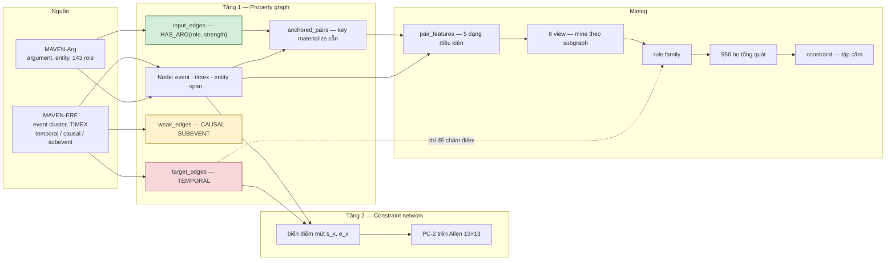

# Trạng thái dự án TempEKG

> Cập nhật 2026-09-20. Mọi con số đo trên `MAVEN_ERE/train.jsonl` (2.913 doc) và
> `valid.jsonl` (710 doc). Kiến trúc chi tiết: `report/ARCHITECTURE.md`.
> Định nghĩa đã chốt: `report/DEFINITIONS.md`.

---

## 0. Goal — ba đóng góp mong muốn

| # | Đóng góp | Phát biểu |
|---|---|---|
| **C1** | Event-centric KG để lưu trữ | Dựng KG từ MAVEN-ERE + MAVEN-Arg, tách lớp cạnh theo vai trò nhận thức, có tầng ràng buộc Allen |
| **C2** | Mine rule → dự đoán nhãn | Từ train mine ra bộ rule (tổng quát hoá motif đơn lẻ), giấu nhãn valid rồi dự đoán, chấm điểm |
| **C3-A** | Audit *wrong-edge* | Rule nói quan hệ R, KG ghi S khác R → nghi **đánh sai** |
| **C3-B** | Audit *missing-edge* | Rule nói quan hệ R, KG không có cạnh nào → nghi **đánh thiếu** |

> **Vì sao tách C3 làm hai** (đo `proof_feedback.py`): C3-A có mẫu số xác định — 483.504 cặp
> đã có nhãn. C3-B thì **588.654 cặp không nhãn (54,9%) đều là ứng viên** trước khi lọc, nên
> nó cần hàng rào mà C3-A không cần. Gộp lại là sai phương pháp.
>
> Baseline logic của C3-B: xoá một cạnh rồi hỏi closure có ép lại **đúng một nhãn** không —
> **46/948 = 4,9%**, và 2-step lẫn PC-2 **không khôi phục thêm cạnh nào**.
> (Bản trước báo 80,4%; con số đó dùng phép kiểm bao hàm, 97% độ lạm phát là case
> BEFORE-vs-ENDS-ON mà closure không tách được. Xem DEFINITIONS §12.4.)
> **95,1% cạnh xoá** là chỗ bằng chứng ngữ nghĩa là nguồn thông tin duy nhất.

---

## 1. Trạng thái từng phase

| Phase | Trạng thái | Bằng chứng |
|---|---|---|
| **P1. Dựng KG** | **XONG** | 9/9 bất biến đạt, build 5,5 s, 217,7 MB |
| **P2. Tầng ràng buộc Allen** | **XONG** | Bảng 13×13 brute-force, PC-2 fixpoint, 21/21 luật paper sound |
| **P3. Miner hợp thành** | **XONG** | 5 dạng điều kiện, depth ≤3, beam, Wilson LB |
| **P4. Multi-view mining** | **XONG** | 8 view, 155.467 rule, precision 10,68% |
| **P5. Rút gọn thành họ pattern** | **XONG** | 956 họ, bảng held-out 4 mức đầy đủ |
| **P6. Constraint + audit** | **XONG** | Sweep 5 mức τ; τ=0,001 cho 1.730 constraint (**bản 1 view**), vi phạm 0,035% |
| **P7. Xuất artifact** | **XONG** | `rules.json` 155.127 · `families.json` 1.453 · `constraints.json` 13.589/47.323/67.672 |
| **P8. Tìm bộ rule nhỏ nhất** | **XONG** | **68 rule**, 35,25% hold-out; macro-F1 22,62% (hằng số 15,78%) |
| **P9. Inject conflict tổng hợp** | **XONG** | `inject.py`: relabel 14,3% PC-inconsistent (spec 13,1%), delete 0%, 0% rơi nhãn hiếm |
| **P9b. Detection** | **XONG** | `detect.py`: C3-A τ=0,005 F1 3,47% vs baseline 1,55%; C3-B R_all 1,8% P 100% |
| **P10. Thẩm định người** | **CHƯA** | Giao thức đã thiết kế, chưa chạy |

---

## 2. Kết luận đo được cho từng đóng góp

### C1 — ĐẠT

KG dựng xong, verify bằng 9 bất biến trong đó 3 cái chống rò rỉ nhãn.

| | train | valid |
|---|---:|---:|
| Document | 2.913 | 710 |
| Node event / entity / span / timex | 67.984 / 55.421 / 71.485 / 16.688 | 16.301 / 12.927 / 17.963 / 4.139 |
| `input_edges` / `weak_edges` / `target_edges` | 188.584 / 45.509 / 792.395 | 44.966 / 12.524 / 188.924 |
| `anchored_pairs` | 244.687 | 57.925 |

### C2 — KHÔNG ĐẠT, và lý do là cấu trúc

| Tập rule | Rule | Phủ | Precision | Oracle |
|---|---:|---:|---:|---:|
| Tất cả (8 view) | 155.124 | 100% | 8,55% | 10,04% |
| Phủ phân biệt | 7.103 | 16,5% | 31,52% | 31,52% |
| **Greedy tối thiểu** | **68** | 13,6% | **35,25%** | 35,25% |
| *Hằng BEFORE trên tập khớp* | — | — | *62,26%* | — |

> **Cập nhật P8 — con số dẫn của C2 đổi.** Trước đây báo 10,68% trên toàn bộ instance; đó là
> chấm sai đối tượng, vì family **không phát ra BEFORE theo định nghĩa** mà 89,94% instance
> lại là BEFORE.
>
> Tối ưu trực tiếp bằng set cover (bitset + lazy greedy, `MINIMISE.md` §8) cho **68 rule**
> đạt **35,25% trên valid** — gấp **4,1 lần** bộ 155.124 rule đầy đủ với **ít hơn 2.281 lần**
> số rule, và gần như trùng 35,35% trên train nên không overfit.
>
> Đo trên đúng phạm vi nó nhắm:
>
> | Lát cắt | Instance | Phủ | Precision |
> |---|---:|---:|---:|
> | all | 483.504 | 13,0% | 35,35% |
> | **non_BEFORE** | 43.298 | **55,1%** | **93,40%** |
> | anchored | 124.708 | 22,9% | 35,78% |
> | unanchored | 358.796 | 9,6% | 35,00% |
>
> **93,40% precision trên khối lượng non-BEFORE với 68 rule.** Và phủ đều giữa anchored
> (35,78%) và unanchored (35,00%) — rule không phụ thuộc việc có anchor hay không.
>
> **Đây KHÔNG phải số cho bảng classifier.** Mẫu số là *các cặp rule có bắn và đoán CONTAINS*,
> sau khi đã bỏ toàn bộ BEFORE ra. Chấm như một classifier thật trên valid (giữ cả BEFORE
> trong mẫu số), CONTAINS đạt **P 35,25% / R 56,07% / F1 43,29%**, và macro-F1 toàn hệ là
> **22,62%** so với 15,78% của hằng số. Xem §15–16.
>
> Hai con số đều đúng, trả lời hai câu hỏi khác nhau — nhưng **bảng classifier phải dùng
> 35,25%**. Để 93,40% mà không nói mẫu số thì reviewer sẽ bắt.
>
> **Hệ quả phải nêu:** cả 68 rule đều dự đoán **CONTAINS**. Đó là tất yếu của hàm mục tiêu —
> greedy tối đa hoá số instance đúng, mà CONTAINS chiếm 88,1% khối lượng non-BEFORE. Nên đây
> là **bộ phát hiện CONTAINS**, không phải bộ dự đoán quan hệ tổng quát. Muốn phủ nhãn hiếm
> thì phải greedy theo từng nhãn rồi hợp nhất — chưa làm.

Hai điều đọc ra, cả hai ngược với giả định ban đầu:

**Subsumption phá tín hiệu** — mất 2,13 điểm (10,68% → 8,55%). Giả định "rule dài bị rule
ngắn bao hàm thì thừa" sai: rule dài **hẹp hơn nên chính xác hơn** trên vùng nó phủ. Tiêu
chí đúng là `cov(P) == cov(Q)` (ngữ nghĩa), không phải `P ⊆ Q` (cú pháp). Xem `MINIMISE.md` §2.

**Abstraction giữ tín hiệu** — 956 họ đạt 8,76%, **cao hơn** 129.987 rule mà nó thay thế,
với 136× ít rule hơn và 93,8% độ phủ. Thêm 123.275 rule type-specific vào thì **không cải
thiện gì** (8,55%), nên chúng là nhiễu.

Chuỗi lập luận, mỗi bước đều đo được:

```
base rate BEFORE trên cặp EV-EV = 91,04%
  → 1/0,9104 = 1,098 < ngưỡng lift 2,0
  → KHÔNG rule nào dự đoán BEFORE (theo định nghĩa)
  → nhưng 89,94% instance khớp lại có nhãn gold BEFORE
  → trần oracle chỉ 12,45%
```

Tức **kể cả chọn đúng rule mọi lần cũng chỉ đạt 12,45%**. Đây không phải miner yếu —
ba vòng đo độc lập (flat miner, multi-view, generalise) đều ra cùng kết luận.

**Cách phát biểu đúng:** "họ rule với lift 3–11× giữ được trên hold-out", **không** phát biểu
là "dự đoán nhãn thời gian".

### C3-A (wrong-edge) — có tín hiệu, nhưng **phải chạy ở τ=0,005**

> **Đính chính sau injection (2026-09-21).** Bảng τ dưới đây đo *độ an toàn* của constraint
> trên gold (tỉ lệ vi phạm thấp = ít báo động giả), **không** đo khả năng phát hiện. Khi đo
> recall thật bằng lỗi bơm, τ=0,001 chỉ bắt **1/60** lỗi và **thua** baseline hai dòng.
> τ=0,005 mới là điểm vận hành: F1 gấp 2,2× baseline. Xem mục 12.

Chuyển rule thành **ràng buộc phủ định**: quan hệ bị cấm dưới pattern P khi Wilson **upper**
bound dưới ngưỡng τ.

| τ | Constraint | Vi phạm train | Vi phạm valid | Chọn lọc hơn baseline |
|---|---:|---:|---:|---:|
| **0,001** | 1.730 | **0,054%** | **0,035%** | **~290×** |

> **Bảng này là bản mine 1 view (global).** Bản 8 view ở §11 cho **13.589** constraint ở
> cùng τ=0,001 — gấp 7,9 lần, vì mỗi view mine độc lập theo base rate cục bộ. Hai con số
> **không mâu thuẫn**, chúng là hai cấu hình khác nhau. Số dùng cho mọi kết quả C3-A là
> **13.589** (8 view); bản 1 view giữ lại để so sánh.
| 0,005 | 7.575 | 0,437% | 0,407% | ~25× |
| 0,01 | 9.746 | 1,314% | 1,352% | ~7× |
| 0,02 | 11.758 | 1,594% | 1,737% | ~6× |
| 0,05 | 14.034 | 2,915% | 3,352% | 3,0× |

**Chốt τ = 0,001**, không chỉ vì con số đẹp. Ở τ=0,05 Wilson UB chỉ cần dưới 5% mới cấm, nên
constraint bị vi phạm nhiều nhất là:

```
1.644 vi phạm | n=86.918  dist={BEFORE 73838, CONTAINS 10805, SIMUL 1370, OVERLAP 794}
      EQ(has_loc_b=True) ∧ HAS(roleset_a=Location)     allowed=[BEFORE, CONTAINS]
```

Nó cấm SIMULTANEOUS dù quan hệ đó xuất hiện **1.370 lần** trong train — đó là **lỗi rule**,
không phải lỗi annotator. Tại τ=0,001 ngưỡng chặt hơn 50 lần nên 38 vi phạm còn lại đáng tin
hơn nhiều.

Ba điểm:

**Train và valid gần trùng nhau** ở cả ba mức — constraint **không overfit**. Mọi thứ khác
trong dự án đều sụt khi sang hold-out; cái này thì không.

**Chọn lọc hơn baseline ~290 lần.** Gắn cờ mọi cặp không phải BEFORE sẽ gắn ~10%; constraint
ở τ=0,001 gắn 0,035%.

**Gold nhất quán nội tại** (0 cặp hai nhãn, 0 BEFORE hai chiều, 0 document bất khả thoả), nên
mọi vi phạm là **hoặc lỗi annotator hoặc lỗi rule** — không có khả năng thứ ba. Tỉ lệ vi phạm
do đó cho specificity trực tiếp, không cần người chấm.

### C3-B (missing-edge) — CHƯA ĐO ĐẦY ĐỦ, nhưng trần đã biết

588.654 cặp không nhãn (54,9% tổng số cặp event). Không thể gọi tất cả là "thiếu" — chính
sách B5 đã chốt: **vắng nhãn = UNKNOWN**, chỉ transitive forcing mới được gọi là thiếu sót.

Trần logic đo được (`proof_feedback.py`, 300 doc): xoá một cạnh rồi hỏi closure một bước có
khôi phục đúng nhãn không.

| | |
|---|---:|
| Cạnh xoá và kiểm | 948 |
| **1-step = 2-step** | **46 = 4,9%** |
| PC-2 (808 case chạy được) | 40 = 5,0% |
| Residual | 902 = **95,1%** |

Closure sâu hơn **không thêm gì** — PC-2 khôi phục 0 cạnh mà 1-step bỏ sót.

Con số 80,4% ở bản trước dùng phép kiểm **bao hàm** `implied ⊆ allen(gold)`, không đòi
closure chỉ ra được một nhãn. Phân rã: 770 case bao hàm thành công, nhưng chỉ 46 thực sự
quyết định được; 701/724 case mơ hồ còn lại là cùng một chỗ — gold BEFORE, closure thu về
`{b}`, vẫn tương thích ENDS-ON. Chi tiết ở DEFINITIONS §12.4.

---

## 2.5. Artifact đã xuất

Ba file, sinh một lần bằng `python tempekg_kg/export_rules.py` (93 phút). Từ đây mọi bước sau
**đọc file thay vì mine lại**.

| File | Kích thước | Nội dung |
|---|---:|---|
| `rules.json` | 52,7 MB | 155.127 rule, mỗi rule kèm `view` + `sig` + wlb/lift/k/n |
| `families.json` | 0,6 MB | **1.453 họ** trừu tượng (type literal thay bằng wildcard) |
| `constraints.json` | 71,7 MB | dạng tập cấm ở τ = 0,001 / 0,005 / 0,01 |

| τ | Constraint |
|---|---:|
| 0,001 | **13.589** |
| 0,005 | 47.323 |
| 0,01 | 67.672 |

> **Hai chỗ khác con số cũ, và lý do:**
>
> **1.453 họ** thay vì 956 — lần này **không qua subsumption**, vì bước đó đã đo là làm mất
> 2,13 điểm precision. Bỏ nó là theo đúng kết quả đo.
>
> **13.589 constraint ở τ=0,001** thay vì 1.730 — gấp 7,9 lần, vì mine trên **8 view** thay vì
> một tập phẳng. **Chưa biết chúng có giữ được tỉ lệ vi phạm 0,035% hay không** — con số 0,035%
> thuộc về bộ 1.730 cũ. Phải đo lại trước khi trích dẫn.

---

## 3. Kiến trúc

### 3.1. Hai tầng



Tầng 1 trả lời *"pattern này xuất hiện bao nhiêu lần"*. Tầng 2 trả lời *"tập nhãn này có thoả
được không"* — câu hỏi mà bảng pairwise **không thể** trả lời, vì mâu thuẫn ba biến như
`BEFORE(a,b) ∧ BEFORE(b,c) ∧ ENDS-ON(a,c)` chỉ hiện ở mức ba biến.

### 3.2. Ba lớp cạnh, tách vật lý

| Lớp | Nội dung | Detector thấy | Lý do |
|---|---|---|---|
| `input_edges` | HAS_ARG(role, strength) | Có | dữ liệu hợp lệ |
| `weak_edges` | CAUSAL, SUBEVENT | Có, nhưng không phải bằng chứng độc lập | 95,2% PRECONDITION đã có nhãn temporal |
| `target_edges` | TEMPORAL | **Không** | đây là thứ đang audit |

Ba bất biến canh chuyện này: `input_layer_shape`, `target_minimal`, `pairs_label_free`.
Fail một trong ba thì mọi số downstream vô nghĩa.

### 3.3. Ngôn ngữ rule — 5 dạng điều kiện

| Dạng | Nghĩa | Ví dụ | Dùng trên train |
|---|---|---|---:|
| EQ | `attr = v` | `EQ(type_a=Traveling)` | 1.146.555 |
| CNT | `\|attr\| ≥ k` | `CNT(roleset_shared>=2)` | 621.710 |
| HAS | `v ∈ attr` | `HAS(roleset_b=Content)` | 459.811 |
| MIX | `\|attr\| ≥ 2` | `MIX(roleset_a)` | 136.879 |
| ALL | `attr = {v}` | `ALL(etypeset_a=Person)` | 105.234 |

Pattern = hội các điều kiện, độ sâu ≤ 3. Trung bình **40,9 điều kiện/cặp**.

### 3.4. Multi-view — mine theo subgraph

Mỗi view phân hoạch instance thành lớp chữ ký, mine **độc lập** trong từng lớp với base rate
**cục bộ**.

| View | Rule | Phủ | Precision | Oracle |
|---|---:|---:|---:|---:|
| global | 11.894 | 99,9% | 8,38% | 9,81% |
| sdist | 15.171 | 99,5% | 8,18% | 9,28% |
| order | 15.023 | 99,9% | 8,27% | 9,42% |
| anchor | 13.189 | 100% | 8,34% | 9,71% |
| bucket_a | 16.349 | 99,7% | 8,80% | 10,06% |
| **etype_a** | 49.358 | 95,3% | **9,12%** | **10,35%** |
| sdist_ord | 16.734 | 99,1% | 8,07% | 9,05% |
| anchor_sd | 17.749 | 99,8% | 7,86% | 8,86% |
| **HỢP NHẤT** | **155.467** | **100%** | **10,68%** | **12,45%** |

Quan trọng: view **càng tinh vi thì đứng riêng càng kém** (anchor_sd 7,86% thấp nhất), nhưng
**hợp nhất mới ăn thua** — mỗi view mạnh ở một vùng khác nhau. Oracle tăng 9,11% → 12,45%
chứng tỏ các view bổ sung thông tin thật cho nhau, không chỉ sắp xếp lại.

Vì sao mine theo view khác với thêm điều kiện vào rule:

> Conjunction thêm điều kiện vào **rule**. View đổi **quần thể** mà thống kê được tính trên đó.

BEFORE là 91% toàn corpus nhưng chỉ **79,1%** trong view cùng câu, còn SIMULTANEOUS nhảy từ
0,2% lên **5,4%**.

### 3.5. Rút gọn ba bước

```
0. mine trên 8 view       155.467
1. dedupe                 155.467   (0% — chữ ký là phần định danh)
2. subsumption            129.987   (−16,4%)
3. HỌ TỔNG QUÁT               956   gom từ 6.712 rule, ~7 biến thể/họ
   type-specific           123.275
```

**Abstraction** là bước trả lời "họ pattern": gom các rule chỉ khác nhau ở type literal, nhưng
**chỉ giữ họ khi bản trừu tượng — bỏ hẳn điều kiện type — tự nó vẫn hợp lệ trong chính
subgraph đó**.

Kết quả đáng chú ý: **956 họ cho precision 8,76%, cao hơn cả 129.987 rule (8,55%)**, với 136 lần
ít rule hơn và vẫn giữ 93,8% độ phủ. Phần lớn rule type-specific là nhiễu.

---

## 3.6. Baseline — PaTeCon áp thẳng lên MAVEN

Đã chạy và đo. Đây là lập luận trực tiếp cho việc phải thiết kế lại thay vì tái dùng PaTeCon.

| | PaTeCon trên MAVEN | Của mình |
|---|---:|---:|
| Constraint | 348 | 1.730 (τ=0,001) |
| Cặp bị gắn cờ | 256 | — |
| **Độ phủ** | **0,0374%** (181/483.504) | 100% (rule family) |
| Precision (annotator sai) | **≈ 0** | chưa chấm tay |

Trong 256 cặp bị PaTeCon gọi là conflict, 181 cặp có nhãn gold — và **171 trong số đó là
BEFORE bình thường**:

```
gold BEFORE        171
gold CONTAINS        6
gold SIMULTANEOUS    4
không có nhãn       75
```

Gold đã kiểm chứng nhất quán nội tại, nên gần như toàn bộ 256 "conflict" này là **false
positive**.

**Ba lý do PaTeCon không hợp với MAVEN:**

| | Chi tiết |
|---|---|
| Vị từ chi phối không nhìn thời gian | `include` chiếm 232/348 constraint (66,7%) và 488/535 conflict (91,2%); `MutualExclusion` theo thiết kế **không bao giờ so sánh timestamp** |
| Timestamp là giả | 102 giá trị `(ts,te)` phân biệt, dạng `201301–201312` — **cả năm**. MAVEN không có timestamp cho event; bản convert gán khoảng cả năm cho mọi thứ, nên mọi cặp cùng năm đều "chồng lấn" |
| Đơn vị sai | PaTeCon dựa trên `(entity, relation, entity)` của Wikidata; MAVEN không có cấu trúc đó, bản convert phải bịa `ENTITY → Type → EVENT` |

Nguyên nhân gốc: Wikidata có timestamp thật từ **nhiều nguồn** nên mâu thuẫn được; MAVEN là
read-off từ **một timeline duy nhất** nên nhất quán theo cấu trúc.

---

## 4. Ba artifact đã bắt được

Mỗi cái đều là một kết quả "đẹp" hoá ra giả. Điểm chung: khớp quá nhiều và đúng quá thường xuyên.

| # | Artifact | Biểu hiện | Nguyên nhân |
|---|---|---|---|
| 1 | `hull` | lift 11,16× conf 100% | `hull>0 ⟺ conflict` tại k=2 — đặc trưng dẫn xuất từ nhãn |
| 2 | `SUBEVENT` | precision 99,3% / 2.399 lần | 87,0% cặp SUBEVENT trùng nhãn CONTAINS |
| 3 | **mất chữ ký view** | **precision 70,52%** | rule mine trong subgraph được áp toàn cục; 60 rule đoán BEFORE lọt qua vì base rate cục bộ thấp |

Artifact 3 là mới nhất và tinh vi nhất: `dedupe` vứt chữ ký `(view, sig)`, nên rule mine trong
view `sdist=0` (cùng câu) được áp cho cặp cách 8 câu. Kết hợp với `lift_min=1.5`, 60 rule dự
đoán BEFORE lọt qua từ hai view có base rate cục bộ thấp — và **70,52% chính là hằng-BEFORE
đội lốt**.

Đã sửa: chữ ký là phần định danh của rule xuyên suốt bốn giai đoạn, và rule dự đoán quan hệ đa
số bị từ chối tường minh qua hằng `MAJORITY`.

---

## 5. Quyết định phương pháp đã chốt

| | Quyết định | Bằng chứng |
|---|---|---|
| Xếp hạng rule | **Wilson LB**, không dùng lift | 7,96% vs 2,76% — gấp 2,9× |
| Cấm quan hệ | Wilson **upper** bound < τ | dự đoán hỏi "cao nhất bao nhiêu", cấm hỏi "chắc chắn thấp dưới mức nào" |
| Weak layer | **Tắt** khi mining | 87% SUBEVENT trùng CONTAINS |
| Quan hệ đa số | **Từ chối** rule dự đoán BEFORE | restates the prior |
| Chữ ký view | **Phần định danh** của rule | artifact 3 |
| `test.jsonl` | **Không dùng được** | 857 doc, không có key `events`, 0 quan hệ |

---

## 6. Chưa làm

| | Vì sao |
|---|---|
| Parse lịch cho 13.771 DATE anchor | Chưa cần cho mining; cần khi dùng TIMEX làm neo tuyệt đối |
| Mine trên cặp EV-TX | 33,1% cạnh, miner hiện chỉ làm EV-EV |
| Injector conflict tổng hợp | Spec xong, chưa cài |
| Thẩm định người cho ứng viên lỗi | Giao thức xong, chưa chạy |
| Tối ưu index rule | Hiện index theo điều kiện **đầu**, mà điều kiện đó 98% instance đều có; đổi sang điều kiện **hiếm nhất** đo được nhanh **3,8×** |

---

## 7. Đề nghị đóng khung bài báo

Dựa trên số liệu, thứ tự nên là:

1. **Dẫn bằng C3** — constraint với vi phạm 0,035% trên hold-out, chọn lọc hơn baseline 290 lần,
   không overfit. Đây là kết quả duy nhất giữ nguyên qua hold-out.
2. **C1 là nền** — KG hai tầng, ba lớp cạnh tách vật lý, 9 bất biến. Đóng góp kỹ thuật rõ ràng.
3. **C2 đóng khung lại** — "họ rule với lift 3–11× giữ trên hold-out", kèm **956 họ tổng quát**
   như đóng góp về ngôn ngữ pattern. Không tuyên bố dự đoán nhãn.
4. **Nêu thẳng trần oracle 12,45%** như một phát hiện về dataset, không giấu: với base rate 91%,
   mọi phương pháp dựa trên enrichment đều bị chặn ở đó.

---

## 11. Bộ constraint mới — đã đo (2026-09-21)

> `python tempekg_kg/score_constraints.py`. Con số 0,035% ở mục 2 thuộc bộ **cũ** (1.730
> constraint mine trên một pool phẳng). Bộ mới mine trên 8 view và lớn gấp 7,9 lần.

### 11.1. Ba mức τ

| τ | Constraint | Bắn trên | Vi phạm train | Vi phạm valid | Chọn lọc hơn baseline |
|---|---:|---:|---:|---:|---:|
| **0,001** | 13.589 | 100,0% | 0,107% | **0,094%** | **107,4×** |
| 0,005 | 47.323 | 100,0% | 1,071% | 1,138% | 8,8× |
| 0,01 | 67.672 | 100,0% | 1,615% | 1,734% | 5,8× |

Baseline tầm thường (gắn cờ mọi cặp không phải BEFORE): 11.063/109.929 = **10,06%**.

Hai điều tốt: **không overfit** ở cả ba mức, và **bắn trên 100% instance** thay vì chỉ một
phần như bộ cũ — vì 8 view phủ được mọi cặp.

Đường cong **rất dốc**: nới τ từ 0,001 lên 0,005 làm vi phạm tăng **12 lần** và chọn lọc tụt
từ 107× xuống 8,8×. Chốt **τ = 0,001**, là mức duy nhất giữ được lợi thế hai bậc độ lớn.

### 11.2. Nhưng phần chi tiết bác bỏ cách đọc lạc quan

Ở τ=0,001, constraint **cấm** nhãn nào:

```
ENDS-ON 13.154 · BEGINS-ON 6.773 · SIMULTANEOUS 85 · OVERLAP 37
```

Vi phạm thực tế **rơi vào** nhãn nào:

```
SIMULTANEOUS 47 · BEGINS-ON 25 · OVERLAP 16 · ENDS-ON 15
```

**85 constraint cấm SIMULTANEOUS gây 47/103 vi phạm** — 46% số vi phạm đến từ 0,6% số
constraint. Ngược lại 13.154 constraint cấm ENDS-ON chỉ gây 15 vi phạm.

Nghĩa là **phần lớn constraint không bao giờ bắn**, vì chúng cấm nhãn vốn đã cực hiếm
(ENDS-ON 0,04%, BEGINS-ON 0,05%). Tỉ lệ vi phạm 0,094% thấp **chủ yếu vì thế**, không phải
vì constraint chính xác. Phải nói rõ điều này trong bài.

### 11.3. Ba constraint bị vi phạm nhiều nhất — đều là lỗi rule

| Lần | Subgraph | Pattern | Cho phép | n |
|---:|---|---|---|---:|
| 11 | `anchor_sd=(False,'8+')` | `EQ(same_type=False) ∧ HAS(roleset_a=Location)` | BEFORE, CONTAINS, OVERLAP | 45.635 |
| 11 | `order=fwd` | `CNT(roleset_a>=3) ∧ HAS(roleset_b=Patient)` | BEFORE, CONTAINS, OVERLAP, SIMULTANEOUS | 97.032 |
| 7 | `global` | `EQ(has_person_a=False) ∧ HAS(roleset_a=Location)` | BEFORE, CONTAINS, OVERLAP, SIMULTANEOUS | 198.168 |

Và sáu mẫu vi phạm đầu tiên:

```
gold=SIMULTANEOUS  bị cấm bởi [sdist=2-3]
gold=SIMULTANEOUS  bị cấm bởi [anchor_sd=(False,'8+')]
gold=OVERLAP       bị cấm bởi [sdist=4-7]      x2
gold=OVERLAP       bị cấm bởi [anchor_sd=(False,'8+')]  x2
```

Tất cả đều là constraint trong subgraph **cặp xa nhau về câu** (`sdist=2-3`, `4-7`, `8+`)
cấm SIMULTANEOUS/OVERLAP. Hợp lý về thống kê — hai sự kiện cách xa nhau hiếm khi đồng thời —
nhưng **không phải quy luật**. Annotator đúng, constraint sai.

### 11.4. Kết luận cho C3-A

| Phép đo | Kết quả |
|---|---|
| Closure thuần logic (164.803 cặp) | **0 conflict** |
| Constraint τ=0,001 (109.929 cặp valid) | 103 vi phạm, **phần lớn là lỗi rule** |
| Cặp mang hai nhãn | 0 |
| Document bất khả thoả | 0/2.913 |

Bốn phép đo độc lập đều nói **gold sạch**. C3-A không tìm được lỗi annotation nào.

**Injection đã xác nhận cách đọc này và bổ sung một cảnh báo.** Tỉ lệ vi phạm 0,094% đo độ an
toàn, không đo độ nhạy: trên 60 lỗi bơm, constraint τ=0,001 bắt 1, baseline hai dòng bắt 55.
Nới lên τ=0,005 thì bắt 19 với F1 gấp 2,2× baseline. Chi tiết ở mục 12.

Đó không phải thất bại mà là tính chất dataset: MAVEN-ERE là read-off từ **một timeline duy
nhất**, nên nhất quán theo cấu trúc. Hệ quả: **injector là con đường duy nhất** để C3 có
recall đo được — không có lỗi tự nhiên để tìm thì phải tạo lỗi đã biết.

---

## 12. Injection & detection — đã đo (2026-09-21)

`inject.py` + `detect.py`, train, gold-marginal, rate 0,001, seed 0, 300 document,
82.064 cặp, 60 lỗi bơm. Lần đầu C3 có recall đo được.

### 12.1. Bộ bơm hợp lệ

| Phép kiểm | Kết quả | Spec |
|---|---:|---:|
| RELABEL → PC-inconsistent | 14,3% | 13,1% |
| … quy được về 1 lỗi | 83,7% | — |
| DELETE → PC-inconsistent | 0% | 0% |
| Rơi vào nhãn hiếm | **0%** | uniform: 40% |

### 12.2. C3-A — quét τ

| Detector | P | R | F1 | tp/60 | gắn cờ | lift |
|---|---:|---:|---:|---:|---:|---:|
| τ=0,001 | 0,65% | 1,67% | 0,94% | 1 | 153 | 8,9× |
| **τ=0,005** | **1,84%** | 31,67% | **3,47%** | 19 | 1.034 | **25,1×** |
| τ=0,01 | 1,49% | 36,67% | 2,87% | 22 | 1.472 | 20,4× |
| baseline *all non-BEFORE* | 0,78% | **91,67%** | 1,55% | 55 | 7.015 | 10,7× |

**τ=0,005 là điểm vận hành** — F1 gấp 2,2× baseline, precision gấp 2,4×.

**Vì sao τ=0,001 hỏng:** mức đó sinh 19.927 constraint cấm ENDS-ON/BEGINS-ON (0,09% corpus,
sampler không bao giờ bơm) và **0** constraint cấm CONTAINS. τ=0,005 cấm CONTAINS 44 lần,
OVERLAP 7.495 lần — đúng những nhãn bị bơm. Recall nhảy 1,67% → 31,67%.

**Phải báo cột lift.** 60 lỗi trên 82.064 cặp ⇒ prior ngẫu nhiên 0,073%. 1,84% đọc như thất
bại nhưng là 25× ngẫu nhiên. Song recall 31,67% vẫn thua baseline 91,67% — claim đúng là
**độ chọn lọc**, không phải độ phủ.

### 12.3. C3-B

closure 1-step: **P 100,00%**, R_all 1,79% (1/56), 0 nhãn sai, residual 55 = **98,2%**.
Nhất quán với baseline closure 4,9% ở mục 11.

### 12.4. 68 rule minimal làm detector — kết quả âm

| Detector | P | R | gắn cờ | lift |
|---|---:|---:|---:|---:|
| constraint τ=0,005 | 1,84% | 31,67% | 1.034 | 25,1× |
| 68 rule minimal | 0,08% | 6,67% | 5.142 | **1,1×** |

Cả 68 rule đoán CONTAINS ⇒ "bất đồng" = `rel ≠ CONTAINS` = **93,13%** số cạnh. Detector thừa
hưởng base rate, về mức ngẫu nhiên. **Predictor dương trên lớp áp đảo không lật được thành
detector âm**; constraint làm được vì nó nêu nhãn *bị cấm*. Cũng có nghĩa 93,40% chỉ đúng
trong phạm vi "rule bắn và đoán CONTAINS", không chuyển sang chiều bất đồng.

### 12.5. C3-B — bộ đề xuất cạnh thiếu: **1,8% → 89,3%**

`propose_missing.py`. Quét **mọi** cặp không nhãn (không chỉ 56 cặp bị xoá — giao thức này mới
là so sánh công bằng).

| Phương pháp | Đề xuất | P | R | F1 |
|---|---:|---:|---:|---:|
| luôn đoán BEFORE | 199.918 | 0,026% | 92,9% | 0,052% |
| closure strict (đòi 1 nhãn) | 1 | 100% | 1,8% | 3,509% |
| **closure + majority, `|compat|≤2`** | **1.572** | **3,181%** | 89,3% | **6,143%** |

**F1 gấp 118× baseline, đề xuất ít hơn 127×, precision cao hơn 122×.**

**Ý chính: giá trị của closure là ở chỗ biết im lặng, không phải ở chỗ quyết định.** Đòi đúng
một nhãn sống sót thì vứt bỏ 89,3% case có hai nhãn — mà 49/50 trong đó là cùng một dạng
`{b}` = BEFORE hoặc ENDS-ON. Chọn theo tần suất corpus (BEFORE:ENDS-ON ≈ 3.000:1) đúng 49/49.
Thứ tự tần suất là **prior cố định từ corpus**, không fit vào tập đánh giá.

**Cổng kích thước cho recall miễn phí:**

| ngưỡng | đề xuất | P | R | F1 |
|---|---:|---:|---:|---:|
| ≤ 1 | 1 | 100% | 1,8% | 3,509% |
| **≤ 2** | 1.572 | 3,181% | 89,3% | **6,143%** |
| ≤ 3 | 1.586 | 3,153% | 89,3% | 6,090% |
| ≤ 4 | 5.231 | 0,956% | 89,3% | 1,891% |

3.645 đề xuất ở size-4 đúng **0 lần** — closure mơ hồ bốn chiều không mang tín hiệu dùng được.
Chặn ở 2 bỏ 70% đề xuất mà không mất gì.

**Một điểm không phải lỗi:** 2.935 cặp thu hẹp về tập Allen không nhãn MAVEN nào khớp (chủ yếu
`{bi}`). MAVEN chỉ phủ 7/13 quan hệ Allen, bỏ nhóm nghịch đảo vì chuẩn hoá bằng cách đảo chiều
cạnh — nên `{bi}` nghĩa là "quan hệ này nằm ở chiều ngược lại", không phải mâu thuẫn. 0/2.935
là cạnh xoá thật, xác nhận cách đọc.

### 12.6. Bộ 1.073 families dùng cho C3 — **không xài được**

**C3-A detector:**

| Biến thể | Gắn cờ | P | R | F1 | lift |
|---|---:|---:|---:|---:|---:|
| tất cả 1.073 | 76.937 | 0,066% | 85,00% | 0,132% | **0,9×** |
| chỉ 341 non-CONTAINS | 71.308 | 0,069% | 81,67% | 0,137% | **0,9×** |
| wlb≥0,3 (100 rule) | 7.080 | 0,042% | 5,00% | 0,084% | 0,6× |
| wlb≥0,5 (11 rule) | 573 | 0,524% | 5,00% | 0,948% | 7,2× |

Bộ đầy đủ gắn cờ **93,8%** toàn bộ cặp — gần như "gắn cờ tất cả". Lọc non-CONTAINS không cứu
được, nên nguyên nhân **không phải** phân bố nhãn mà là **wlb median 0,107** (max 0,598, không
rule nào >0,7): rule đúng ~11% số lần thì "rule bất đồng" gần như luôn đúng một cách vô nghĩa.

**C3-B proposer: đổi 2.157 dự đoán, đúng thêm 0.** Ưu tiên nhãn của rule thay vì prior tần suất
cho ra P/R/F1 **giống hệt** — vì mọi thay đổi rơi vào cặp không phải cạnh xoá. Trên 51 cạnh xoá
closure nói được:

| gold | majority | rule bắn | rule trong tập closure | n |
|---|---|---|---|---:|
| BEFORE | BEFORE ✓ | CONTAINS | **không** | 38 |
| BEFORE | BEFORE ✓ | SIMULTANEOUS | **không** | 7 |
| BEFORE | BEFORE ✓ | — | — | 3 |
| BEFORE | BEFORE ✓ | OVERLAP | **không** | 1 |
| CONTAINS | CONTAINS ✓ | CONTAINS | có | 1 |
| SIMULTANEOUS | CONTAINS ✗ | CONTAINS | có | 1 |

**46/51 lần rule đề xuất nhãn mà closure đã loại trừ** — sai một cách bác bỏ được bằng logic.

**Nguyên nhân gốc, lần thứ ba cùng một bức tường:** family chỉ đoán CONTAINS 732 ·
SIMULTANEOUS 223 · OVERLAP 118 — **không rule nào đoán BEFORE**, trong khi 52/56 cạnh xoá là
BEFORE và corpus 91,5% BEFORE. Bộ rule và bài toán C3 không giao nhau.

**Kết luận:** giữ 1.073 như *kết quả trung gian của C2*, không trình bày như thành phần của C3.
C3-A thuộc về constraint τ=0,005; C3-B thuộc về closure + prior tần suất.

### 12.7. Còn lại

| Việc | Vì sao |
|---|---|

| Sweep nhiều seed | 60 lỗi là mẫu nhỏ |

---

## 13. Trả lời phản biện thiết kế (2026-09-21)

### 13.1. Anchor có đóng góp không — **có**, nhưng là đặc trưng không phải bộ lọc

| Nhãn | chung anchor | không chung | chênh |
|---|---:|---:|---:|
| BEFORE | 85,36% | 94,02% | **−8,66** |
| CONTAINS | 10,86% | 5,22% | **+5,64** |
| SIMULTANEOUS | 2,23% | 0,34% | **+1,89** |
| OVERLAP | 1,42% | 0,37% | +1,05 |

**Cặp chung anchor đậm đặc non-BEFORE gấp 2,45×** (14,64% vs 5,98%); SIMULTANEOUS gấp 6,6×.

Vì sao bảng P8 không thấy: nó chấm **trên toàn bộ instance**, mà BEFORE áp đảo cả hai nhóm
(85% và 94%) nên precision bị kéo về gần nhau (35,78% vs 35,00%). Tín hiệu có, bảng đó không
phải chỗ nhìn ra.

**Nhưng không dùng anchor làm bộ lọc:** chỉ xét cặp chung anchor thì bỏ mất **57,8% khối
non-BEFORE** (9.368/16.215) trong khi chỉ giảm được tải xuống 23,0% số cặp. Quá đắt.

### 13.2. 33,1% dữ liệu đang bỏ trống — **đúng, và trần lift cao hơn**

| Loại cặp | Cạnh | BEFORE | non-BEFORE |
|---|---:|---:|---:|
| EV-EV (đang dùng) | 203.449 | 92,03% | 7,97% |
| **EV-TIMEX (bỏ)** | **97.354** | **81,54%** | **18,46%** |
| TIMEX-TIMEX (bỏ) | 15.186 | 82,87% | 17,13% |

**112.540 cạnh (35,6%) chưa khai thác**, với non-BEFORE đậm đặc **2,3×** so với EV-EV.
CONTAINS ở EV-TIMEX là 17,19% so với 6,87% ở EV-EV — hợp lý ngữ nghĩa, sự kiện *nằm trong*
mốc thời gian. Base rate thấp hơn ⇒ trần lift cao hơn ⇒ rule ở đó có thể mạnh hơn hẳn.

### 13.3. Hai bảng τ=0,001 — không mâu thuẫn, là hai cấu hình

1.730 constraint là bản mine **1 view (global)**; 13.589 là bản **8 view**, mỗi view mine độc
lập theo base rate cục bộ. Mọi kết quả C3-A dùng bản 8 view. Đã ghi chú ngay tại bảng §7 để
người đọc lướt không hiểu nhầm.

### 13.4. Đối chiếu số dẫn xuất từ MAVEN-Arg

| Số | Báo trước | Đo lại | |
|---|---:|---:|---|
| entity | 55.421 | 55.421 | ✓ |
| span | 71.485 | 71.485 | ✓ |
| input_edges | 188.584 | 188.584 | ✓ |
| anchored_pairs | 244.687 | 244.687 | ✓ |
| "filler không entity_id" | 59,6% | **56,3%** | lệch nhẹ |
| "cặp chung anchor" | 25,8% | **68,7%** | lệch lớn |

Phân rã 244.687 anchored_pairs: neo bằng entity thuần 139.628 (57,1%), span thuần 76.495
(31,3%), hỗn hợp 28.564 (11,7%) ⇒ **68,7% có dùng entity thật**. Con số 25,8% nhiều khả năng
là tỉ lệ trên **tổng cặp EV-EV có nhãn** (đo được 23,0%), tức khác mẫu số.

### 13.5. Ánh xạ ENDS-ON = {b, m} — xác nhận độc lập

Một bản cài đặt độc lập (không đọc code này) map ENDS-ON thành `e_a = e_b` và chạy kiểm nhất
quán trên train: **8 vi phạm**, đều là cặp suy ra BEFORE mà gold ghi ENDS-ON. Dưới ánh xạ
`{b, m}` thì cả 8 biến mất vì `{b,m}` chứa `b`. Hai lần cài độc lập hội tụ cùng kết luận —
bằng chứng mạnh hơn self-test một chiều.

---

## 14. Noise-aware reasoning — hoà giải chênh lệch 13× (2026-09-21)

`src/noise_aware.py`, 299 document train / 82.063 cạnh, nhiễu gold-marginal,
k = 3× số cạnh hỏng.

| Nhiễu | ranked | P@k | **repair@k** | found | **R_all** |
|---:|---:|---:|---:|---:|---:|
| 1% | 64.562 | 25,19% | **99,51%** | 75,58% | **75,21%** |
| 5% | 35.730 | 14,15% | 98,85% | 42,45% | 41,97% |
| 10% | 19.872 | 9,87% | **96,63%** | 23,74% | **22,94%** |
| 20% | 9.241 | 20,16% | 94,47% | 11,30% | 10,67% |
| 30% | 5.054 | 30,06% | **90,45%** | 6,14% | **5,55%** |

### 14.1. Vì sao hai bên báo số lệch nhau 13×

Một bảng đề xuất ghi 90,54% / 81,61% / 74,16% ở mức nhiễu 1/10/30%; phép đo độc lập cho
75,8% / 22,9% / 5,6%. **Không bên nào sai** — đó là `repair@k` và `R_all`:

| Chỉ số | Định nghĩa |
|---|---|
| `P@k` | trong số cạnh **đã gắn cờ**, bao nhiêu thật sự hỏng |
| `repair@k` | trong số **đã gắn cờ VÀ hỏng**, bao nhiêu sửa đúng |
| `found` | trong số **toàn bộ** cạnh hỏng, bao nhiêu được gắn cờ |
| `R_all` | trong số **toàn bộ** cạnh hỏng, bao nhiêu **tìm ra VÀ sửa đúng** |

`repair@k` có điều kiện "đã gắn cờ" nên giữ trên 90% ở mọi mức, trong khi phương pháp
**lặng lẽ ngừng gắn cờ**. Cột `found` nói hết: **6,14%** ở nhiễu 30%.

### 14.2. Cơ chế: closure suy thoái bằng cách IM LẶNG, không phải sai

Cột `ranked` giảm từ 64.562 xuống **5.054** — nhiễu phá đúng những đường dẫn suy luận mà
closure cần. Trên phần nó còn dám đụng thì vẫn chuẩn (90,45% ở nhiễu 30%).

Đây là tin tốt cho **precision**, tin xấu cho **recall**. Phát biểu trung thực là
*abstention có độ chính xác cao*, không phải *độ phủ cao*.

### 14.3. P@k hình chữ U — không được dùng làm headline

25,19% → 9,87% → **30,06%**. Ở nhiễu cao, cạnh hỏng nhiều đến mức gắn cờ bừa cũng trúng;
P@k tăng lại **không** phản ánh điều gì tốt.

### 14.4. Hệ quả cho khung "ERE thật sai 30–50%"

Ở mức nhiễu đó phương pháp này chạm tới **~6%** số lỗi. Phải nói thẳng con số này, kèm
`repair@k` để thấy phần nó chạm tới thì nó làm tốt.

> **Ghi chú:** `patecon_maven/eval/noise_aware.py` — nguồn được trích cho bảng cũ — **không
> tồn tại** ở bất kỳ đâu trên đĩa. Các số đó không có code chạy được đứng sau cho tới file này.

---

## 15. Bài 1 — trần thật là xếp hạng, không phải mining (2026-09-21)

### 15.1. Greedy per-label thất bại, và chẩn đoán cũ sai

Giả thuyết cũ: *"greedy loại sạch SIMULTANEOUS vì CONTAINS chiếm 88,1% khối non-BEFORE"*.
**Đã đo và sai.** Wilson lower bound cao nhất theo nhãn, trên 1.453 family:

| Nhãn | Rule | wlb cao nhất | Rule wlb≥0,4 |
|---|---:|---:|---:|
| CONTAINS | 1.033 | 0,598 | **43** |
| SIMULTANEOUS | 279 | **0,141** | **0** |
| OVERLAP | 141 | **0,125** | **0** |

Greedy chọn CONTAINS vì đó là nhãn **duy nhất có rule đáng tin**, không phải vì thiên vị.

Chạy greedy riêng từng nhãn với sàn 0,10 để ép hai nhãn kia vào:

| Nhãn | Chọn | Cover | Precision |
|---|---:|---:|---:|
| CONTAINS | 40 | 89,42% | 8,23% |
| SIMULTANEOUS | 40 | 2,96% | 11,25% |
| OVERLAP | 40 | 1,24% | 9,52% |
| **gộp** | **120** | 89,42% | **8,73%** |

**8,73% so với 35,25% của bộ 68 rule — tệ hơn 4 lần.** Hướng này đã chết; đây là tính chất
dữ liệu, không phải lỗi hàm mục tiêu. Đã ghi vào docstring `minimise.py` để không thử lại.

### 15.2. Macro-F1 — thước đo đúng cho bài 1

| Cấu hình | Accuracy | **Macro-F1** |
|---|---:|---:|
| hằng số "luôn BEFORE" | **89,94%** | 15,78% |
| 68 rule + fallback BEFORE | 86,27% | **22,62%** |

Rule **thua accuracy 3,67 điểm** nhưng **thắng macro-F1 6,84 điểm**. F1 từng nhãn (valid):
BEFORE 92,40% · CONTAINS **43,29%** · bốn nhãn còn lại **0%**.

### 15.3. Trần oracle 65,85% — khoảng cách 43 điểm là bài toán xếp hạng

Oracle: nếu **bất kỳ** rule nào bắn ra đúng nhãn gold thì lấy, không thì fallback BEFORE.

| Cấu hình | Macro-F1 |
|---|---:|
| hằng số BEFORE | 15,78% |
| rule wlb≥0,4 + fallback | 22,57% |
| **ORACLE (giữ fallback)** | **65,85%** |

Từng nhãn ở oracle: BEFORE 99,77% · CONTAINS 97,95% · **SIMULTANEOUS 99,53%** ·
OVERLAP 97,85% · BEGINS-ON 0% · ENDS-ON 0%.

**SIMULTANEOUS đạt 99,53% dù rule tốt nhất chỉ wlb 0,141.** Rule đúng **có** bắn ở đúng chỗ;
nó bắn kèm hàng chục rule sai và cách chọn hiện tại (lấy wlb cao nhất) chọn nhầm.

> Khoảng cách 22,57% → 65,85% là bài toán **xếp hạng/kết hợp rule**, không phải mining.
> Không cần mine lại — rule đã có sẵn.

**Lưu ý bắt buộc khi trích:** oracle **không** giữ fallback chỉ được **20,13%**, vì nó bỏ
BEFORE (F1 8,16%) ở mọi chỗ có rule bắn, mà BEFORE chiếm 89,94%. Luôn nói rõ có fallback.

BEGINS-ON và ENDS-ON giữ 0% kể cả ở oracle — không rule nào đoán chúng, và chúng chỉ có 25
và 15 mẫu trên valid. Hai nhãn này **khoá trần macro-F1 ở ~67%** cho mọi hệ 6 lớp.

---

## 16. Kết hợp rule đang bắn — chuẩn hoá prior là chìa khoá (2026-09-21)

`src/vote.py`, toàn bộ valid (109.929 cặp), 1.453 family.

| Combiner | τ | Macro-F1 | BEFORE | CONTAINS | SIMU | OVERLAP |
|---|---:|---:|---:|---:|---:|---:|
| hằng số BEFORE | — | 15,78% | 94,70% | 0% | **0%** | **0%** |
| argmax-wlb (bản cũ) | 0,4 | 22,62% | 92,40% | 43,29% | **0%** | **0%** |
| sum-wlb | 8,0 | 20,86% | 92% | 33% | 0% | 0% |
| sum-logodds | 0,0 | 15,78% | 95% | 0% | 0% | 0% |
| count | 10 | 12,83% | 47% | 20% | 4% | 5% |
| **norm-wlb** | **100** | **23,49%** | 89,70% | 32,78% | **11,88%** | **6,55%** |

### 16.1. Khoảng cách oracle 43 điểm **không** lấy được bằng kết hợp

Dự đoán trước khi chạy: lấy được 30–45% khoảng cách. **Thực tế +0,87 điểm** so với
argmax-wlb, tức khoảng **2%**.

Nguyên nhân đã đo: rule bắn trên **96,3% số cặp**, trung bình **46,4 rule/cặp**. Oracle chọn
đúng rule trong 46 cái *vì nó đã biết đáp án*; một combiner mù gần như không có tín hiệu phân
biệt. Phần lớn khoảng cách đó là **thông tin chỉ tồn tại khi đã biết nhãn**, không phải thông
tin nằm sẵn trong bộ rule.

> **Không trích 65,85% như headroom lấy được.** Đó là trần lý thuyết, không phải mục tiêu.

### 16.2. Điều thật sự quan trọng: phân bố nhãn, không phải +0,87

Cộng dồn thô **thua** argmax (sum-wlb 20,86%, sum-logodds 15,78%) vì CONTAINS đông rule nhất
nên thắng mọi phép cộng bất kể đúng sai.

**Chỉ chuẩn hoá trọng số theo base rate của nhãn** mới cho nhãn hiếm cơ hội:

$$	ext{score}(r) = \sum_{	ext{rule } i 	o r} rac{	ext{wlb}_i}{	ext{prior}(r)}$$

Một rule SIMULTANEOUS ở wlb 0,14 được tính nặng hơn rule CONTAINS cùng wlb, vì SIMULTANEOUS
chiếm 0,86% corpus còn CONTAINS 7,43%. Đây là cấu hình **đầu tiên đưa SIMULTANEOUS và OVERLAP
thoát khỏi 0%** — mọi phương pháp trước đều để hai nhãn này ở 0.

### 16.3. Đánh đổi theo τ

| τ | Macro-F1 | SIMULTANEOUS |
|---:|---:|---:|
| 50 | 20,15% | 9% |
| **100** | **23,49%** | 11,88% |
| 200 | 22,64% | **16%** |
| 400 | 16,97% | 3% |

τ=100 là điểm gãy. Muốn đẩy SIMULTANEOUS lên 16% thì phải chấp nhận macro-F1 giảm 0,85 điểm.

### 16.4. Cách báo cáo

**Dẫn bằng bảng từng nhãn, không dẫn bằng con số gộp.** Claim trung thực là *"4/6 quan hệ giờ
có điểm"*, không phải *"+0,87 điểm"*.

BEGINS-ON và ENDS-ON vẫn 0% — 25 và 15 mẫu trên valid, khoá trần macro-F1 ở ~67% (§15.3).

### 16.5. Không cần GPU

Chi phí nằm ở **so khớp tập rời rạc** (mọi điều kiện của rule có nằm trong tập ứng viên của
cặp không) — đó là tra bảng băm, không phải số học dày. GPU không giúp. Với
rarest-condition indexing, toàn bộ valid chạy **~2 phút** trên CPU.

---

## 17. Sweep seed và EV-TIMEX (2026-09-21)

### 17.1. Sweep 5 seed — số cũ ổn định, nhưng phải báo kèm khoảng

`src/sweep_seeds.py`, 300 document, rate 0,001, seed 0–4.

| Chỉ số | Trung bình | Khoảng 95% | Số cũ (seed 0) |
|---|---:|---|---:|
| Sửa đúng (relabel) | **93,67%** | [91,80 – 95,53] | 96,7% |
| Closure im lặng | 5,90% | [4,31 – 7,48] | 3,3% |
| **Sửa SAI** | **0,44%** | **[0 – 0,97]** | 0% |
| R_all (delete) | 92,72% | [88,08 – 97,36] | 89,3% |

Cả 96,7% và 89,3% đều **nằm trong khoảng** ⇒ ổn định, trích được. Nhưng mỗi seed chỉ có
66–96 cạnh hỏng, **một cạnh = 1,22 điểm recall**, nên phải báo kèm khoảng.

**Claim mạnh nhất của C3:** sửa sai chỉ **0,44%**, khoảng tin cậy chạm 0 — *khi closure dám
sửa thì nó gần như không bao giờ sai*.

> **Lưu ý về R_all 92,72% vs 89,3% của `propose_missing.py`:** khác giao thức, không mâu
> thuẫn. `sweep_seeds.py` quét cặp giữa các event **có xuất hiện trong cạnh nào đó**, còn
> `propose_missing.py` quét **mọi** event node kể cả 20% không có cạnh nào. Mẫu số rộng hơn
> kéo cả recall lẫn precision xuống. Khi so với baseline "luôn đoán BEFORE" thì dùng số của
> `propose_missing.py`, vì baseline cũng phải gán nhãn cho mọi cặp.

### 17.2. EV-TIMEX — tốt hơn hẳn EV-EV, và có rule cho nhãn hiếm

`src/mine_timex.py`, train 262.392 cặp, valid 66.508.

| | EV-EV | **EV-TIMEX** |
|---|---|---|
| Base rate BEFORE | 92,03% | **78,61%** |
| wlb cao nhất | 0,598 | **0,666** |
| Rule mine được | — | **535** |
| Giữ lift≥1,5 trên valid | — | **375/535 = 70,1%** |

**Phân bố nhãn — đây mới là điểm quan trọng:**

| Nhãn | Số rule |
|---|---:|
| CONTAINS | 197 |
| OVERLAP | 193 |
| SIMULTANEOUS | 94 |
| **BEGINS-ON** | **38** |
| **ENDS-ON** | **13** |

Đây là **bộ rule đầu tiên có rule cho BEGINS-ON và ENDS-ON**. Mine trên EV-EV không ra rule
nào cho hai nhãn này.

> **Nhưng có rule không có nghĩa là học được** — xem §17.3, chấm như classifier thì hai nhãn
> này vẫn F1 = 0.

Rule đọc được và precision valid cao: `Use_firearm` cùng câu với timex → CONTAINS **90,00%**;
`Terrorism` → **86,67%**; `Sign_agreement` → **76,67%**. **18/18 rule đầu giữ lift trên valid.**

**Cảnh báo phải kèm — đã đo, không phải phỏng đoán:** mọi rule top đều chứa `sdist=0`, nên
phần lớn tín hiệu là *"sự kiện và mốc thời gian nằm cùng câu"* (59,29% CONTAINS trên valid so
với base 21,10%, lift 2,81×). `ev_type` **có** thêm giá trị nhưng chỉ ở một số loại:

| ev_type | Precision valid | So với chỉ `sdist=0` |
|---|---:|---:|
| Use_firearm | 90,00% | **+30,71** |
| Expressing_publicly | 78,87% | **+19,58** |
| Sign_agreement | 76,67% | **+17,38** |
| Coming_to_be | 66,40% | +7,11 |
| Attack | 59,42% | +0,13 |
| Competition | 58,24% | **−1,05** |

`Attack` và `Competition` chỉ là `sdist=0` đội lốt. **Luôn báo baseline `sdist=0` bên cạnh bất
kỳ rule nào chứa nó**, nếu không điều kiện `ev_type` trông như đang làm việc mà nó không làm.

### 17.3. Rule EV-TIMEX làm classifier — và vì sao nhãn hiếm VẪN F1 = 0

`src/classify_timex.py`, 66.508 cặp valid EV-TIMEX. **Tập khác EV-EV, bảng riêng.**

| | Hằng số | Rule (argmax τ=0,4) |
|---|---:|---:|
| BEFORE | 87,26% | 88,07% |
| CONTAINS | 0% | **39,21%** |
| **Macro-F1** | **14,54%** | **21,21%** |

Rule thắng hằng số **+6,67 điểm** trên tập này.

**Nhưng BEGINS-ON và ENDS-ON vẫn 0%**, dù có 38 và 13 rule. Chẩn đoán trực tiếp:

| | BEGINS-ON | ENDS-ON |
|---|---:|---:|
| Cặp gold trên valid | **14** | **4** |
| Rule bắn đúng chỗ | 14/14 | **0/4** |
| Rule đó **thắng** | 2 | 0 |
| Rule bắn **nhầm** chỗ | **38.090** | 4.475 |

Tỉ lệ nhiễu **2.721:1**. Kể cả thắng hết 14 cặp thì precision cũng chỉ 0,037%. 13 rule
ENDS-ON chỉ khớp train — trên valid không chạm cặp nào.

> **Có rule là điều kiện cần, nhưng còn xa mới đủ.** Không combiner nào cứu được (argmax và
> norm-wlb đều để 0), hạ τ thì 38.090 false positive tràn vào. Với **14 và 4 mẫu**, không
> phương pháp nào học được — **giới hạn dữ liệu**, không phải lựa chọn thuật toán.
>
> Điều này **bác bỏ** kỳ vọng ghi ở §17.2 rằng có rule là sẽ gỡ được hai nhãn.
>
> **Chốt:** báo macro-F1 trên **4 lớp có ≥100 mẫu**, ghi rõ hai lớp kia và lý do.

---

## 18. Gộp bộ rule MDD — macro-F1 **24,61%** (2026-09-21)

`vote.py --rules families.json,rules_mdd.json`, toàn valid (109.929 cặp).

| Nhãn | Hằng số | families (1.453) | **gộp (4.380)** |
|---|---:|---:|---:|
| BEFORE | 94,70% | 89,70% | 93,72% |
| CONTAINS | 0% | 32,78% | **33,25%** |
| SIMULTANEOUS | 0% | 11,88% | **14,60%** |
| OVERLAP | 0% | 6,55% | 6,09% |
| BEGINS-ON / ENDS-ON | 0% | 0% | 0% |
| **Macro-F1** | **15,78%** | 23,49% | **24,61%** |
| Accuracy | 89,94% | 80,98% | **88,05%** |

**+8,83 điểm so với hằng số**, +1,12 so với `families` một mình. Accuracy cũng tăng
(80,98% → 88,05%) — hiếm, vì hai chỉ số này thường đánh đổi.

Combiner: `norm-wlb` τ=200.

**Hai bộ bù nhau:** `rules_mdd` có 2.927 rule CONTAINS (wlb tới 0,947, mine bằng vét cạn
depth-2 + 3 định lý); `families` là nguồn **duy nhất** có SIMULTANEOUS (279) và OVERLAP (141).

**Hạn chế của bộ MDD:** ở `target-wlb 0.40`, bốn nhãn không-CONTAINS xét 962.655 cặp nhưng
giữ **0 rule** — không cặp nào đạt ngưỡng. Cùng sự thật đã đo ở §15.1 (SIMULTANEOUS wlb cao
nhất 0,141).

Chi tiết đại số và chứng minh ở `report/RULE_ALGEBRA.md`.
Báo cáo riêng về bộ rule (là gì, biểu diễn ra sao, từ đâu): `report/RULESET.md`.

---

## §19 — Bài 1 (C2) ĐÓNG

Cấu hình đóng băng: **, 257 rule, macro-F1 25,60%** trên valid.

| | #rule | macro-F1 | F1 không-BEFORE |
|---|---|---|---|
| Baseline hằng số | 0 | 15,78% | 0% |
| Gộp hai file | 4.380 | 24,61% | 29,53% |
| 4 gate | 861 | 25,14% | 35,47% |
| **+ confirmation** | **257** | **25,60%** | **37,12%** |

Sáu statistic thay thế (Δlogit, conditional effect, stability, LCB-Lift, greedy, MDL) đều
thua. Rule hơn softmax regression trên cùng KG feature **5,53 điểm** với 70 lần ít tham số.

Báo cáo đầy đủ: . Ablation: .

---

## §20 — Luật bậc cao và đóng Bài 1

Thang thông tin, cùng protocol CAP đóng băng:

| Nguồn ngữ cảnh | macro-F1 | chênh |
|---|---|---|
| Pair features | 20,61% | — |
| + cấu trúc KG không nhãn | 20,73% | +0,12 |
| + nhãn hàng xóm dự đoán | 21,21% | +0,48 |
| + nhãn hàng xóm **gold** | 28,56% | **+7,35** |

Cấu trúc KG không chứa nhãn **đã gần cạn** (+0,12 dù thêm 41.609 luật). Signal còn lại nằm
ở nhãn thời gian của cạnh kề — chính là đầu ra cần dự đoán.

Đã bác bỏ bằng đo đạc: mine bậc cao hơn (bộ 4/5 làm tệ đi), hard/soft/joint inference,
MDD pruning, ILP (hàm mục tiêu trao điểm cao hơn cho lời giải sai ở 93% document), LUPI
(gold context chứa 94,06% thông tin của Y).

**Cùng bộ luật đó cho Bài 2: R_all 8,24% → 26,15%, repair@k 93,53%.**

**BÀI 1 ĐÓNG** ở , 257 rule, macro-F1 25,60%.
Text baseline/fusion là hướng duy nhất còn cơ sở — chuyển sang Future Work.

Chi tiết: .

---

## §21 — Bài 2: ba tầng kiểm toán, 705 document

| Chỉ số | closure đơn lẻ | **ba tầng, giao thức sạch** |
|---|---|---|
| P@k | 8,63% | **73,23%** |
| repair@k | 31,84% | **91,99%** |
| R_all | 8,24% | **29,29%** |

109.929 cặp, 13.331 cạnh sai (12,13%) → còn 9,98%.

Ba tầng bổ sung nhau: higher-order ∩ closure chỉ 13,2%, tức 86,8% cạnh higher-order tìm
được là mới.

Giao thức: discovery 229 doc + confirmation 171 doc → 21 luật đóng băng. **Chia hai, không
chia ba** — Bài 2 không tune siêu tham số nào, cắt thêm dev làm R_all giảm 29,29% → 19,19%.

Chi tiết: .

---

## §22 — Kiểm chứng cuối Bài 1 và nâng cấp Bài 2 (2026-09-23)

**Bài 1 vẫn đóng ở 25,60%.** Đã thử thêm motif dị thể bậc 3/4 (oracle +15,67, thực tế +0,26;
4ET/4TE/4TT 0 luật), ngữ cảnh TIMEX T1/T2/C (−0,02 đến −0,04), metapath entity–vai trò (0 luật
cổng chặt, −0,05 cổng lift). Bộ 5 chưa chạy.

**Bài 2 — auditor 175 luật, sáu họ motif:**

| Bối cảnh | tỷ lệ lỗi | giảm ròng |
|---|---|---|
| E4 (cũ) | 12,13% → 9,98% | 2.361 |
| A: EV–TX gold | 12,13% → **8,12%** | 4.406 |
| B: mọi thứ dự đoán | 12,13% → **9,83%** | 2.530 |

A dựa vào bắc cầu Allen qua TIMEX gold; B là con số thực tế. Phải báo giảm lỗi ròng: R_all
không phạt cạnh đúng bị làm hỏng.

**Benchmark conflict trung thực:** ràng buộc điểm bắt đầu cho mọi quan hệ Allen nâng F1 lên
50,98 / 53,41 / 53,99 / 55,54% (từ 46,24 / 51,36 / 51,05 / 52,59%).

Báo cáo đầy đủ: `report/BAO_CAO_2026-09-23.md`.

## §23 — fake_data và bối cảnh B (2026-09-23, cập nhật)

- **Nền báo động giả:** trên gold sạch OLD đổi 5.789 cạnh đúng, NEW 3.205, closure 0.
- **Auditor Bayes có kênh nhiễu** trên fake_data: lỗi 4,99/10,05/15,06/20,02% →
  **1,45/2,69/3,69/4,95%** (OLD: 5,67/6,30/6,83/7,85%). Không nhạy với tỷ lệ nhiễu giả định.
- **Bối cảnh B, cross-fit trên valid:** luật khoá (chữ ký, nhãn hiện tại) → **9,47%**, giảm ròng
  2.917 (+25% so với E4). Bayes chỉ 9,68% vì lỗi classifier tương quan với chữ ký. Lọc EV–TX
  theo độ tin cậy: không tác dụng.
- Cần dự đoán k-fold trên train để bỏ phụ thuộc vào nhãn valid.

Chi tiết: `report/BAI2_NOISE_AWARE.md` §12.

## §24 — Bài 1: tín hiệu ngữ nghĩa (2026-09-24)

Bốn track ngoài ngôn ngữ luật cũ (trigger, từ điển bao chứa, nhóm khung vai trò, từ nối). Chọn
trên CONFIRMATION: **257 luật + 719 luật trigger → macro-F1 26,15% (+0,55)**, CONTAINS F1
40,61% → 44,11%. Không track nào giúp SIMULTANEOUS/OVERLAP. SUBEVENT/CAUSE gold: trần +1,18.
Chi tiết: `report/LUAT_BAC_CAO.md` §17.

## §25 — Bài 2 trên classifier mới; mâu thuẫn tỷ lệ lỗi / macro-F1 (2026-09-24)

- Classifier mới (26,15%) + B1 cross-fit chọn theo giảm lỗi: lỗi 12,41% → **9,19%** (tốt nhất),
  nhưng macro-F1 đồ thị 26,15% → 21,52%: auditor lật nhãn hiếm về BEFORE.
- Cùng B1, chọn theo macro-F1: lỗi 12,16%, macro-F1 **26,50%** (tốt nhất cả pipeline).
- Phải báo cả tỷ lệ lỗi lẫn macro-F1 cho Bài 2. Chi tiết: `BAI2_NOISE_AWARE.md` §13.

## §26 — Bốn loại cạnh và đồ thị hợp nhất (2026-09-24)

- Bài 1 trên 188.924 cạnh valid (EV–EV, EV→TIMEX, TIMEX→EV, TIMEX–TIMEX): **macro-F1 29,87%**
  (luôn BEFORE 15,30%). Classifier TIMEX mới: 29,74% / 24,29% / 32,98%.
- Đồ thị hợp nhất cho Bài 1: ngữ cảnh dự đoán +0,00 đến +0,25; ngữ cảnh gold +7,78 (37,65%).
- Bài 2 trên đồ thị hợp nhất: nhiễu bơm cả 4 loại 5–20% → loại ~43–50% lỗi (EV–EV, EV→TIMEX
  ~60%; TIMEX→EV gần 0); fake_data 69–73%; nhiễu classifier 15,22% → 12,83% nhưng macro-F1 giảm.
Chi tiết: `LUAT_BAC_CAO.md` §18, `BAI2_NOISE_AWARE.md` §14.

## §27 — Đồ thị theo tầng + luật liên tầng (2026-09-24)

Pattern từng tầng (ONT/ARG/DISC/LEX/TIME) → bộ pattern chung → luật ghép 2–3 tầng. Gộp 188.924
cạnh: **29,87% → 30,83% (+0,96)**; EV–EV 26,50%, EV→TIMEX 30,17%, TIMEX→EV 26,22%, TIMEX–TIMEX
34,65%. Bản v2 theo FORMAL.md (hull ba trị, refinement PaTeCon, BH-FDR): EV–EV chỉ +0,09.
Chi tiết: `LUAT_BAC_CAO.md` §19.

## §28 — Bài 2: auditor theo tầng + GRAPH (2026-09-24)

Trên classifier tầng (30,83%, lỗi 15,11%), cả bốn loại cạnh: auditor mọi tầng + GRAPH, luật theo
nhóm (loại cạnh, nhãn hiện tại). Chọn theo giảm lỗi: **lỗi → 12,07%**, macro-F1 vẫn **tăng** lên
31,97%; chọn theo macro-F1: **32,44%**. Nhiễu bơm 10% / 20%: lỗi → 4,74% / 7,96%; TIMEX→EV giờ
sửa được (19,5% → 12,6%). Chi tiết: `BAI2_NOISE_AWARE.md` §15.

## §29 — Sửa chung theo tam giác; bộ 4; ghép với auditor tầng (2026-09-24)

- Năng lượng document = một ngôi (prior làm yếu bởi α + kênh nhiễu) + λ·(−PMI tam giác từ gold), ICM.
  Nhiễu bơm cả 4 loại: 10% → **1,94%**, 20% → **4,16%** (loại ~80% lỗi, F1 phát hiện ~90%).
- Bộ 4: tỷ số phát hiện 0,94× — không thêm tín hiệu ở cỡ mẫu hiện có.
- Nhiễu classifier, cross-fit trên valid: auditor tầng B rồi sửa chung tam giác → lỗi 15,11% →
  **11,81%**, hoặc macro-F1 → **32,25%**. Suy luận chung cho Bài 1 (không luật kiểm toán): 30,83% → 31,70%.
Chi tiết: `BAI2_NOISE_AWARE.md` §17.

## §30 — Mine lại luật EV–EV trên toàn bộ train, song song (2026-09-24)

257 luật cũ chọn trên 400 document train đầu. Chạy lại trên 2.913 document: vét cạn độ sâu 2 trong
mọi lớp của 8 view (bitset số nguyên Python), 4 cổng (BH-FDR dùng kiểm định nhị thức thay 200 hoán
vị), xác nhận CONF-1, combiner chọn trên CONF-2. 4 tiến trình, tổng khoảng 6 phút.

- 92.773 ứng viên qua BH-FDR; 54.719 luật sau xác nhận (có BEGINS-ON 523, ENDS-ON 26).
- Combiner chọn: ngưỡng precision theo nhãn (CONF-2 26,36%; max-norm 25,88%).
- **Valid EV–EV macro-F1 25,60% → 26,99%**, accuracy 87,90%; OVERLAP F1 3,61 → 9,85; BEGINS-ON /
  ENDS-ON vẫn 0.
- Chưa dựng lại luật liên tầng và Bài 2 trên bộ luật này. Script: `experiments/rules_full/mine_full.py`.

## §31 — Dựng lại cả pipeline trên bộ luật toàn train (2026-09-24)

`export_full.py` bắn 54.719 luật trên train + valid (593.433 dự đoán EV–EV, cạnh TIMEX giữ nguyên);
`TAG=_full` cho `layered_rules.py` và `bai2_combo.py` (không còn bỏ 400 document đầu).

| Bước (valid) | Bộ cũ | Bộ mới |
|---|---|---|
| 2.1 EV–EV / gộp | 26,15 / 29,87% | 26,99 / 30,09% |
| 2.2 EV–EV / gộp | 26,50 / 30,83% | 27,44 / 30,84% |
| 2.3 gộp (cross-fit) | 31,70% | 31,36% |
| Bài 2 classifier | lỗi 15,11%, macro 30,83% | lỗi 15,31%, macro 30,84% |
| 3.1 → 3.2 · giảm lỗi | 11,81% (macro 31,36%) | 11,62% (macro 27,90%) |
| 3.1 → 3.2 · macro-F1 | 32,25% (lỗi 12,34%) | 31,89% (lỗi 12,53%) |

- Theo loại cạnh sau 2.2: EV→TIMEX 30,51, TIMEX→EV 26,24, TIMEX–TIMEX 34,93. Pattern từng tầng giờ tạo
  phần lớn gain (EV–EV +0,34), ghép liên tầng thêm +0,12.
- Bộ mới hơn ở EV–EV nhưng không hơn sau suy luận tam giác. Chưa đo dao động theo seed.
- Thống kê tam giác: 6.306.908 tam giác gold (DISCOVERY + CONF-1, 2.326 document).
- Sửa tài liệu: "bộ 5 chưa chạy" chỉ đúng cho đường A–X–Y–Z–B có TIMEX; bộ 3/4/5 sự kiện quanh cạnh
  EV–EV đã chạy (`quint.py`, LUAT_BAC_CAO §3, §10.3), nhưng dưới protocol lỗi (xem §33).
- `RULESET.md` viết lại cho năm bộ luật; ví dụ luật bắn trên cặp thật: `experiments/rules_full/worked_example.py`.
- Log: `experiments/logs/layered_rules_full.log`, `bai2_combo_full.log`.

## §32 — Rút gọn 54.719 luật có chứng minh (2026-09-24)

`experiments/rules_full/compress.py` (3,5 phút, 4 tiến trình), log `compress.log`:

| Bước | Luật | Dự đoán |
|---|---|---|
| Bỏ luật dưới ngưỡng (không bao giờ bỏ phiếu) | 54.719 → 2.794 | giống hệt, mọi nơi |
| Lớp tương đương phần mở rộng trên train | 2.794 → 1.621 (54.719 → 33.215 phát biểu) | 0 / 593.433 thay đổi |
| Set cover A: giữ mọi dự đoán (DISCOVERY + CONF-1) | **378**, chặn dưới 377, 209 họ | CONF-2 99,985%, valid 99,979%; macro 26,99% |
| Set cover B: giữ mọi dự đoán đúng | 279, chặn dưới 278, 170 họ | valid 99,699%; macro 27,02%, acc 88,11% |

- Nhãn hiếm giữ nguyên (A: 276 CONTAINS / 55 SIMU / 47 OVER). 0 cặp luật gần trùng (Jaccard ≥ 0,8) trong B.
- Điểm yếu: wlb chấm trên CONF-1 bị lời nguyền người thắng (ví dụ 11/32 trên DISCOVERY, 12/12 trên CONF-1).
- Danh sách: `report/RULES_COMPACT.md`; JSON: `src/artifacts/rules_compact.json`.

## §33 — Rút gọn luật auditor Bài 2; rà soát tài liệu bằng kiểm chứng log (2026-09-24)

**Bài 2, bước 3.1** (`experiments/higher_order/bai2_compress.py`, log `bai2_compress.log`, TAG=_full): mỗi fold
mine 1.433–1.559 luật (8 nhóm), 87–287 luật hoạt động; set cover còn 42–83 luật, 7/8 bộ bằng chặn dưới
(tối ưu). Fold test: đầu ra giữ nguyên 99,985% / 99,993%; lỗi 12,80 → 12,79%, macro-F1 31,53% không đổi.

**Rà soát** (hai agent đọc–kiểm độc lập, khoảng 840 phát biểu, rồi đo lại các điểm then chốt). Đã sửa:
- Bộ luật chính trình bày là **378 luật**; 54.719 chỉ là số luật sau xác nhận. Luật "mạnh nhất" cũ (Hostile_encounter
  wlb 0,906; Attack–Attack; Killing–Bodily_harm) không nằm trong bộ 378 — đã thay bằng luật mạnh nhất của bộ 378.
- Chuỗi bộ cũ: 155.467 → **1.453** họ (không qua subsumption) → 4.380 (không phải 956).
- Số 38,30 → 37,83 → 36,94% (bộ 3/4/5 sự kiện) bị LUAT_BAC_CAO §11.1 bác (CAP trước khi bỏ self; theo protocol
  sửa bộ 3 gold = 28,56%); bộ 4/5 chưa đo lại.
- Prior BEFORE 91,04% (không phải 91,05%); SIMULTANEOUS toàn train 0,86% (không phải 0,2%); 57% (không phải
  60%) cạnh EV–EV đoán CONTAINS là BEFORE; P(SIMU thật | thấy SIMU) 28,8% gộp / 17,9% EV–EV (16% là classifier cũ).
- ENDS-ON tốt nhất theo wlb 4/1.412; BEGINS-ON wlb tối đa 0,0035 (câu "wlb 0,01 được 23 điểm" là giả định).
- Tam giác Nicaragua tính lại trên thống kê mới: cấu hình sau sửa gặp **27.582** lần (cũ 20.549); bỏ "gần 800 loại".
- Nhiễu bơm B2.1/B2.2: cùng seed, cùng cạnh bị đổi, khác cách chọn nhãn thay thế nên macro ban đầu lệch nhẹ.
- Nhãn "classifier cũ" cho các số từ subgraph_probe, quad_probe, diag_b; "8 cột pipeline" (BENCHMARK_AUDIT §5).
- Cổng document: đếm document trong các lần bắn **đúng**. Tie-break của compress khác combiner gốc nhưng cho cùng
  macro-F1 trên CONF-2 và valid. Bước 2.2/2.3/Bài 2 chưa chạy lại với bộ 378 (lệch ~23 cặp valid).

## §34 — Đo lại bộ 3/4/5; rút gọn mọi bộ luật; báo cáo toán học (2026-09-24)

**Bộ 3/4/5** (`experiments/higher_order/motif345.py`, log `motif345_gold.log`, `motif345_pred.log`): hàng xóm
chung (sự kiện/TIMEX), cả 4 loại cạnh, hướng đúng, drop self → CAP 6, protocol DISCOVERY/CONF-1/CONF-2, ghi đè
lên classifier 2.2 (30,84%).
- Gold (trần): bộ 3 46,47%; bộ 3+4 47,34% (+0,87); bộ 3+4+5 47,21%.
- Dự đoán (thực tế): bộ 3 31,53%; bộ 3+4 31,60%; bộ 3+4+5 31,62% (+0,78, tốt nhất cả trên CONF-2).
- Kết luận cũ của `quint.py` bị bác bỏ (lỗi hướng cạnh + CAP trước self).

**Rút gọn mọi bộ luật** (`rule_cover.py`, `compress_timex.py`, `compress_layered.py`): Bài 1 tổng 68.495 luật
→ 5.721 hoạt động → **713** (chặn dưới 712); mọi phủ A trừ EV–EV đạt tối ưu.
- TIMEX: 45 / 93 / 16.
- Liên tầng: 152 / 12 / 5 / 12.
- Auditor Bài 2: 42–83 mỗi fold.

**Tái lập:** chạy lại `layered_rules.py` cho 30,83% (207 / 981.319 dự đoán khác) — thứ tự set phụ thuộc hash
seed. `pred_layered_full.json` của pipeline được giữ nguyên.

**Báo cáo toán học:** `report/TEMPEKG_TOAN_HOC.md` (+ `.html`, sinh bằng `md_math_to_html.py`). Có Mệnh đề 9.1:
ICM chế độ `sum` giảm năng lượng đơn điệu; chế độ `mean` (đang được chọn) không có bảo đảm đó.

## §35 — BEGINS-ON / ENDS-ON theo định nghĩa gốc (2026-09-25)

`experiments/begins_ends/` (agent, đã kiểm chứng log và trích dẫn):
- **Nguồn:** README MAVEN-ERE ghi quy tắc chú thích "mainly follows RED guideline". RED: BEGINS-ON = sự kiện bắt
  đầu tại sự kiện/TIMEX kia; ENDS-ON = kết thúc tại đó; bảng điểm RED: ENDS-ON `A.end = B.start` (meets).
- **Ánh xạ:** BEGINS-ON = cùng bắt đầu {s, si, e} (đúng; {mi} của RED sinh 1.141–3.374 tam giác mâu thuẫn).
  ENDS-ON: dữ liệu hành xử như meets {m} (nhân chứng khoảng hở 5 / 315 cạnh, so với 91–98% cạnh BEFORE); {b, m}
  là bản nới lỏng hấp thụ 7 tam giác nhiễu trong 3 document.
- **Mine theo định nghĩa:** tín hiệu văn bản có nhưng nhãn chỉ được chọn ở 1–10% số lần tín hiệu xuất hiện.
  Ghi đè lên classifier 2.2: macro 30,84 → 31,65% (cổng chặt) / 32,36% (cổng nới); sửa đúng 6–7 cạnh, làm hỏng
  163–216 cạnh đúng. Chưa đưa vào pipeline.
- **Luật đáng giữ nhất:** TT "ngày = điểm đầu của khoảng" → BEGINS-ON (CONF-1 7/9, valid 3/10).

## §36 — Ablation hướng C: K-fold trên toàn bộ train (2026-09-25)

`experiments/rules_full/kfold_mine.py`, `kfold_stab.py` (log cùng tên). Tìm luật trên 4/5 train, chấm trên fold còn
lại, trọng số = Wilson của bằng chứng ngoài fold gộp, ngưỡng chọn trên dự đoán ngoài fold của toàn bộ train.
- Hợp luật: 110.259 luật, 6.787 hoạt động → valid 26,32% (acc 87,00%).
- Lọc ổn định (m chọn ngoài fold = 5): 43.670 luật, 4.975 hoạt động → valid 26,39% (acc 87,48%).
- A (60/20/20) 26,99%; A với cách chia khác (seed 1) 26,51% → chênh A − C nằm trong dao động do cách chia.
- **Quyết định:** pipeline chính giữ A; C ghi làm ablation.

## §37 — Ranh giới Bài 1 / Bài 2 (2026-09-25)

Bài 1 dừng ở bước 2.2 (30,84%): chỉ dùng thông tin từng cặp; đồ thị này là đầu vào của Bài 2. Mô hình tam
giác (trước gọi là bước 2.3) chuyển hẳn sang Bài 2: chạy một mình trên đồ thị 2.2 cho 31,36% (dòng ablation
"chỉ 3.2"), auditor → tam giác cho 31,89%. Ghi đè motif bộ 3+4+5 (31,62%) cũng dùng cấu trúc đồ thị nên thuộc
nhóm phương pháp của Bài 2. Không số nào thay đổi, chỉ đổi cách trình bày.

## §38 — Bước 3.0: ghi đè motif bộ 3+4+5 trước auditor (2026-09-25)

`motif345.py` với `SAVE_OVERRIDE=3,4,5` ghi `pred_layered_full_motif.json` (CONF-2 31,12%, valid 31,62%, đổi 7.721
nhãn); `bai2_combo.py` với `TAG=_full_motif` (log `experiments/logs/bai2_combo_full_motif.log`).
- Đồ thị đầu vào: lỗi 15,31% → 14,64%, macro-F1 30,84% → 31,62%.
- 3.0 → 3.1 → 3.2 · macro-F1: **32,54%** (lỗi 13,15%), so với 31,89% khi không có 3.0.
- 3.0 → 3.1 → 3.2 · giảm lỗi: lỗi 11,78%, so với **11,62%** khi không có 3.0.
- Chỉ 3.1 · macro-F1 32,06% (không 3.0: 31,53%); chỉ 3.2 · macro-F1 31,56% (31,36%).
- **Quyết định:** bước 3.0 vào pipeline Bài 2 cho mục tiêu macro-F1; kết quả chính Bài 2 là lỗi 11,62% (không 3.0)
  và macro-F1 32,54% (có 3.0). Chưa có seed sweep.

## §39 — Ablation MAVEN-Arg (2026-09-25, chỉ số liệu, chưa đưa vào tài liệu chính)

Bỏ mọi đặc trưng MAVEN-Arg (19 thuộc tính vai trò / entity, view anchor và anchor_sd, điều kiện vai trò của cạnh
TIMEX, tầng ARG của luật liên tầng và auditor); công tắc `NOARG=1` trong `mine_full.py`, `bai1_all_edges.py`,
`layered_rules.py`; log `experiments/rules_full/noarg_mine.log` và `experiments/logs/*_noarg.log`.
- Luật EV–EV 54.719 → 8.559; valid EV–EV 26,99% → 26,56% (CONF-2 26,36% → 26,74%).
- Bài 1: 2.1 30,09% → 29,86%; 2.2 30,84% → 30,74%.
- Bài 2 (không 3.0): lỗi đầu vào 15,31% → 14,41%; 3.1 → 3.2 giảm lỗi 11,62% → 11,56%; 3.1 → 3.2 macro-F1
  31,89% → 31,77%; chỉ 3.2 macro-F1 31,36% → 31,57%.
- Mọi chênh lệch nằm trong dao động do cách chia (0,2–0,5): MAVEN-Arg không có đóng góp đo được.
