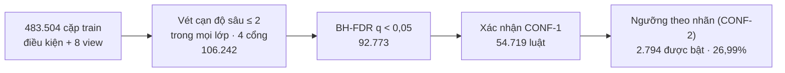
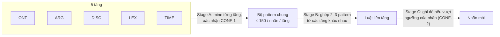
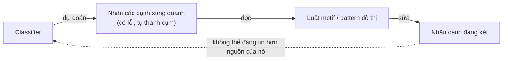

# TempEKG — Bài 1: phân loại quan hệ thời gian

**Bài toán:** cho một cặp (sự kiện hoặc TIMEX) trong cùng văn bản, đoán nhãn quan hệ thời gian
trong 6 nhãn. Tương đương "che nhãn cạnh trên valid rồi đoán lại".

**Kết quả hiện tại:** macro-F1 **31,36%** trên cả 188.924 cạnh valid (luôn đoán BEFORE: 15,30%).
Riêng EV–EV: **26,99%** với bộ luật mine trên toàn bộ train, **27,44%** sau luật liên tầng.

Kiến trúc chung (dữ liệu, KG, chia tập, thiết kế tầng) ở `TEMPEKG_KIEN_TRUC.md`. Bộ luật (luật là gì,
dựng ra sao, ví dụ luật thật và cách luật bắn trên một cặp thật) ở `RULESET.md`.

---

## 1. Quy trình


| Bước | macro-F1 gộp | Ghi chú |
|---|---|---|
| Luôn đoán BEFORE | 15,30% | baseline |
| 2.1 Classifier từng loại cạnh | 30,09% | EV–EV 26,99 · EV→TIMEX 29,74 · TIMEX→EV 24,29 · TIMEX–TIMEX 32,98 |
| 2.2 + luật liên tầng | 30,84% | EV–EV 27,44 · 30,51 · 26,24 · 34,93 |
| 2.3 + suy luận chung tam giác | **31,36%** | cross-fit trên valid |

**So với bộ 257 luật cũ** (chỉ chọn trên 400 document train đầu):

| Bước | Bộ cũ (257 + 719 luật trigger) | Bộ mới: mine toàn train (2.794 luật hoạt động; bộ gọn 378 luật cùng dự đoán) |
|---|---|---|
| 2.1 EV–EV | 26,15% | **26,99%** |
| 2.1 gộp | 29,87% | **30,09%** |
| 2.2 EV–EV | 26,50% | **27,44%** |
| 2.2 gộp | 30,83% | 30,84% |
| 2.3 gộp | **31,70%** | 31,36% |

Bộ mới hơn rõ ở EV–EV, nhưng lợi thế gần như không còn khi gộp bốn loại cạnh, và sau suy luận tam
giác thì thấp hơn 0,34. Chưa đo dao động theo seed cho các bước này, nên chưa kết luận được chênh lệch
0,3–0,4 là thật hay nhiễu. Tài liệu dùng bộ mới làm số chính vì nó không phải bỏ 400 document train
bị in-sample.

---

## 2. Một luật trông thế nào

Luật có `wlb` cao nhất trong **bộ 378 luật đang dùng** (xem mục 3):

```json
{"view": "etype_a", "sig": "Military_operation",
 "conds": [["ALL", "roleset_a", "Location"]],
 "rel": "CONTAINS", "k": 245, "n": 345, "ck": 31, "cn": 31, "wlb": 0.890, "base": 0.373}
```

*Trong lớp “A là một chiến dịch quân sự”, nếu tham số duy nhất của A là địa điểm thì A CONTAINS B.*
Đúng 245/345 lần trên DISCOVERY (nơi luật được đề xuất) và 31/31 trên CONFIRMATION-1 (nhãn chưa từng
dùng để chọn luật).

Hàm `pair_features` tính mọi đặc trưng của một cặp **mà không đọc nhãn của cặp đó**: loại sự kiện,
cặp loại, thứ tự và khoảng cách câu, vị trí câu, tập vai trò, loại entity, neo chung, số lần nhắc.
Mỗi đặc trưng sinh ra điều kiện nguyên tử (trung bình 40,9 điều kiện mỗi cặp):

| Dạng | Nghĩa | Ví dụ thật | Số lần trong 54.719 luật sau xác nhận |
|---|---|---|---|
| EQ | thuộc tính bằng đúng giá trị | `EQ(type_b, Bodily_harm)` | 37.616 |
| HAS | tập chứa giá trị | `HAS(roleset_a, Cause)` | 35.715 |
| CNT | tập có đúng k phần tử | `CNT(anchor_roles, 3)` | 11.023 |
| REL | so sánh giữa hai sự kiện | `REL(a_before_b, False)` | 10.454 |
| MIX | tập có ít nhất 2 loại phần tử | — | 4.590 |
| ALL | tập chỉ gồm đúng giá trị đó | `ALL(etypeset_a, Person)` | 3.416 |

**Chấm luật bằng Wilson lower bound**, không bằng confidence (luật rỗng đã đạt 0,91 vì 91% là BEFORE)
hay lift (5/5 cho lift 116× với SIMULTANEOUS, chỉ do may):

```
wlb(k,n) = ( p̂ + z²/2n − z·√( p̂(1−p̂)/n + z²/4n² ) ) / ( 1 + z²/n ),   p̂ = k/n,  z = 1,96
```

Xếp hạng bằng Wilson cho precision gấp 2,9 lần xếp bằng lift.

---

## 3. Bước 2.1a — Dựng bộ luật EV–EV trên toàn bộ train



- **Chia dữ liệu:** 2.913 document train chia theo hash: DISCOVERY (292.719 cặp, đề xuất luật),
  CONFIRMATION-1 (95.352, chấm lại luật), CONFIRMATION-2 (95.433, chọn combiner). Valid mở một lần.
- **View:** chia các cặp thành lớp theo 8 cách (`global`, khoảng cách câu, thứ tự, có chung entity, vị
  trí câu của A, loại của A, và hai tổ hợp), mine luật **trong từng lớp** và chấm theo tỷ lệ nền của
  chính lớp đó. Trong lớp các cặp cùng câu, BEFORE chỉ còn 79,1% (toàn train 91,0%) và SIMULTANEOUS tăng từ 0,86% lên 5,4%.
- **Vét cạn bằng bitset:** mỗi điều kiện là một số nguyên có bit i bật khi cặp i thoả; support của luật
  hai điều kiện là `popcount(mask_a & mask_b)`. Duyệt **mọi** cặp điều kiện trong mọi lớp (40 đơn vị
  view × nhãn, 4 tiến trình, 74 giây).
- **Bốn cổng trên DISCOVERY:** `n ≥ 25` và `k ≥ 8`; lift trong lớp ≥ 1,5; các lần bắn đúng nằm ở ≥ 5 document (luật từ 2–3
  document rớt 19,2 điểm precision khi sang valid); Δlogit ≥ 0,5 so với điều kiện cha tốt nhất. Sau đó
  **Benjamini–Hochberg** q < 0,05, dùng kiểm định nhị thức so với tỷ lệ nền (thiết kế gốc dùng 200 hoán
  vị theo document, quá chậm trên 480 nghìn cặp).
- **Xác nhận:** giữ luật có `cn ≥ 10` và `wlb(ck, cn)` lớn hơn tỷ lệ nền trên CONFIRMATION-1.
- **Combiner:** trung bình 147 luật bắn trên một cặp. Luật chỉ được bỏ phiếu khi `wlb` vượt ngưỡng
  precision của nhãn nó; cặp nhận nhãn của luật có `wlb` cao nhất, không có thì BEFORE. Ngưỡng chọn
  trên CONFIRMATION-2 (26,36%, thắng `max-norm` cũ 25,88%).

| Nhãn (EV–EV, valid) | Số cạnh | 257 luật: F1 | Toàn train: P | R | F1 |
|---|---|---|---|---|---|
| BEFORE | 98.866 | 93,50% | 93,62% | 93,43% | 93,53% |
| CONTAINS | 9.391 | 40,61% | 42,06% | 42,92% | 42,49% |
| SIMULTANEOUS | 1.062 | 15,87% | 17,17% | 15,07% | 16,05% |
| OVERLAP | 570 | 3,61% | 8,67% | 11,40% | **9,85%** |
| BEGINS-ON / ENDS-ON | 25 / 15 | 0% | 0% | 0% | 0% |
| **Macro-F1** | | **25,60%** | | | **26,99%** |

**Số luật qua từng bước và luật mạnh nhất trong bộ 378:**

| Nhãn | Sau xác nhận | Được bật | Bộ 378 | Ngưỡng (CONF-2) | Luật mạnh nhất trong bộ 378: lớp · điều kiện · DISCOVERY · CONF-1 |
|---|---|---|---|---|---|
| CONTAINS | 29.049 | 2.109 | 276 | 0,5 | `etype_a = Military_operation` · `roleset_a = {Location}` · 245/345 · 31/31 (wlb 0,890) |
| SIMULTANEOUS | 20.538 | 278 | 55 | 0,15 | `etype_a = Damaging` · `a_before_b = False ∧ cùng câu` · 11/54 · 8/18 (wlb 0,246) |
| OVERLAP | 4.583 | 407 | 47 | 0,1 | `sdist = 0` · `roleset_a ∋ Victim ∧ type_b = Bodily_harm` · 36/98 · 13/34 (wlb 0,239) |
| BEGINS-ON | 523 | 0 | 0 | tắt | tốt nhất (theo wlb) 12/1.968 trên CONFIRMATION (0,6%) |
| ENDS-ON | 26 | 0 | 0 | tắt | tốt nhất (theo wlb) 4/1.412 (0,3%) |
| **Tổng** | **54.719** | **2.794** | **378** | | bộ 378: 58 luật một điều kiện, 320 luật hai điều kiện |

Luật mạnh nhất trong 54.719 luật (`bucket_a = lead` · `type_a = Hostile_encounter ∧ nrole_a = 0`, 239/254 ·
37/37, wlb 0,906) không nằm trong bộ 378: mọi cặp nó bắn đã có luật CONTAINS khác vượt ngưỡng và thắng
mọi nhãn khác, nên bỏ nó không đổi dự đoán.

**Ví dụ thật: luật bắn thế nào trên một cặp valid.** *Cyclone Forrest* — “… the system produced
significant storm surge, **damaged** or **destroyed** 1,700 homes …” (A = destroyed, B = damaged,
gold SIMULTANEOUS). 1.066 luật bắn; chỉ hai vượt ngưỡng: `a_before_b = False ∧ CNT(anchor_roles, 3)`
→ SIMULTANEOUS (wlb 0,152) và `HAS(anchor_roles, (Agent, Agent)) ∧ HAS(roleset_b, Loss)` → OVERLAP
(wlb 0,127). SIMULTANEOUS có `wlb` cao hơn nên thắng — đúng. Thêm ví dụ ở `RULESET.md` §5.

Nhiều luật gần trùng giữa các view (`sdist = 0`, `sent_gap = 0`, `order = same` cùng nói "cùng câu"),
nên 54.719 luật không phải 54.719 phát biểu độc lập; combiner chỉ lấy luật mạnh nhất nên bản trùng
không bị đếm hai lần.

**Rút gọn có chứng minh: 54.719 → 378 luật, cùng dự đoán** (chi tiết và chứng minh: `RULESET.md` §12;
danh sách theo họ: `RULES_COMPACT.md`):

| Bước | Lý do toán học | Số luật | Dự đoán |
|---|---|---|---|
| Bỏ luật dưới ngưỡng | không bao giờ vào tập bỏ phiếu | 2.794 | giống hệt, mọi nơi |
| Gộp luật trùng phần mở rộng | quan hệ tương đương (cùng tập cặp bắn); 54.719 luật = 33.215 phát biểu | 1.621 | giống hệt |
| **Set cover giữ dự đoán** | mỗi cặp cần một luật cùng nhãn thắng mọi nhãn khác; greedy + xoá ngược, chặn dưới 377 | **378** (209 họ) | giống hệt trên dữ liệu dựng; valid 99,979%, macro-F1 26,99% |
| Set cover giữ dự đoán đúng | mỗi cặp đoán đúng vẫn đúng | 279 (170 họ) | valid macro-F1 27,02%, accuracy 88,11% |

Các bước 2.2, 2.3 và Bài 2 chạy trên dự đoán của 2.794 luật hoạt động; bộ 378 lệch khoảng 23 cặp valid
(0,021%) nên chưa chạy lại, và thay đổi nếu có sẽ rất nhỏ.

Greedy cách tối ưu tối đa 1 luật (377 ≤ OPT ≤ 378). Nhãn hiếm được giữ: 55 luật SIMULTANEOUS, 47
OVERLAP — khác set cover gộp nhãn trước đây chỉ giữ CONTAINS.

**Cùng cách rút gọn cho mọi bộ luật của Bài 1** — tổng **68.495 → 713 luật**:

| Bộ luật | Sau xác nhận / qua cổng | Hoạt động | Phát biểu khác nhau | **Phủ A** (chặn dưới) | Valid: giữ nguyên / macro-F1 |
|---|---|---|---|---|---|
| EV–EV (2.1) | 54.719 | 2.794 | 1.621 | **378** (377) | 99,979% / 26,99% |
| EV→TIMEX (2.1) | 1.412 | 134 | 125 | **45** (45) | 100% / 29,74% |
| TIMEX→EV (2.1) | 1.710 | 598 | 583 | **93** (93) | 99,997% / 24,29% |
| TIMEX–TIMEX (2.1) | 416 | 100 | 90 | **16** (16) | 100% / 32,98% |
| Liên tầng EV–EV (2.2) | 7.856 | 1.595 | 1.015 | **152** (152) | 99,979% / 27,41% |
| Liên tầng EV→TIMEX | 959 | 273 | 217 | **12** (12) | 99,989% / 30,58% |
| Liên tầng TIMEX→EV | 875 | 6 | 6 | **5** (5) | 100% / 26,24% |
| Liên tầng TIMEX–TIMEX | 548 | 221 | 121 | **12** (12) | 100% / 34,93% |
| **Bài 1 tổng** | **68.495** | **5.721** | | **713** (712) | |
| Auditor Bài 2 (mỗi fold · mục tiêu) | 1.433–1.559 | 87–287 | | **42–83** (42–83) | 99,985–99,993% |

Mọi phủ A trừ EV–EV bằng đúng chặn dưới, tức là **tối ưu**; EV–EV cách tối ưu tối đa 1 luật. Luật liên tầng
dùng combiner ghi đè, nên tập cặp cần giữ gồm cả những cặp mà luật đề xuất đúng nhãn đang có để chặn nhãn
khác (`experiments/rules_full/rule_cover.py`). Script: `compress_timex.py`, `compress_layered.py`; bộ gọn:
`src/artifacts/rules_compact_timex.json`, `rules_compact_layered.json`. Chạy lại bước liên tầng để xuất luật
cho 30,83% thay vì 30,84% (207 / 981.319 dự đoán khác nhau): bước này không tái lập từng bit, vì thứ tự duyệt
set phụ thuộc hash seed.

> **Bộ cũ (257 luật)** chọn trên 400 document train đầu: 155.467 luật thô (beam search 8 view) →
> 1.453 họ trừu tượng (không qua subsumption) → 4.380 (gộp với nhánh vét cạn độ sâu 2 chỉ ở view `global`) → 861 (bốn cổng) → 257 (top
> 30% theo Wilson trên CONFIRMATION), 25,60%; thêm 719 luật từ trigger (ví dụ `trigger_a = "wars"` →
> CONTAINS, 0,93) được 26,15%. Bộ mới đạt 26,99% không cần luật trigger.

---

## 4. Bước 2.1b — Ba loại cạnh TIMEX

Mỗi chiều một mô hình luật. Đặc trưng: phía sự kiện (loại, trigger, vị trí), phía TIMEX (loại, độ mịn
lịch, từ nội dung như "war", "century"), hình học văn bản (cùng câu, khoảng cách, TIMEX gần nhất),
giới từ ngay trước TIMEX (in, on, during, since, between…), và so sánh lịch cho TIMEX–TIMEX.

**Mỗi nhãn một ngưỡng precision riêng** (chọn trên CONFIRMATION-2). Ngưỡng chuẩn hoá theo prior dùng
chung không làm được khi prior một nhãn là 0,3% còn nhãn khác 30%.

| Loại cạnh | Luật | Luôn BEFORE | Luật: macro-F1 | F1 nổi bật |
|---|---|---|---|---|
| EV→TIMEX | 1.412 | 15,91% | 29,74% | CONTAINS 39,2 · SIMU 23,0 · OVER 21,6 |
| TIMEX→EV | 1.710 | 13,51% | 24,29% | CONTAINS 59,9 |
| TIMEX–TIMEX | 416 | 14,73% (chỉ so lịch 29,94%) | 32,98% | CONTAINS 46,3 · SIMU 60,4 |

Luật thật: `giới từ between ∧ TIMEX cách sự kiện ≤ 8 token` → OVERLAP (0,40); `giới từ of ∧ TIMEX chứa
"world"` (… World War) → TIMEX CONTAINS sự kiện (0,97); `cả hai neo được ∧ cùng giá trị lịch` →
SIMULTANEOUS (0,77).

---

## 5. Bước 2.2 — Luật liên tầng



| Loại cạnh | Classifier | Chỉ pattern từng tầng | + luật liên tầng | Nhãn được lợi |
|---|---|---|---|---|
| EV–EV | 26,99% | 27,33% | 27,44% | CONT 42,5 → 45,5 |
| EV→TIMEX | 29,74% | 30,16% | 30,51% | CONT 39,2 → 43,3 |
| TIMEX→EV | 24,29% | 26,24% | 26,24% | OVER 4,4 → 16,0 |
| TIMEX–TIMEX | 32,98% | 34,67% | 34,93% | CONT 46,3 → 57,6 |
| **Gộp** | **30,09%** | | **30,84%** | OVER 12,1 → 14,8 |

- **Trên bộ luật mới, pattern từng tầng tạo phần lớn gain** (EV–EV +0,34, TIMEX–TIMEX +1,69, TIMEX→EV
  +1,95); ghép liên tầng thêm một phần (EV–EV +0,12, EV→TIMEX +0,36, TIMEX–TIMEX +0,26, TIMEX→EV 0).
  Trên bộ cũ thì ngược lại (pattern +0,01, ghép liên tầng thêm +0,34 ở EV–EV): một phần tín hiệu mà pattern mang lại
  đã được bộ luật mới nắm sẵn.
- Luật liên tầng thật: *sự kiện ở giữa bài, giới từ "during" (DISC) + TIMEX chứa "war", "world" (LEX)* →
  TIMEX CONTAINS sự kiện (0,95); *B đứng trước A (DISC) + cùng giá trị lịch (TIME)* → SIMULTANEOUS cho
  TIMEX–TIMEX (0,77).
- Bản thử theo Event-Centric PaTeCon (hull mốc thời gian ba trị, refinement trong dàn view, BH-FDR)
  chỉ +0,09 ở EV–EV (trên bộ cũ): khi mỗi tầng chỉ còn vài trăm pattern, vét cạn tổ hợp 2–3 tìm được
  nhiều luật tốt hơn là tinh chỉnh dần.

---

## 6. Bước 2.3 — Suy luận chung theo tam giác

Dùng mô hình năng lượng tam giác của Bài 2 (xem `TEMPEKG_BAI2.md`, bước 3.2) trên đầu ra của bước 2.2:
gán nhãn cho cả document, cân giữa nhãn từng cạnh và độ hợp lý của mọi tam giác (PMI học từ gold
train). Chọn tham số theo macro-F1, cross-fit trên valid: **30,84% → 31,36%** (bộ cũ: 30,83% →
31,70%). λ và α chọn giống nhau ở cả hai fold.

---

## 7. Vì sao tín hiệu bậc cao khó dùng ở Bài 1



Đo trên classifier cũ:

| Nguồn ngữ cảnh | macro-F1 gộp |
|---|---|
| Classifier (không dùng đồ thị) | 29,87% |
| + pattern đồ thị hợp nhất, nhãn xung quanh **dự đoán** | tối đa 30,12% (+0,25) |
| + pattern đồ thị hợp nhất, nhãn xung quanh **gold** (trần) | 37,65% (+7,78), accuracy 94,92% |

- **Tính vòng tròn:** luật đọc nhãn dự đoán không thể đáng tin hơn classifier sinh ra nhãn đó.
- **Lỗi tụ cụm** (EV–EV, classifier cũ): quanh một cạnh sai, 32,9% cạnh kề cũng sai (quanh cạnh đúng:
  7,6%), nên cả tam giác thường sai cùng lúc.
- **Các biểu diễn quan sát được khác đã thử:** ngữ cảnh TIMEX không đọc quan hệ (−0,02 đến −0,04);
  đường đi qua entity có vai trò (0 luật qua cổng chặt, chỉ phủ khoảng 18% cặp).
- **Hai lỗi phương pháp đã tìm ra và sửa:** chỉ giữ nhãn đa số của chữ ký làm mọi luật thành BEFORE
  (+0,00 giả); cổng lift ≥ 2 quá lỏng với nhãn cực hiếm làm luật BEGINS-ON precision 0,1% lật hàng
  chục nghìn dự đoán.

---

## 7b. Tình trạng bộ 3, 4, 5 giữa sự kiện và TIMEX

| Cấu trúc | Đã áp dụng ở đâu | Kết quả |
|---|---|---|
| **Bộ 3**: đường A–X–B, X là sự kiện hoặc TIMEX | Bài 1: luật motif 3E/3T; Bài 2: tầng GRAPH; cả hai bài: tam giác trong suy luận chung | Bài 1: motif thực tế tối đa +0,26 (vòng tròn), trần +15,67 (bộ 257 luật cũ); suy luận tam giác +0,52. Bài 2: đơn vị suy luận chính (loại khoảng 80% lỗi bơm; lỗi classifier 15,31% → 11,62% cùng auditor 3.1) |
| **Bộ 4** dạng đường A–X–Y–B (4EE/4ET/4TE/4TT) | Bài 1: luật motif; Bài 2: tầng GRAPH | Bài 1: 0 luật qua cổng chặt khi có TIMEX ở giữa, +0,17 với 4EE; Bài 2: là một phần của tầng GRAPH |
| **Bộ 4** dạng cụm đủ 6 cạnh | thăm dò làm hạng tử suy luận chung (Bài 2, nhiễu classifier, classifier cũ) | không có tín hiệu thêm (tỷ số 0,94×): cấu hình quá thưa |
| **Bộ 3 / 4 / 5 quanh một cạnh** (1 / 2 / 3 hàng xóm chung, sự kiện hoặc TIMEX; bộ 4K thêm cạnh giữa hai hàng xóm) | **đo lại 24/09** trên cả 4 loại cạnh, protocol hiện tại (`motif345.py`); ghi đè lên classifier bước 2.2 (30,84%) | hàng xóm **gold** (trần): bộ 3 46,47%, bộ 3+4 **47,34%** (+0,87 so với bộ 3), bộ 3+4+5 47,21% (bộ 5 không thêm). Hàng xóm **dự đoán** (thực tế): bộ 3 31,53% (+0,69), bộ 3+4 31,60%, bộ 3+4+5 **31,62%** (+0,78; bộ 4 và 5 chỉ thêm +0,09) |
| **Bộ 5** dạng đường A–X–Y–Z–B có TIMEX | chưa chạy | bộ 5 dạng hàng xóm chung đã không thêm gì so với bộ 3+4 ở cả hai chế độ, nên kỳ vọng thấp |

Lần đo cũ bằng `quint.py` (38,30 → 37,83 → 36,94%) bị bác bỏ vì hai lỗi: gán cùng nhãn cho hai chiều của
cạnh (LUAT_BAC_CAO §10.1) và áp CAP trước khi bỏ chính cạnh đang xét (§11.1). Đo lại cho thấy bộ 4 **có**
thêm tín hiệu khi biết nhãn xung quanh (+0,87), còn trong thực tế cả bộ 4 lẫn bộ 5 gần như không thêm gì.
Ghi đè bằng motif bộ 3+4+5 (31,62%) cao hơn suy luận tam giác hiện tại (31,36%), nhưng chưa ghép hai bước.

---

## 8. Những gì đã thử mà không hiệu quả

| Hướng | Kết quả |
|---|---|
| Sáu cách chấm điểm luật thay thế (Δlogit, conditional effect, stability selection, LCB-Lift, greedy, MDL) | đều thua "giữ top 30% theo bằng chứng xác nhận, riêng từng nhãn" (bộ cũ) |
| Combiner `max-norm` với bộ 54.719 luật | 25,88% trên CONF-2, thua ngưỡng theo nhãn (26,36%) |
| Lặp / soft / joint inference với luật cũ | 19,41–23,10%, dưới pair-level 24,11% |
| Motif bộ 3, bộ 4 trên nhãn dự đoán | tối đa +0,26 |
| Ngữ cảnh TIMEX không đọc quan hệ | −0,02 đến −0,04 |
| Metapath entity–vai trò | 0 luật qua cổng chặt |
| Gộp thô các track ngữ nghĩa | mất hết gain (precision CONTAINS 39,8% → 32,7%) |
| Nhóm loại theo khung vai trò, từ nối | −0,01 / 0,00 |

---

## 9. Giới hạn và việc tiếp

- BEGINS-ON / ENDS-ON vẫn F1 = 0 trong pipeline. Mine lại theo định nghĩa RED (BEGINS-ON = cùng bắt đầu, ENDS-ON =
  meets; `experiments/begins_ends/`): macro-F1 30,84% → 31,65% (cổng chặt) hoặc 32,36% (cổng nới). Nhưng cái giá
  là sửa đúng 6–7 cạnh và làm hỏng 163–216 cạnh đúng, vì tín hiệu văn bản ("since", "from … to", "until") chỉ đi
  kèm nhãn hiếm ở 1–10% số lần. Luật đáng giữ nhất: TIMEX–TIMEX "ngày = điểm đầu của khoảng" → BEGINS-ON
  (CONF-1 7/9, valid 3/10).
- Bộ luật mới hơn bộ cũ ở EV–EV nhưng không hơn sau suy luận tam giác (31,36% so với 31,70%); cần đo
  dao động theo seed trước khi kết luận.
- Trần khi biết nhãn xung quanh là 37,65%; hiện 31,36%.
- Lemma chỉ là tách hậu tố; phân cấp loại sự kiện MAVEN chưa có trên máy.
- Chỉ đo trên MAVEN-ERE.

---

## 10. Tái tạo

| Bước | Script (trong `tempekg/`) |
|---|---|
| Bộ luật EV–EV trên toàn bộ train | `NW=4 python experiments/rules_full/mine_full.py` (khoảng 6 phút), `export_full.py` |
| Ví dụ luật bắn trên cặp thật | `experiments/rules_full/worked_example.py` |
| Classifier ba loại cạnh TIMEX | `experiments/higher_order/bai1_all_edges.py` |
| Luật liên tầng | `TAG=_full python experiments/higher_order/layered_rules.py` (khoảng 8 phút) |
| Suy luận chung tam giác | `TAG=_full python experiments/higher_order/bai2_combo.py` (khoảng 34 phút, gồm cả Bài 2) |
| Bộ 257 luật cũ, luật trigger | `python src/vote.py --tau-sweep`; `semantic_tracks.py`, `semantic_combo.py`, `semantic_export.py` |
| Đồ thị hợp nhất (trần, thực tế) | `experiments/higher_order/unified_graph.py`, `unified_diag.py` |
| Rút gọn mọi bộ luật (có chứng minh) | `experiments/rules_full/compress.py`, `compress_timex.py`, `compress_layered.py` (dùng `rule_cover.py`) |
| Bộ 3 / 4 / 5 đo lại | `python experiments/higher_order/motif345.py gold` và `... pred` (khoảng 11 phút mỗi lượt) |
| BEGINS-ON / ENDS-ON theo định nghĩa RED | `experiments/begins_ends/s01…s06*.py` |

Số liệu chi tiết: `RULESET.md`, `TEMPEKG_TOAN_HOC.md`, `LUAT_BAC_CAO.md` §13–19, `STATUS.md` §22–35.

---

## Phụ lục — Số liệu chi tiết

Tất cả trên valid (710 document). P, R, F1 theo từng nhãn; macro-F1 là trung bình F1 của 6 nhãn
(nhãn không xuất hiện trong một loại cạnh vẫn tính F1 = 0). Nguồn: log trong `experiments/logs/` và
`experiments/rules_full/mine_full.log`.

### P.1 EV–EV (109.929 cạnh), từng nhãn, ba bộ luật

| Nhãn | Số cạnh | 257 luật: P | R | F1 | + trigger: F1 | Toàn train: P | R | F1 | Luôn BEFORE: F1 |
|---|---|---|---|---|---|---|---|---|---|
| BEFORE | 98.866 | 93,42% | 93,59% | 93,50% | 93,29% | 93,62% | 93,43% | 93,53% | 94,70% |
| CONTAINS | 9.391 | 39,79% | 41,47% | 40,61% | 44,11% | 42,06% | 42,92% | 42,49% | 0% |
| SIMULTANEOUS | 1.062 | 15,92% | 15,82% | 15,87% | 15,87% | 17,17% | 15,07% | 16,05% | 0% |
| OVERLAP | 570 | 27,50% | 1,93% | 3,61% | 3,61% | 8,67% | 11,40% | 9,85% | 0% |
| BEGINS-ON | 25 | 0% | 0% | 0% | 0% | 0% | 0% | 0% | 0% |
| ENDS-ON | 15 | 0% | 0% | 0% | 0% | 0% | 0% | 0% | 0% |
| **Macro-F1** | | | | **25,60%** | **26,15%** | | | **26,99%** | 15,78% |
| Accuracy | | | | 87,87% | 87,59% | | | 87,90% | 89,94% |

### P.2 Ba loại cạnh TIMEX, từng nhãn (bước 2.1)

| Loại cạnh | Nhãn | Số cạnh | P | R | F1 |
|---|---|---|---|---|---|
| EV→TIMEX (macro 29,74%, acc 89,44%) | BEFORE | 24.264 | 94,6% | 94,7% | 94,6% |
| | CONTAINS | 1.799 | 41,1% | 37,5% | 39,2% |
| | SIMULTANEOUS | 84 | 21,2% | 25,0% | 23,0% |
| | OVERLAP | 408 | 18,7% | 25,7% | 21,6% |
| | BEGINS-ON / ENDS-ON | 14 / 4 | 0 | 0 | 0 |
| TIMEX→EV (macro 24,29%, acc 74,09%) | BEFORE | 27.209 | 81,9% | 81,1% | 81,5% |
| | CONTAINS | 12.232 | 58,5% | 61,3% | 59,9% |
| | OVERLAP | 494 | 9,4% | 2,8% | 4,4% |
| TIMEX–TIMEX (macro 32,98%, acc 84,35%) | BEFORE | 9.888 | 85,5% | 97,5% | 91,1% |
| | CONTAINS | 2.128 | 74,3% | 33,6% | 46,3% |
| | SIMULTANEOUS | 328 | 70,2% | 53,0% | 60,4% |
| | OVERLAP / BEGINS-ON / ENDS-ON | 98 / 30 / 15 | 0 | 0 | 0 |
| TIMEX–TIMEX, chỉ so lịch (macro 29,94%) | BEFORE / CONTAINS / SIMU | | 83,0 / 92,1 / 70,2 | 99,5 / 17,0 / 53,0 | 90,5 / 28,7 / 60,4 |

### P.3 Gộp 188.924 cạnh, F1 từng nhãn qua từng bước

| Nhãn | Số cạnh | 2.1 Classifier: P / R / F1 | 2.2 + liên tầng | 2.3 + tam giác | + Bài 2 (3.1→3.2, macro) |
|---|---|---|---|---|---|
| BEFORE | 160.227 | 91,2 / 91,8 / 91,5 | 91,3 | 92,3 | 93,1 |
| CONTAINS | 25.550 | 51,6 / 50,6 / 51,1 | 52,9 | 53,7 | 56,6 |
| SIMULTANEOUS | 1.474 | 27,8 / 24,1 / 25,8 | 26,0 | 25,7 | 28,4 |
| OVERLAP | 1.570 | 12,6 / 11,7 / 12,1 | 14,8 | 14,6 | 13,4 |
| BEGINS-ON | 69 | 0 | 0 | 0 | 0 |
| ENDS-ON | 34 | 0 | 0 | 0 | 0 |
| **Macro-F1** | | **30,09%** | **30,84%** | **31,36%** | **31,89%** |
| Accuracy | | 84,96% | 84,69% | 86,17% | 87,47% |

Hai cột cuối là cross-fit trên valid; hai cột đầu dùng protocol DISCOVERY / CONFIRMATION. Với bộ 257
luật cũ, hàng macro-F1 là 29,87 / 30,83 / 31,70 / 32,25%.

### P.4 Luật liên tầng theo loại cạnh, F1 từng nhãn

| Loại cạnh | Macro-F1: trước → sau | BEFORE | CONTAINS | SIMU | OVER | Pattern / luật liên tầng |
|---|---|---|---|---|---|---|
| EV–EV | 26,99 → 27,44 | 93,1 | 45,5 | 16,1 | 9,8 | 1.673 / 6.184 |
| EV→TIMEX | 29,74 → 30,51 | 94,6 | 43,3 | 23,1 | 22,1 | 245 / 715 |
| TIMEX→EV | 24,29 → 26,24 | 81,5 | 59,9 | — | 16,0 | 248 / 627 |
| TIMEX–TIMEX | 32,98 → 34,93 | 91,7 | 57,6 | 60,3 | 0 | 98 / 450 |

### P.5 Track ngữ nghĩa cho EV–EV (cổng chặt, trên bộ 257 luật cũ)

| Track | Số luật | Macro-F1 | Chênh | F1 CONTAINS | Cổng lift: macro-F1 |
|---|---|---|---|---|---|
| LEX (từ trigger) | 922 | 26,06% | +0,46 | 43,8% | 25,49% |
| DUR (từ điển bao chứa) | 174 | 25,99% | +0,39 | 44,4% | 21,19% |
| GRP (nhóm khung vai trò) | 110 | 25,59% | −0,01 | 41,1% | 22,11% |
| CONN (từ nối) | 71 | 25,60% | 0,00 | 40,7% | 24,78% |
| Gộp thô cả bốn | 1.488 | 25,61% | +0,01 | 43,1% | 21,37% |
| SUBEVENT/CAUSE gold (trần) | 303 | 26,78% | +1,18 | 47,3% | 26,69% |
| **Chọn trên CONFIRMATION: LEX, ngưỡng +0,05** | **719** | **26,15%** | **+0,55** | **44,11%** | |

### P.6 Motif bậc 3 và bậc 4 trên EV–EV (cổng chặt, trên bộ 257 luật cũ)

| Họ motif | Oracle (nhãn xung quanh gold) | Thực tế (nhãn xung quanh dự đoán) |
|---|---|---|
| 3E: A–E–B | 41,19% (+15,59) | 25,86% (+0,26) |
| 3T: A–TIMEX–B | 31,04% (+5,44) | 25,77% (+0,17) |
| 4EE | 29,07% (+3,47) | 25,77% (+0,17) |
| 4ET | 30,64% (+5,04) | 0 luật qua cổng |
| 4TE | 28,83% (+3,23) | 0 luật qua cổng |
| 4TT | 30,24% (+4,64) | 0 luật qua cổng |
| **Gộp** | **41,27% (+15,67)** | **25,86% (+0,26)** |

### P.7 Đồ thị hợp nhất theo loại cạnh (macro-F1, classifier cũ)

| Cấu hình | Gộp | EV–EV | EV→TIMEX | TIMEX→EV | TIMEX–TIMEX |
|---|---|---|---|---|---|
| Classifier bước 2.1 | 29,87% | 26,15% | 29,74% | 24,29% | 32,98% |
| + pattern đồ thị, nhãn xung quanh dự đoán (cross-fit) | 30,12% | 26,47% | 29,66% | 23,98% | 32,98% |
| + pattern đồ thị, nhãn xung quanh gold (trần) | 37,65% | 33,61% | 30,74% | 36,38% | 41,41% |
