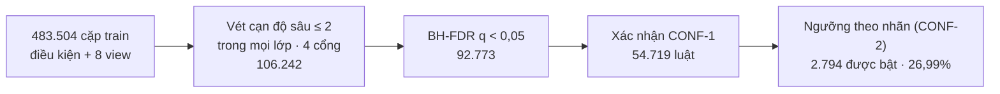
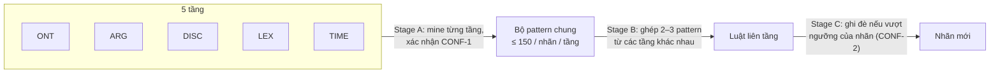

# TempEKG — Bài 1: phân loại quan hệ thời gian

**Bài toán:** cho một cặp (sự kiện hoặc TIMEX) trong cùng văn bản, đoán nhãn quan hệ thời gian trong 6 nhãn.
Tương đương "che toàn bộ nhãn cạnh trên valid rồi đoán lại". Biết cặp nào có quan hệ, chỉ không biết nhãn.
Bài 1 chỉ dùng thông tin của từng cặp, không bao giờ đọc nhãn thời gian của cạnh khác. Đồ thị dự đoán của Bài 1
là đầu vào của Bài 2.

## Kết quả chính

Macro-F1 trên valid (710 document, 188.924 cạnh), theo loại cạnh:

| Bước | EV–EV | EV→TIMEX | TIMEX→EV | TIMEX–TIMEX | **Gộp** |
|---|---|---|---|---|---|
| Luôn đoán BEFORE | 15,78% | 15,91% | 13,51% | 14,73% | 15,30% |
| 2.1 Luật riêng cho từng loại cạnh | 26,99% | 29,74% | 24,29% | 32,98% | 30,09% |
| **2.2 + luật liên tầng (kết quả Bài 1)** | **27,44%** | **30,51%** | **26,24%** | **34,93%** | **30,84%** |

Số luật: 68.495 sau xác nhận, 5.721 được bật; rút gọn có chứng minh còn **713 luật** cho cùng dự đoán.
F1 từng nhãn ở phụ lục P.1–P.4. Các so sánh và biến thể nằm riêng ở mục 8 (Ablation).

Kiến trúc chung (dữ liệu, KG, chia tập, thiết kế tầng) ở `TEMPEKG_KIEN_TRUC.md`. Bộ luật (luật là gì,
dựng ra sao, ví dụ luật thật và cách luật bắn trên một cặp thật) ở `RULESET.md`. Bản đồ cả dự án ở
`TEMPEKG_TONG_QUAN.md`.

---

## 1. Quy trình


```mermaid
flowchart LR
    F["Đặc trưng quan sát được<br/>(không đọc nhãn thời gian)"] --> C["2.1 Classifier luật<br/>theo từng loại cạnh"]
    C -->|"30,09%"| L["2.2 Luật liên tầng<br/>ghi đè khi đủ chắc"]
    L -->|"30,84%"| O["Nhãn cho mọi cạnh<br/>= đầu vào Bài 2"]
```

---

## 2. Một luật trông thế nào

Luật có `wlb` cao nhất trong **bộ 378 luật đang dùng** (xem mục 3):

```json
{"view": "etype_a", "sig": "Military_operation",
 "conds": [["ALL", "roleset_a", "Location"]],
 "rel": "CONTAINS", "k": 245, "n": 345, "ck": 31, "cn": 31, "wlb": 0.890, "base": 0.373}
```

*Trong lớp “A là một chiến dịch quân sự”, nếu tham số duy nhất của A là địa điểm thì A CONTAINS B.*
Đúng 245/345 lần trên DISCOVERY (nơi luật được đề xuất) và 31/31 trên CONFIRMATION-1 (nhãn chưa từng
dùng để chọn luật).

Hàm `pair_features` tính mọi đặc trưng của một cặp **mà không đọc nhãn của cặp đó**: loại sự kiện,
cặp loại, thứ tự và khoảng cách câu, vị trí câu, tập vai trò, loại entity, neo chung, số lần nhắc.
Mỗi đặc trưng sinh ra điều kiện nguyên tử (trung bình 40,9 điều kiện mỗi cặp):

| Dạng | Nghĩa | Ví dụ thật | Số lần trong 54.719 luật sau xác nhận |
|---|---|---|---|
| EQ | thuộc tính bằng đúng giá trị | `EQ(type_b, Bodily_harm)` | 37.616 |
| HAS | tập chứa giá trị | `HAS(roleset_a, Cause)` | 35.715 |
| CNT | tập có đúng k phần tử | `CNT(anchor_roles, 3)` | 11.023 |
| REL | so sánh giữa hai sự kiện | `REL(a_before_b, False)` | 10.454 |
| MIX | tập có ít nhất 2 loại phần tử | — | 4.590 |
| ALL | tập chỉ gồm đúng giá trị đó | `ALL(etypeset_a, Person)` | 3.416 |

**Chấm luật bằng Wilson lower bound**, không bằng confidence (luật rỗng đã đạt 0,91 vì 91% là BEFORE)
hay lift (5/5 cho lift 116× với SIMULTANEOUS, chỉ do may):

```
wlb(k,n) = ( p̂ + z²/2n − z·√( p̂(1−p̂)/n + z²/4n² ) ) / ( 1 + z²/n ),   p̂ = k/n,  z = 1,96
```

Xếp hạng bằng Wilson cho precision gấp 2,9 lần xếp bằng lift.

---

## 3. Bước 2.1a — Dựng bộ luật EV–EV trên toàn bộ train


```mermaid
flowchart LR
    A["483.504 cặp train<br/>điều kiện + 8 view"] --> B["Vét cạn độ sâu ≤ 2<br/>trong mọi lớp · 4 cổng<br/>106.242"]
    B --> C["BH-FDR q < 0,05<br/>92.773"]
    C --> D["Xác nhận CONF-1<br/>54.719 luật"]
    D --> E["Ngưỡng theo nhãn (CONF-2)<br/>2.794 được bật · 26,99%"]
```

- **Chia dữ liệu:** 2.913 document train chia theo hash: DISCOVERY (292.719 cặp, đề xuất luật),
  CONFIRMATION-1 (95.352, chấm lại luật), CONFIRMATION-2 (95.433, chọn combiner). Valid mở một lần.
- **View:** chia các cặp thành lớp theo 8 cách (`global`, khoảng cách câu, thứ tự, có chung entity, vị
  trí câu của A, loại của A, và hai tổ hợp), mine luật **trong từng lớp** và chấm theo tỷ lệ nền của
  chính lớp đó. Trong lớp các cặp cùng câu, BEFORE chỉ còn 79,1% (toàn train 91,0%) và SIMULTANEOUS tăng
  từ 0,86% lên 5,4%.
- **Vét cạn bằng bitset:** mỗi điều kiện là một số nguyên có bit i bật khi cặp i thoả; support của luật
  hai điều kiện là `popcount(mask_a & mask_b)`. Duyệt **mọi** cặp điều kiện trong mọi lớp (40 đơn vị
  view × nhãn, 4 tiến trình, 74 giây).
- **Bốn cổng trên DISCOVERY:** `n ≥ 25` và `k ≥ 8`; lift trong lớp ≥ 1,5; các lần bắn đúng nằm ở ≥ 5
  document (luật từ 2–3 document rớt 19,2 điểm precision khi sang valid); Δlogit ≥ 0,5 so với điều kiện cha
  tốt nhất. Sau đó **Benjamini–Hochberg** q < 0,05, dùng kiểm định nhị thức so với tỷ lệ nền.
- **Xác nhận:** giữ luật có `cn ≥ 10` và `wlb(ck, cn)` lớn hơn tỷ lệ nền trên CONFIRMATION-1.
- **Combiner:** trung bình 147 luật bắn trên một cặp. Luật chỉ được bỏ phiếu khi `wlb` vượt ngưỡng
  precision của nhãn nó; cặp nhận nhãn của luật có `wlb` cao nhất, không có thì BEFORE. Ngưỡng chọn
  trên CONFIRMATION-2: CONTAINS 0,5, SIMULTANEOUS 0,15, OVERLAP 0,1; BEGINS-ON và ENDS-ON bị tắt vì luật tốt
  nhất chỉ đúng 0,3–0,6%.
- **Rút gọn có chứng minh:** 54.719 → 2.794 được bật → 1.621 phát biểu khác nhau → **378 luật** (set cover
  giữ nguyên dự đoán, chặn dưới 377). Bộ 378 vẫn giữ nhãn hiếm: 55 luật SIMULTANEOUS, 47 OVERLAP. Chi tiết
  và chứng minh ở `RULESET.md` §12, danh sách theo họ ở `RULES_COMPACT.md`.

**Ví dụ thật: luật bắn thế nào trên một cặp valid.** *Cyclone Forrest* — “… the system produced
significant storm surge, **damaged** or **destroyed** 1,700 homes …” (A = destroyed, B = damaged,
gold SIMULTANEOUS). 1.066 luật bắn; chỉ hai vượt ngưỡng: `a_before_b = False ∧ CNT(anchor_roles, 3)`
→ SIMULTANEOUS (wlb 0,152) và `HAS(anchor_roles, (Agent, Agent)) ∧ HAS(roleset_b, Loss)` → OVERLAP
(wlb 0,127). SIMULTANEOUS có `wlb` cao hơn nên thắng — đúng. Thêm ví dụ ở `RULESET.md` §5.

---

## 4. Bước 2.1b — Ba loại cạnh TIMEX

Mỗi chiều một mô hình luật. Đặc trưng: phía sự kiện (loại, trigger, vị trí), phía TIMEX (loại, độ mịn
lịch, từ nội dung như "war", "century"), hình học văn bản (cùng câu, khoảng cách, TIMEX gần nhất),
giới từ ngay trước TIMEX (in, on, during, since, between…), và so sánh lịch cho TIMEX–TIMEX. Số luật:
EV→TIMEX 1.412, TIMEX→EV 1.710, TIMEX–TIMEX 416.

**Mỗi nhãn một ngưỡng precision riêng** (chọn trên CONFIRMATION-2). Ngưỡng chuẩn hoá theo prior dùng
chung không làm được khi prior một nhãn là 0,3% còn nhãn khác 30%.

Luật thật: `giới từ between ∧ TIMEX cách sự kiện ≤ 8 token` → OVERLAP (0,40); `giới từ of ∧ TIMEX chứa
"world"` (… World War) → TIMEX CONTAINS sự kiện (0,97); `cả hai neo được ∧ cùng giá trị lịch` →
SIMULTANEOUS (0,77).

---

## 5. Bước 2.2 — Luật liên tầng


```mermaid
flowchart LR
    subgraph T["5 tầng"]
        ONT["ONT"]; ARG["ARG"]; DISC["DISC"]; LEX["LEX"]; TIME["TIME"]
    end
    T -->|"Stage A: mine từng tầng,<br/>xác nhận CONF-1"| P["Bộ pattern chung<br/>≤ 150 / nhãn / tầng"]
    P -->|"Stage B: ghép 2–3 pattern<br/>từ các tầng khác nhau"| R["Luật liên tầng"]
    R -->|"Stage C: ghi đè nếu vượt<br/>ngưỡng của nhãn (CONF-2)"| O["Nhãn mới"]
```

- Tầng: ONT (loại sự kiện, loại TIMEX), ARG (vai trò, entity, neo chung), DISC (vị trí, khoảng cách, từ nối,
  giới từ), LEX (trigger, từ điển bao chứa, từ trong TIMEX), TIME (TIMEX gần, độ mịn lịch, so sánh lịch).
- Đây vẫn là luật theo từng cặp, **không phải transitivity**: không luật nào đọc nhãn của cạnh khác.
- Luật liên tầng thật: *sự kiện ở giữa bài, giới từ "during" (DISC) + TIMEX chứa "war", "world" (LEX)* →
  TIMEX CONTAINS sự kiện (0,95); *B đứng trước A (DISC) + cùng giá trị lịch (TIME)* → SIMULTANEOUS cho
  TIMEX–TIMEX (0,77).
- Gain lớn nhất: CONTAINS của TIMEX–TIMEX 46,3 → 57,6, OVERLAP của TIMEX→EV 4,4 → 16,0 (phụ lục P.4).

---

## 6. Ranh giới với Bài 2

Mọi phương pháp đọc nhãn của các cạnh xung quanh (mô hình tam giác, tầng GRAPH, luật motif) thuộc Bài 2, vì
chúng dùng cấu trúc cả đồ thị. Ở Bài 1, nhãn xung quanh chỉ có thể là nhãn dự đoán, và luật đọc nhãn dự đoán
không thể đáng tin hơn classifier sinh ra nhãn đó (tính vòng tròn; số đo ở mục 8.5). Các phiên bản trước có
"bước 2.3" chạy mô hình tam giác ngay trên đầu ra 2.2; bước đó giờ là dòng ablation "chỉ 3.2" của Bài 2.

---

## 7. Giới hạn đã biết

- BEGINS-ON / ENDS-ON có F1 = 0 (69 và 34 cạnh valid). Mine lại theo định nghĩa RED (BEGINS-ON = cùng bắt đầu,
  ENDS-ON = meets; `experiments/begins_ends/`) nâng macro-F1 30,84% → 31,65% (cổng chặt) hoặc 32,36% (cổng nới),
  nhưng chỉ sửa đúng 6–7 cạnh và làm hỏng 163–216 cạnh đúng, vì tín hiệu văn bản ("since", "from … to",
  "until") chỉ đi kèm nhãn hiếm ở 1–10% số lần.
- Trần khi biết nhãn gold xung quanh là 37,65% (đo với classifier cũ); Bài 1 hiện 30,84%.
- Lemma chỉ là tách hậu tố; phân cấp loại sự kiện MAVEN chưa có trên máy. Chỉ đo trên MAVEN-ERE.
- Chưa đo dao động theo seed cho cả pipeline; đổi cách chia train làm EV–EV dao động khoảng 0,5 điểm (mục 8.2).

---

## 8. Ablation

Mọi dòng dưới đây là so sánh phụ; số chính ở bảng đầu tài liệu.

### 8.1 Bộ luật cũ (257 luật) và bộ luật mới

| Bước (macro-F1) | Bộ cũ: 257 + 719 luật trigger, chọn trên 400 document | **Bộ mới: mine toàn train** |
|---|---|---|
| 2.1 EV–EV | 26,15% | **26,99%** |
| 2.1 gộp | 29,87% | **30,09%** |
| 2.2 EV–EV | 26,50% | **27,44%** |
| 2.2 gộp | 30,83% | 30,84% |

Bộ mới hơn rõ ở EV–EV nhưng gần như bằng khi gộp bốn loại cạnh. Bộ cũ: 155.467 luật thô → 1.453 họ →
4.380 → 861 (bốn cổng) → 257 (top 30% theo Wilson), 25,60%; thêm 719 luật trigger được 26,15%. Tài liệu dùng
bộ mới vì nó không phải bỏ 400 document train bị in-sample.

### 8.2 Cách dùng dữ liệu train để tìm và chấm luật (EV–EV)

| Cách | Luật hoạt động | Valid macro-F1 |
|---|---|---|
| **A: 60 / 20 / 20 (pipeline chính)** | 2.794 | **26,99%** |
| A, cách chia train khác (seed 1) | — | 26,51% |
| C: K-fold (K = 5), hợp luật mọi fold | 6.787 | 26,32% |
| C + lọc ổn định (luật được cả 5 fold chọn) | 4.975 | 26,39% |

Chênh A − C (0,6) cỡ bằng dao động của chính A khi đổi cách chia, nên không kết luận A tốt hơn C. Chi tiết:
`RULESET.md` §3.6; script `kfold_mine.py`, `kfold_stab.py`.

### 8.3 Pattern từng tầng và luật liên tầng (bước 2.2)

| Loại cạnh | 2.1 | Chỉ pattern từng tầng | + luật liên tầng |
|---|---|---|---|
| EV–EV | 26,99% | 27,33% | 27,44% |
| EV→TIMEX | 29,74% | 30,16% | 30,51% |
| TIMEX→EV | 24,29% | 26,24% | 26,24% |
| TIMEX–TIMEX | 32,98% | 34,67% | 34,93% |

Pattern từng tầng tạo phần lớn gain; ghép liên tầng thêm một phần. Bản thử theo Event-Centric PaTeCon (hull mốc
thời gian ba trị, refinement trong dàn view) chỉ +0,09 ở EV–EV (bộ cũ).

### 8.4 Bỏ toàn bộ đặc trưng MAVEN-Arg

| | Có MAVEN-Arg | Không MAVEN-Arg |
|---|---|---|
| Luật EV–EV sau xác nhận | 54.719 | 8.559 |
| 2.1 EV–EV | 26,99% | 26,56% |
| 2.1 gộp | 30,09% | 29,86% |
| 2.2 gộp (kết quả Bài 1) | 30,84% | 30,74% |

Chênh lệch nằm trong dao động do cách chia: MAVEN-Arg không có đóng góp đo được (`STATUS.md` §39).

### 8.5 Tín hiệu bậc cao ở Bài 1 (đọc nhãn cạnh xung quanh)

| Nguồn ngữ cảnh (classifier cũ) | Macro-F1 gộp |
|---|---|
| Classifier, không dùng đồ thị | 29,87% |
| + pattern đồ thị, nhãn xung quanh **dự đoán** | tối đa 30,12% (+0,25) |
| + pattern đồ thị, nhãn xung quanh **gold** (trần) | 37,65% (+7,78) |

Đo lại bộ 3 / 4 / 5 quanh một cạnh trên classifier hiện tại (`motif345.py`, ghi đè lên 30,84%): với nhãn
xung quanh gold, bộ 3 46,47%, bộ 3+4 47,34%, bộ 3+4+5 47,21%; với nhãn dự đoán, chỉ 31,53–31,62%. Tín hiệu có
thật nhưng chỉ dùng được khi nhãn xung quanh là quan sát, tức ở Bài 2. Lỗi classifier tụ cụm (classifier cũ): quanh một cạnh
sai, 32,9% cạnh kề cũng sai (quanh cạnh đúng: 7,6%).

### 8.6 Những hướng đã thử mà không hiệu quả

| Hướng | Kết quả |
|---|---|
| Sáu cách chấm điểm luật thay thế (Δlogit, conditional effect, stability selection, LCB-Lift, greedy, MDL) | đều thua "giữ top 30% theo bằng chứng xác nhận, riêng từng nhãn" (bộ cũ) |
| Combiner `max-norm` với 54.719 luật | 25,88% trên CONF-2, thua ngưỡng theo nhãn (26,36%) |
| Lặp / soft / joint inference với luật cũ | 19,41–23,10%, dưới pair-level 24,11% |
| Ngữ cảnh TIMEX không đọc quan hệ | −0,02 đến −0,04 |
| Metapath entity–vai trò | 0 luật qua cổng chặt |
| Gộp thô các track ngữ nghĩa | mất hết gain (precision CONTAINS 39,8% → 32,7%) |
| Nhóm loại theo khung vai trò, từ nối | −0,01 / 0,00 |

---

## 9. Tái tạo

| Bước | Script (trong `tempekg/`) |
|---|---|
| Bộ luật EV–EV trên toàn bộ train | `NW=4 python experiments/rules_full/mine_full.py` (khoảng 6 phút), `export_full.py` |
| Ví dụ luật bắn trên cặp thật | `experiments/rules_full/worked_example.py` |
| Classifier ba loại cạnh TIMEX | `experiments/higher_order/bai1_all_edges.py` |
| Luật liên tầng | `TAG=_full python experiments/higher_order/layered_rules.py` (khoảng 8 phút) |
| Bài 2 (mô hình tam giác, auditor) | `TAG=_full python experiments/higher_order/bai2_combo.py` (khoảng 34 phút) |
| Bộ 257 luật cũ, luật trigger | `python src/vote.py --tau-sweep`; `semantic_tracks.py`, `semantic_combo.py`, `semantic_export.py` |
| Đồ thị hợp nhất (trần, thực tế) | `experiments/higher_order/unified_graph.py`, `unified_diag.py` |
| Rút gọn mọi bộ luật (có chứng minh) | `experiments/rules_full/compress.py`, `compress_timex.py`, `compress_layered.py` (dùng `rule_cover.py`) |
| Bộ 3 / 4 / 5 đo lại | `python experiments/higher_order/motif345.py gold` và `... pred` (khoảng 11 phút mỗi lượt) |
| BEGINS-ON / ENDS-ON theo định nghĩa RED | `experiments/begins_ends/s01…s06*.py` |

Số liệu chi tiết: `RULESET.md`, `TEMPEKG_TOAN_HOC.md`, `LUAT_BAC_CAO.md` §13–19, `STATUS.md` §22–35.

---

## Phụ lục — Số liệu chi tiết

Tất cả trên valid (710 document). P, R, F1 theo từng nhãn; macro-F1 là trung bình F1 của 6 nhãn
(nhãn không xuất hiện trong một loại cạnh vẫn tính F1 = 0). Nguồn: log trong `experiments/logs/` và
`experiments/rules_full/mine_full.log`.

### P.1 EV–EV (109.929 cạnh), từng nhãn, ba bộ luật

| Nhãn | Số cạnh | 257 luật: P | R | F1 | + trigger: F1 | Toàn train: P | R | F1 | Luôn BEFORE: F1 |
|---|---|---|---|---|---|---|---|---|---|
| BEFORE | 98.866 | 93,42% | 93,59% | 93,50% | 93,29% | 93,62% | 93,43% | 93,53% | 94,70% |
| CONTAINS | 9.391 | 39,79% | 41,47% | 40,61% | 44,11% | 42,06% | 42,92% | 42,49% | 0% |
| SIMULTANEOUS | 1.062 | 15,92% | 15,82% | 15,87% | 15,87% | 17,17% | 15,07% | 16,05% | 0% |
| OVERLAP | 570 | 27,50% | 1,93% | 3,61% | 3,61% | 8,67% | 11,40% | 9,85% | 0% |
| BEGINS-ON | 25 | 0% | 0% | 0% | 0% | 0% | 0% | 0% | 0% |
| ENDS-ON | 15 | 0% | 0% | 0% | 0% | 0% | 0% | 0% | 0% |
| **Macro-F1** | | | | **25,60%** | **26,15%** | | | **26,99%** | 15,78% |
| Accuracy | | | | 87,87% | 87,59% | | | 87,90% | 89,94% |

### P.2 Ba loại cạnh TIMEX, từng nhãn (bước 2.1)

| Loại cạnh | Nhãn | Số cạnh | P | R | F1 |
|---|---|---|---|---|---|
| EV→TIMEX (macro 29,74%, acc 89,44%) | BEFORE | 24.264 | 94,6% | 94,7% | 94,6% |
| | CONTAINS | 1.799 | 41,1% | 37,5% | 39,2% |
| | SIMULTANEOUS | 84 | 21,2% | 25,0% | 23,0% |
| | OVERLAP | 408 | 18,7% | 25,7% | 21,6% |
| | BEGINS-ON / ENDS-ON | 14 / 4 | 0 | 0 | 0 |
| TIMEX→EV (macro 24,29%, acc 74,09%) | BEFORE | 27.209 | 81,9% | 81,1% | 81,5% |
| | CONTAINS | 12.232 | 58,5% | 61,3% | 59,9% |
| | OVERLAP | 494 | 9,4% | 2,8% | 4,4% |
| TIMEX–TIMEX (macro 32,98%, acc 84,35%) | BEFORE | 9.888 | 85,5% | 97,5% | 91,1% |
| | CONTAINS | 2.128 | 74,3% | 33,6% | 46,3% |
| | SIMULTANEOUS | 328 | 70,2% | 53,0% | 60,4% |
| | OVERLAP / BEGINS-ON / ENDS-ON | 98 / 30 / 15 | 0 | 0 | 0 |
| TIMEX–TIMEX, chỉ so lịch (macro 29,94%) | BEFORE / CONTAINS / SIMU | | 83,0 / 92,1 / 70,2 | 99,5 / 17,0 / 53,0 | 90,5 / 28,7 / 60,4 |

### P.3 Gộp 188.924 cạnh, F1 từng nhãn qua từng bước

| Nhãn | Số cạnh | 2.1 Classifier: P / R / F1 | 2.2 + liên tầng (Bài 1) | Bài 2: chỉ tam giác | Bài 2: 3.1→3.2 (macro) |
|---|---|---|---|---|---|
| BEFORE | 160.227 | 91,2 / 91,8 / 91,5 | 91,3 | 92,3 | 93,1 |
| CONTAINS | 25.550 | 51,6 / 50,6 / 51,1 | 52,9 | 53,7 | 56,6 |
| SIMULTANEOUS | 1.474 | 27,8 / 24,1 / 25,8 | 26,0 | 25,7 | 28,4 |
| OVERLAP | 1.570 | 12,6 / 11,7 / 12,1 | 14,8 | 14,6 | 13,4 |
| BEGINS-ON | 69 | 0 | 0 | cộng với ENDS-ON ≈ 1,9\* | ≈ 0\* |
| ENDS-ON | 34 | 0 | 0 | (xem trên) | (xem trên) |
| **Macro-F1** | | **30,09%** | **30,84%** | **31,36%** | **31,89%** |
| Accuracy | | 84,96% | 84,69% | 86,17% | 87,47% |

\* Log gốc của hai cột Bài 2 chỉ in F1 của 4 nhãn chính. Cộng ngược từ macro-F1: ở cột "chỉ tam giác", F1 của
BEGINS-ON và ENDS-ON cộng lại khoảng **1,9 điểm** (1,6–2,1 do làm tròn; 6 × 31,36 − (92,3 + 53,7 + 25,7 + 14,6)),
tức là bước tam giác đoán đúng được một ít cạnh của hai nhãn này. Ở cột Bài 2 phần đó xấp xỉ 0. Số chính xác từng
nhãn sẽ có khi chạy lại bước này với bản `bai2_combo.py` đã sửa để in đủ 6 nhãn.

Hai cột cuối là cross-fit trên valid; hai cột đầu dùng protocol DISCOVERY / CONFIRMATION. Với bộ 257
luật cũ, hàng macro-F1 là 29,87 / 30,83 / 31,70 / 32,25%.

### P.4 Luật liên tầng theo loại cạnh, F1 từng nhãn

| Loại cạnh | Macro-F1: trước → sau | BEFORE | CONTAINS | SIMU | OVER | Pattern / luật liên tầng |
|---|---|---|---|---|---|---|
| EV–EV | 26,99 → 27,44 | 93,1 | 45,5 | 16,1 | 9,8 | 1.673 / 6.184 |
| EV→TIMEX | 29,74 → 30,51 | 94,6 | 43,3 | 23,1 | 22,1 | 245 / 715 |
| TIMEX→EV | 24,29 → 26,24 | 81,5 | 59,9 | — | 16,0 | 248 / 627 |
| TIMEX–TIMEX | 32,98 → 34,93 | 91,7 | 57,6 | 60,3 | 0 | 98 / 450 |

### P.5 Track ngữ nghĩa cho EV–EV (cổng chặt, trên bộ 257 luật cũ)

| Track | Số luật | Macro-F1 | Chênh | F1 CONTAINS | Cổng lift: macro-F1 |
|---|---|---|---|---|---|
| LEX (từ trigger) | 922 | 26,06% | +0,46 | 43,8% | 25,49% |
| DUR (từ điển bao chứa) | 174 | 25,99% | +0,39 | 44,4% | 21,19% |
| GRP (nhóm khung vai trò) | 110 | 25,59% | −0,01 | 41,1% | 22,11% |
| CONN (từ nối) | 71 | 25,60% | 0,00 | 40,7% | 24,78% |
| Gộp thô cả bốn | 1.488 | 25,61% | +0,01 | 43,1% | 21,37% |
| SUBEVENT/CAUSE gold (trần) | 303 | 26,78% | +1,18 | 47,3% | 26,69% |
| **Chọn trên CONFIRMATION: LEX, ngưỡng +0,05** | **719** | **26,15%** | **+0,55** | **44,11%** | |

### P.6 Motif bậc 3 và bậc 4 trên EV–EV (cổng chặt, trên bộ 257 luật cũ)

| Họ motif | Oracle (nhãn xung quanh gold) | Thực tế (nhãn xung quanh dự đoán) |
|---|---|---|
| 3E: A–E–B | 41,19% (+15,59) | 25,86% (+0,26) |
| 3T: A–TIMEX–B | 31,04% (+5,44) | 25,77% (+0,17) |
| 4EE | 29,07% (+3,47) | 25,77% (+0,17) |
| 4ET | 30,64% (+5,04) | 0 luật qua cổng |
| 4TE | 28,83% (+3,23) | 0 luật qua cổng |
| 4TT | 30,24% (+4,64) | 0 luật qua cổng |
| **Gộp** | **41,27% (+15,67)** | **25,86% (+0,26)** |

### P.7 Đồ thị hợp nhất theo loại cạnh (macro-F1, classifier cũ)

| Cấu hình | Gộp | EV–EV | EV→TIMEX | TIMEX→EV | TIMEX–TIMEX |
|---|---|---|---|---|---|
| Classifier bước 2.1 | 29,87% | 26,15% | 29,74% | 24,29% | 32,98% |
| + pattern đồ thị, nhãn xung quanh dự đoán (cross-fit) | 30,12% | 26,47% | 29,66% | 23,98% | 32,98% |
| + pattern đồ thị, nhãn xung quanh gold (trần) | 37,65% | 33,61% | 30,74% | 36,38% | 41,41% |
