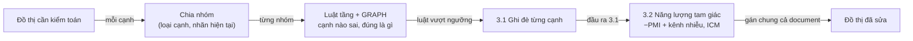
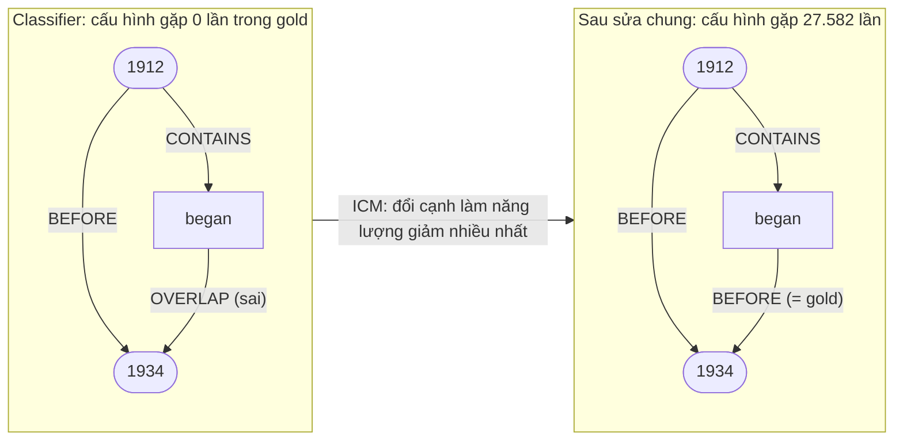

# TempEKG — Bài 2: kiểm toán đồ thị thời gian có nhiễu

**Bài toán:** cho một đồ thị thời gian *đã có* nhưng chứa cạnh sai, tìm cạnh sai và sửa lại.

**Kết quả hiện tại** (cả bốn loại cạnh, 188.924 cạnh valid):

| Nhiễu | Trước | Sau | Ghi chú |
|---|---|---|---|
| Classifier (đầu ra Bài 1) | lỗi 15,31%, macro-F1 30,84% | lỗi **11,62%**, hoặc macro-F1 **31,89%** | cross-fit trên valid |
| Bơm 10% | lỗi 9,94% | **1,94%** | loại khoảng 80% lỗi |
| Bơm 20% | lỗi 19,89% | **4,16%** | |

Classifier đầu vào dùng bộ luật EV–EV mine trên toàn bộ train (2.794 luật hoạt động; bộ gọn 378 luật cho
cùng dự đoán). Với bộ 257 luật cũ: lỗi
15,11% → 11,81%, hoặc macro-F1 32,25%.

Kiến trúc chung ở `TEMPEKG_KIEN_TRUC.md`; bộ luật (kể cả luật của auditor) ở `RULESET.md`.

---

## 1. Vì sao Bài 2 khác Bài 1

Ở Bài 2, đồ thị cần kiểm toán đã tồn tại: các cạnh xung quanh một cạnh là **quan sát**, không phải thứ
auditor phải đoán. Vì vậy tín hiệu bậc cao mà Bài 1 không dùng được (trần +7,78 khi biết nhãn xung
quanh) lại dùng được ở đây.

**Hai nguồn nhiễu:**
- **Nhiễu classifier:** đồ thị do classifier tầng của Bài 1 dự đoán (lỗi 15,31%). Khó, vì lỗi tụ
  thành cụm và có hệ thống.
- **Nhiễu bơm:** đổi nhãn 10% hoặc 20% theo phân phối biên của từng loại cạnh, cùng cách sinh với
  fake_data (fake_data gốc chỉ đổi cạnh EV–EV; ở đây mở rộng sang cả cạnh TIMEX).

---

## 2. Thước đo

| Thước đo | Nghĩa |
|---|---|
| P | trong các cạnh bị gắn cờ, bao nhiêu thật sự sai |
| R | trong tổng số cạnh sai, tìm ra được bao nhiêu |
| F1 phát hiện | trung bình điều hoà của P và R |
| Giảm lỗi ròng | cạnh sửa đúng trừ cạnh đúng bị làm hỏng |
| Tỷ lệ lỗi | trước và sau kiểm toán |
| Macro-F1 đồ thị | macro-F1 của toàn bộ nhãn sau khi sửa — nối Bài 1 và Bài 2 bằng cùng một thước |
| Nền báo động giả | số cạnh đúng bị đổi khi chạy auditor trên đồ thị gold sạch |

Phải báo **cả tỷ lệ lỗi lẫn macro-F1**: cách rẻ nhất để giảm lỗi là lật nhãn hiếm về BEFORE, làm
nhãn hiếm biến mất (cái bẫy accuracy của Bài 1, lặp lại ở Bài 2).

---

## 3. Quy trình



---

## 4. Bước 3.1 — Auditor tầng + GRAPH

Dùng lại miner theo tầng của Bài 1 (ONT, ARG, DISC, LEX, TIME) và thêm tầng **GRAPH**: chữ ký các
đường đi a–x–b và a–x–y–b của cạnh trên đồ thị đang kiểm toán (loại node trung gian + nhãn trên
đường).

- **Luật học theo nhóm (loại cạnh, nhãn hiện tại):** trong các cạnh đang mang nhãn này, cạnh nào sai
  và đúng ra là gì. Mỗi nhãn có luật sửa riêng, nên nhãn hiếm không bị xoá hàng loạt về BEFORE.
- **Cổng thích ứng theo tỷ lệ nền của nhóm:** `k/n ≥ min(2·prior, (1+prior)/2)` và Wilson > prior.
  Cổng "lift ≥ 2" cũ không thể qua khi nhãn cần khôi phục là đa số của nhóm — 57% cạnh EV–EV mà
  classifier gán CONTAINS thực ra là BEFORE — nên bản đầu không sửa được cạnh EV–EV nào.
- **Ngưỡng precision theo (loại cạnh, nhãn)**, chọn theo giảm lỗi hoặc theo macro-F1.

**Một luật auditor trông thế nào.** Điều kiện lấy từ các tầng của Bài 1 cộng tầng GRAPH; kết luận là
nhãn đúng cho cạnh đang mang một nhãn nhất định. Ví dụ tầng GRAPH trên document thật *United States
occupation of Nicaragua*: cạnh *began → 1934* (classifier gán OVERLAP) có đường đi qua TIMEX "1912" với
chữ ký (TIMEX, *began ←CONTAINS– 1912*, *1912 –BEFORE→ 1934*). Luật dạng *"trong nhóm (EV→TIMEX,
OVERLAP), nếu có đường qua TIMEX với chữ ký này thì nhãn đúng là BEFORE"* được giữ nếu qua cổng thích
ứng và ngưỡng của nhóm. Luật mine lại trong từng fold cross-fit (học một nửa valid, chấm nửa kia), nên
không có một bộ luật cố định để liệt kê.

**Auditor dùng bao nhiêu luật.** Combiner của auditor có cùng dạng với Bài 1 (luật có `wlb` cao nhất vượt
ngưỡng quyết định, không có thì giữ nhãn hiện tại), nên cùng chứng minh set cover của `RULESET.md` §12 dùng
được, với "giữ nhãn hiện tại" thay cho BEFORE. Bộ gọn dựng trên tài liệu train của fold, chấm trên fold test:

| Fold · mục tiêu | Luật mine (pattern + liên tầng) | Hoạt động | A: giữ mọi thay đổi (chặn dưới) | B: giữ thay đổi đúng (chặn dưới) |
|---|---|---|---|---|
| 0 · giảm lỗi | 1.559 (1.409 + 150) | 211 | 83 (83) | 73 (73) |
| 0 · macro-F1 | 1.559 | 111 | 70 (70) | 67 (66) |
| 1 · giảm lỗi | 1.433 (1.294 + 139) | 287 | 76 (76) | 69 (69) |
| 1 · macro-F1 | 1.433 | 87 | 42 (42) | 36 (36) |

Bảy trong tám bộ gọn bằng đúng chặn dưới, tức là tối ưu; bộ còn lại cách tối ưu tối đa 1 luật. Trên fold
test (cộng hai fold), auditor gọn giữ nguyên đầu ra ở 99,985% (A, giảm lỗi) và 99,993% (A, macro-F1) số
cạnh; lỗi 12,80% → 12,79%, macro-F1 31,53% không đổi. Script `experiments/higher_order/bai2_compress.py`,
log `experiments/logs/bai2_compress.log`.

Bảng dưới so sánh ba biến thể auditor, **đo trên classifier cũ** (257 luật; mất khoảng 3 giờ, chưa chạy
lại). Trên classifier mới, auditor B cross-fit cho lỗi 15,31% → 12,80% (chọn theo giảm lỗi) hoặc
macro-F1 31,53% (chọn theo macro-F1), xem mục 6.

| Auditor (classifier cũ, mine trên CONF-2) | Lỗi | Macro-F1 |
|---|---|---|
| Chỉ GRAPH | 15,11% → 12,65% | 31,96% |
| **Mọi tầng + GRAPH, chọn theo giảm lỗi** | → **12,07%** | 31,97% |
| **Mọi tầng + GRAPH, chọn theo macro-F1** | → 12,91% | **32,44%** |
| Mọi tầng, không GRAPH | → 12,94% | 31,31% |

Bỏ tầng GRAPH thì kết quả kém rõ rệt, nhất là với TIMEX→EV.

---

## 5. Bước 3.2 — Sửa chung theo document trên tam giác

**Tam giác** = 3 node (sự kiện hoặc TIMEX) có đủ 3 cạnh; **cấu hình** = loại node + 3 nhãn có hướng.
Tần suất cấu hình học từ gold của DISCOVERY + CONFIRMATION-1 (2.326 document): 6,31 triệu tam giác.

**Quan sát then chốt** (đo với classifier cũ và thống kê tam giác cũ): 74,6% cạnh sai của classifier và
98,4% cạnh sai do bơm nhiễu nằm trong ít nhất một tam giác có cấu hình **chưa từng gặp trong gold**.

Ví dụ thật, *United States occupation of Nicaragua* (valid), câu 0–1: "… occupation of Nicaragua from
**1912** to 1933 … from 1898 to **1934**." / "The formal occupation **began** in 1912 …"



"began" nằm trong 1912, mà 1912 kết thúc trước 1934, nên "began OVERLAP 1934" là vô lý. Sửa chung đổi
đúng cạnh đó thành BEFORE, khớp gold.

**Mô hình năng lượng** cho mỗi document:

```
E(L) = Σ_cạnh U_e(l_e) + λ · Σ_tam giác W_t · T_t(L)

U_e(l) = −(1−α)·log P(l | loại cạnh) − log P(nhãn đang thấy | nhãn thật l)     một ngôi: prior + kênh nhiễu
T_t    = −[ log p~(cấu hình t) − Σ_{cạnh ∈ t} log P(l_e | loại cạnh) ]         tam giác: trừ PMI
```

| Thành phần | Vì sao |
|---|---|
| **PMI**, không phải tần suất thô | tần suất thô thưởng cho việc đổi hết thành BEFORE (bản bỏ phiếu thô đã làm mất nhãn hiếm) |
| **α làm yếu prior** | α = 0 là hậu nghiệm Bayes, tự nó đã lật nhãn hiếm về BEFORE: P(SIMULTANEOUS thật \| thấy SIMULTANEOUS) chỉ 28,8% với classifier hiện tại (EV–EV 17,9%) |
| **Kênh nhiễu** | nhiễu bơm: bộ sinh đã biết; nhiễu classifier: ma trận nhầm lẫn ước lượng trên tập chỉnh |
| **ICM** | đổi từng cạnh nếu năng lượng giảm; chỉ xét cạnh nằm trong tam giác có PMI âm, đẩy lại hàng xóm khi có thay đổi |
| **λ, α, cách cân** | chọn trên tập chỉnh; valid mở một lần |

| Nhiễu bơm, cả 4 loại | P | R | F1 | Lỗi | Macro-F1 | Chỉ auditor 3.1 |
|---|---|---|---|---|---|---|
| 10% | 92,32% | 88,24% | **90,23%** | 9,94% → **1,94%** | 69,1% → **85,1%** | 4,74% |
| 20% | 93,52% | 85,31% | **89,23%** | 19,89% → **4,16%** | 51,0% → **72,5%** | 7,96% |

Theo loại cạnh (20%): EV–EV 20,0% → 3,9%, EV→TIMEX 20,0% → 2,1%, TIMEX→EV 19,5% → 6,0%,
TIMEX–TIMEX 19,9% → 4,8%.

**Bộ 4 không thêm tín hiệu** (đo trên nhiễu classifier, classifier cũ): với các lỗi mà tam giác không phát hiện được, cạnh sai và cạnh đúng nằm
trong cụm 4 node "chưa gặp" với tỷ lệ gần như nhau (71,3% so với 75,6%, tỷ số 0,94×). Không gian cấu
hình bộ 4 (6⁶ tổ hợp nhãn mỗi kiểu node) quá thưa so với dữ liệu. Bộ 5 chưa đo trong khung này. Lần đo sớm
trên EV–EV (`quint.py`) chạy dưới protocol sau đó phát hiện có lỗi (LUAT_BAC_CAO §11.1), nên con số
của nó không dùng được. Đo lại có kiểm soát ở Bài 1 (`motif345.py`, nhãn hàng xóm gold — đúng tình huống
của Bài 2, nơi hàng xóm là quan sát): bộ 3 → 46,47%, thêm bộ 4 → 47,34% (+0,87), thêm bộ 5 → 47,21%. Tức là
bộ 4 dạng "hai tam giác chung một cạnh" có mang thêm tín hiệu và đáng thử làm hạng tử cho bước 3.2; bộ 5 thì
không.

---

## 6. Ghép 3.1 → 3.2 cho nhiễu classifier (cross-fit trên valid)

Mọi thứ học từ lỗi out-of-sample: valid chia 2 fold theo hash; trong fold học chia 3 phần (mine luật /
xác nhận luật / chỉnh ngưỡng, kênh nhiễu, λ, α); fold test chấm một lần; cộng hai fold.

| Cấu hình | P | R | F1 | Giảm ròng | Lỗi | Macro-F1 |
|---|---|---|---|---|---|---|
| Classifier tầng (chưa sửa) | — | — | — | — | 15,31% | 30,84% |
| Chỉ 3.1 · giảm lỗi | 66,77% | 34,23% | 45,26% | +4.736 | 12,80% | 31,24% |
| Chỉ 3.2 · giảm lỗi | 72,19% | 33,94% | 46,17% | +5.317 | 12,49% | 28,13% |
| **3.1 → 3.2 · giảm lỗi** | 69,78% | **47,04%** | **56,20%** | **+6.956** | **11,62%** | 27,90% |
| Chỉ 3.1 · macro-F1 | 68,00% | 23,51% | 34,94% | +3.465 | 13,47% | 31,53% |
| Chỉ 3.2 · macro-F1 | 67,89% | 22,33% | 33,60% | +2.793 | 13,83% | 31,36% |
| **3.1 → 3.2 · macro-F1** | 70,40% | 34,10% | 45,94% | +5.236 | 12,53% | **31,89%** |

Ghép thắng từng bước riêng ở cả hai mục tiêu. Chọn theo giảm lỗi thì macro-F1 tụt còn 27,90% (tam giác
đẩy OVERLAP về BEFORE, F1 OVERLAP còn 0,8), nên luôn báo cả hai cấu hình.

| So với bộ 257 luật cũ | Bộ cũ | Bộ mới |
|---|---|---|
| Classifier | lỗi 15,11%, macro 30,83% | lỗi 15,31%, macro 30,84% |
| 3.1 → 3.2 · giảm lỗi | lỗi 11,81% | lỗi **11,62%** |
| 3.1 → 3.2 · macro-F1 | macro **32,25%** | macro 31,89% |

Chưa đo dao động theo seed, nên chưa kết luận được chênh lệch 0,2–0,4 là thật hay nhiễu.

**Vì sao nhiễu classifier khó hơn nhiễu bơm** (đo trên EV–EV với classifier cũ, `diag_b.log`):

1. **Gần một nửa lỗi là nhãn hiếm bị đoán thành BEFORE.** Muốn lật BEFORE (classifier hiện tại đúng 91,9% khi đoán BEFORE) cần
   bằng chứng mạnh hơn classifier ở đúng chỗ nó yếu nhất — chính là bài toán của Bài 1.
2. **Lỗi classifier tụ thành cụm:** quanh một cạnh sai, 32,9% cạnh kề cũng sai (nhiễu bơm: 10,1%,
   bằng tỷ lệ chung). Mô hình kênh nhiễu coi lỗi từng cạnh độc lập nên không bắt được hết.

---

## 7. Các bước trước đó

| Giai đoạn | Làm gì | Bài học |
|---|---|---|
| E4: ba tầng kiểm toán | 21 luật tam giác EV–EV + closure Allen + date bridge; lỗi EV–EV 12,13% → 9,98% | closure một mình gần như im lặng (lỗi tụ cụm nên vẫn nhất quán); date bridge đúng 100% nhưng hiếm khi có đủ mốc |
| Auditor 175 luật, bối cảnh A/B | sáu họ motif; cạnh EV–TIMEX gold (A) hoặc dự đoán (B) | A gần gấp đôi E4 nhờ suy diễn qua mốc gold; B chỉ +7%; phải báo giảm lỗi ròng vì R_all không trừ phần làm hỏng |
| fake_data | đổi nhãn EV–EV 5–20% | auditor luật có nền báo động giả khoảng 6.000 cạnh trên đồ thị sạch (E4 đổi 5.789 cạnh đúng); auditor Bayes có kênh nhiễu sửa được, loại 71–76% lỗi |
| Macro-F1 của đồ thị | đo thêm macro-F1 sau kiểm toán | auditor chọn theo số lỗi xoá nhãn hiếm (SIMULTANEOUS F1 → 0); chia luật theo nhãn hiện tại giải quyết được |
| Đồ thị hợp nhất | pattern trên mọi sự kiện, mọi TIMEX | nhiễu bơm loại khoảng 50% lỗi; TIMEX→EV chưa sửa được cho đến khi chia theo nhãn hiện tại và dùng tam giác |

---

## 8. Benchmark conflict `results/`

Benchmark mức sự kiện: một phần mốc `time_start` bị làm giả theo bốn kiểu (dịch mốc, đảo thứ tự, làm
thô ngày, đổi từ nối).

- **Ít nhất 13 đường rò rỉ:** `timex_raw` giữ ngày thật; conflict được thêm thành dòng trùng nên dòng
  thật vẫn còn; 8 cột pipeline chỉ có giá trị ở dòng conflict; `lexical_score = 0` ở mọi dòng thật;
  `text_span` gần trùng với dòng anh em… Chỉ so `timex_raw` với `time_start` đã đạt F1 76–90%.
- **Bản trung thực:** mỗi sự kiện một dòng (conflict thay dòng thật), 7 cột đầu vào, nối với đồ thị
  TempEKG qua `cluster_id`.
- **Detector:** dạng ngày bị làm thô (`YYYY-01-01`) + ràng buộc điểm bắt đầu cho mọi quan hệ Allen
  (`BEFORE/CONTAINS/OVERLAP ⇒ start(A) ≤ start(B)`), quy trách nhiệm cho một đầu.

| Mức | P | R | F1 |
|---|---|---|---|
| 5% | 52,00% | 50,00% | 50,98% |
| 10% | 66,67% | 44,55% | 53,41% |
| 15% | 71,29% | 43,44% | 53,99% |
| 20% | 76,19% | 43,70% | 55,54% |

Cạnh do TempEKG tự dự đoán kiểm toán tốt ngang cạnh gold (47,03% so với 47,23%).

---

## 9. Giới hạn và việc tiếp

- Kênh nhiễu của bước 3.2 coi lỗi từng cạnh độc lập, trong khi lỗi classifier tụ cụm → cần kênh nhiễu
  có tương quan.
- Mỗi mức nhiễu bơm mới có một seed, và một kiểu nhiễu (đổi nhãn).
- Bộ 4–5 chỉ có ích nếu gộp cấu hình về dạng trừu tượng hơn — chưa làm.
- Gold MAVEN không có lỗi chú thích đo được: đánh giá dựa trên nhiễu bơm hoặc nhiễu classifier.
- So sánh auditor A / B / C (P.1) mới đo trên classifier cũ.
- Chưa đo dao động theo seed của cross-fit.

---

## 10. Tái tạo

| Bước | Script (trong `tempekg/`) |
|---|---|
| Auditor tầng + GRAPH | `experiments/higher_order/bai2_layered.py` |
| Sửa chung tam giác (nhiễu bơm, nhiễu classifier) | `experiments/higher_order/joint_repair.py` |
| Thăm dò tam giác, bộ 4 | `experiments/higher_order/subgraph_probe.py`, `quad_probe.py` |
| Ghép 3.1 → 3.2, cross-fit | `TAG=_full python experiments/higher_order/bai2_combo.py` (khoảng 34 phút; bỏ `TAG` để chạy trên bộ luật cũ) |
| Chẩn đoán nhiễu classifier | `experiments/higher_order/diag_b.py` |
| Rút gọn luật auditor | `TAG=_full python experiments/higher_order/bai2_compress.py` |
| Các giai đoạn trước | `bai2_auditor.py`, `fake_and_b.py`, `bayes_audit.py`, `bai2_unified.py` |
| Benchmark conflict | `experiments/benchmark_honest.py`, `benchmark_honest2.py` |

Số liệu chi tiết: `BAI2_NOISE_AWARE.md` §11–17, `BENCHMARK_AUDIT.md`, `TEMPEKG_TOAN_HOC.md` §8–9, `STATUS.md` §22–35.

---

## Phụ lục — Số liệu chi tiết

Tất cả trên valid (710 document, 188.924 cạnh trừ khi ghi khác). Nguồn: log trong `experiments/logs/`.

### P.1 Auditor tầng + GRAPH (bước 3.1): so sánh A / B / C, classifier cũ

| Nhiễu | Auditor · mục tiêu | P | R | F1 | Sửa / hỏng / ròng | Lỗi | Macro-F1 | Lỗi EV–EV · EV→TX · TX→EV · TX–TX |
|---|---|---|---|---|---|---|---|---|
| Classifier cũ (15,11%, macro 30,83%) | A chỉ GRAPH · giảm lỗi | 69,95% | 29,86% | 41,86% | 8.318 / 3.663 / +4.655 | 12,65% | 31,96% | 9,8 · 9,7 · 22,0 · 14,2 |
| | A · macro-F1 | 70,14% | 24,20% | 35,98% | 6.730 / 2.942 / +3.788 | 13,11% | 32,38% | 9,9 · 9,7 · 23,8 · 14,4 |
| | **B mọi tầng + GRAPH · giảm lỗi** | 69,73% | 37,84% | 49,05% | 10.431 / 4.690 / +5.741 | **12,07%** | 31,97% | 9,1 · 9,7 · 21,4 · 13,6 |
| | **B · macro-F1** | 70,09% | 26,82% | 38,80% | 7.438 / 3.268 / +4.170 | 12,91% | **32,44%** | 9,6 · 9,7 · 23,8 · 13,7 |
| | C không GRAPH · giảm lỗi | 75,63% | 22,73% | 34,95% | 6.191 / 2.091 / +4.100 | 12,94% | 31,31% | 9,7 · 10,1 · 23,4 · 14,4 |
| | C · macro-F1 | 72,22% | 23,68% | 35,66% | 6.458 / 2.601 / +3.857 | 13,07% | 31,58% | 9,7 · 10,3 · 23,6 · 15,1 |
| Bơm 10% (9,94%, macro 69,43%) | A · giảm lỗi | 82,59% | 64,38% | 72,36% | 12.072 / 2.548 / +9.524 | 4,90% | 76,99% | 4,3 · 3,9 · 6,7 · 6,7 |
| | **B · macro-F1** | 78,44% | 72,29% | 75,24% | 13.550 / 3.732 / +9.818 | **4,74%** | **77,11%** | 4,0 · 4,6 · 6,5 · 5,8 |
| | C · giảm lỗi | 72,29% | 56,08% | 63,16% | 10.507 / 4.038 / +6.469 | 6,52% | 73,30% | 5,4 · 5,8 · 9,9 · 7,0 |
| Bơm 20% (19,89%, macro 51,25%) | A · giảm lỗi | 85,51% | 62,82% | 72,43% | 23.562 / 4.001 / +19.561 | 9,54% | 63,51% | 8,8 · 6,8 · 12,7 · 11,3 |
| | **B · giảm lỗi** | 81,81% | 77,40% | 79,54% | 29.010 / 6.468 / +22.542 | **7,96%** | 62,41% | 6,4 · 6,4 · 12,6 · 10,2 |
| | C · giảm lỗi | 80,09% | 66,09% | 72,42% | 24.743 / 6.175 / +18.568 | 10,06% | 56,22% | 7,7 · 7,7 · 17,8 · 11,1 |

Lỗi ban đầu theo loại cạnh — classifier cũ: EV–EV 12,4%, EV→TIMEX 10,5%, TIMEX→EV 25,9%, TIMEX–TIMEX
14,4%; nhiễu bơm xấp xỉ bằng mức bơm ở mọi loại.

### P.2 Sửa chung theo tam giác (bước 3.2), một mình

Nhiễu bơm ở P.1 (`bai2_layered.py`) và P.2 (`joint_repair.py`) dùng cùng seed nên đổi nhãn đúng cùng các
cạnh (cùng tỷ lệ lỗi), nhưng chọn nhãn thay thế từ phân phối biên tính hơi khác, nên macro-F1 ban đầu
lệch nhẹ (69,43% và 69,08% ở mức 10%; 51,25% và 50,98% ở mức 20%).

| Nhiễu | Mục tiêu (cách cân, λ, α) | P | R | F1 | Sửa / hỏng / ròng | Lỗi | Macro-F1 | Lỗi EV–EV · EV→TX · TX→EV · TX–TX |
|---|---|---|---|---|---|---|---|---|
| Bơm 10% | giảm lỗi = macro-F1 (mean, 2,0, 0,5) | 92,32% | 88,24% | **90,23%** | 16.492 / 1.379 / +15.113 | 9,94% → **1,94%** | 69,08% → **85,10%** | 2,0 · 0,9 · 2,5 · 1,8 |
| Bơm 20% | giảm lỗi (mean, 1,0, 0,5) | 93,52% | 85,31% | **89,23%** | 31.943 / 2.222 / +29.721 | 19,89% → **4,16%** | 50,98% → 72,46% | 3,9 · 2,1 · 6,0 · 4,8 |
| | macro-F1 (mean, 2,0, 0,5) | 89,85% | 88,38% | 89,11% | 32.987 / 3.750 / +29.237 | → 4,42% | → **72,63%** | 4,2 · 2,4 · 6,2 · 4,8 |
| Classifier (cross-fit) | giảm lỗi (mean, 0,5, 0,0) | 72,19% | 33,94% | 46,17% | 9.097 / 3.780 / +5.317 | 15,31% → 12,49% | 30,84% → 28,13% | 9,6 · 8,3 · 22,5 · 14,4 |
| | macro-F1 (mean, 1,0, 0,5) | 67,89% | 22,33% | 33,60% | 5.847 / 3.054 / +2.793 | → 13,83% | → 31,36% | 11,1 · 9,7 · 23,3 · 16,7 |

### P.3 Ghép 3.1 → 3.2, nhiễu classifier, cross-fit trên valid

| Cấu hình | P / R / F1 | Sửa / hỏng / ròng | Lỗi | Macro-F1 | Lỗi EV–EV · EV→TX · TX→EV · TX–TX | F1 BEFO · CONT · SIMU · OVER |
|---|---|---|---|---|---|---|
| Chỉ 3.1 · giảm lỗi | 66,77 / 34,23 / 45,26 | 9.662 / 4.926 / +4.736 | 12,80% | 31,24% | 10,1 · 10,7 · 21,2 · 14,3 | 92,9 · 53,6 · 26,0 · 14,8 |
| Chỉ 3.2 · giảm lỗi | 72,19 / 33,94 / 46,17 | 9.097 / 3.780 / +5.317 | 12,49% | 28,13% | 9,6 · 8,3 · 22,5 · 14,4 | 93,0 · 51,4 · 19,5 · 2,1 |
| **3.1 → 3.2 · giảm lỗi** | 69,78 / 47,04 / 56,20 | 12.846 / 5.890 / +6.956 | **11,62%** | 27,90% | 9,2 · 8,0 · 20,0 · 14,0 | 93,6 · 53,2 · 19,9 · 0,8 |
| Chỉ 3.1 · macro-F1 | 68,00 / 23,51 / 34,94 | 6.664 / 3.199 / +3.465 | 13,47% | 31,53% | 11,2 · 10,8 · 21,2 · 14,1 | 92,5 · 55,8 · 26,0 · 14,8 |
| Chỉ 3.2 · macro-F1 | 67,89 / 22,33 / 33,60 | 5.847 / 3.054 / +2.793 | 13,83% | 31,36% | 11,1 · 9,7 · 23,3 · 16,7 | 92,3 · 53,7 · 25,7 · 14,6 |
| **3.1 → 3.2 · macro-F1** | 70,40 / 34,10 / 45,94 | 9.381 / 4.145 / +5.236 | 12,53% | **31,89%** | 10,3 · 9,2 · 20,4 · 14,6 | 93,1 · 56,6 · 28,4 · 13,4 |

Lỗi ban đầu của classifier mới: EV–EV 12,7% · EV→TIMEX 10,7% · TIMEX→EV 25,9% · TIMEX–TIMEX 14,5%, tổng
15,31%. Tham số tam giác (cách cân, λ, α) chọn giống nhau ở cả hai fold với mục tiêu giảm lỗi ((mean, 0,5, 0,0)) và
với tam giác một mình theo macro-F1 ((mean, 1,0, 0,5)); riêng 3.1 → 3.2 theo macro-F1 thì fold 0 chọn λ = 0,5, fold 1 chọn λ = 1,0.

### P.4 Loại lỗi nào sửa được (EV–EV, classifier 257 luật, luật có điều kiện cross-fit)

| Gold → classifier đoán | Số cạnh | % lỗi | Đã sửa | Nhiễu bơm 10%: số / đã sửa |
|---|---|---|---|---|
| BEFORE → CONTAINS | 5.658 | 42,4% | 84,6% | 8.380 / 83,8% |
| CONTAINS → BEFORE | 5.293 | 39,7% | 0,0% | 952 / 3,7% |
| SIMULTANEOUS → BEFORE | 738 | 5,5% | 0,0% | 94 / 0,0% |
| BEFORE → SIMULTANEOUS | 661 | 5,0% | 99,8% | 987 / 84,5% |
| OVERLAP → BEFORE | 464 | 3,5% | 0,0% | 57 / 0,0% |

Lỗi classifier tụ cụm: quanh một cạnh sai, 32,90% cạnh tam giác kề cũng sai (quanh cạnh đúng: 7,61%);
với nhiễu bơm 10% là 10,13% (bằng tỷ lệ chung). Tam giác ủng hộ nhãn sai: 10,08% so với 0,48%.

### P.5 fake_data (chỉ đổi nhãn EV–EV), đồ thị EV–EV

| Mức | Ban đầu | E4 (luật cũ) | Closure | Bayes → closure: lỗi | P / R / F1 |
|---|---|---|---|---|---|
| 5% | 4,99% | 5,67% | 3,58% | 1,45% | 81,7 / 91,6 / 86,4 |
| 10% | 10,05% | 6,30% | 7,83% | 2,69% | 87,7 / 85,6 / 86,7 |
| 15% | 15,06% | 6,83% | 12,55% | 3,69% | 88,1 / 87,7 / 87,9 |
| 20% | 20,02% | 7,85% | 17,56% | 4,95% | 87,8 / 87,9 / 87,8 |

Nền báo động giả trên đồ thị gold sạch: E4 đổi 5.789 cạnh đúng, auditor 175 luật 3.205, closure 0,
Bayes (giả định nhiễu 5%) 427.

### P.6 Benchmark conflict trung thực, mức 20% (2.191 sự kiện, 476 conflict)

| Detector | P | R | F1 | ANCHOR | ORDERING | GRANULARITY | IMPLICIT |
|---|---|---|---|---|---|---|---|
| Dạng ngày bị làm thô | 98,39% | 12,82% | 22,68% | 0/160 | 1/156 | 60/111 | 0/49 |
| Ràng buộc BEFORE, cạnh dự đoán | 73,96% | 29,83% | 42,51% | 55/160 | 54/156 | 32/111 | 1/49 |
| Ràng buộc mọi quan hệ, cạnh dự đoán | 72,17% | 34,87% | 47,03% | 69/160 | 57/156 | 38/111 | 2/49 |
| Ràng buộc mọi quan hệ, cạnh gold | 73,13% | 34,87% | 47,23% | 70/160 | 58/156 | 36/111 | 2/49 |
| Từ nối "after" (trần) | 29,10% | 19,75% | 23,53% | 21/160 | 32/156 | 11/111 | 30/49 |
| **Làm thô + mọi quan hệ** | 76,19% | 43,70% | **55,54%** | 69/160 | 57/156 | 80/111 | 2/49 |
| Làm thô + mọi quan hệ + từ nối | 71,99% | 46,43% | 56,45% | 70/160 | 59/156 | 81/111 | 11/49 |

Theo mức nhiễu (làm thô + mọi quan hệ): F1 50,98 / 53,41 / 53,99 / 55,54% ở 5 / 10 / 15 / 20%. Baseline
tầm thường trên bản gốc có rò rỉ: 76,40 / 83,82 / 87,97 / 89,69%.
