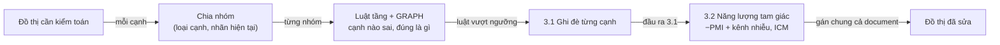
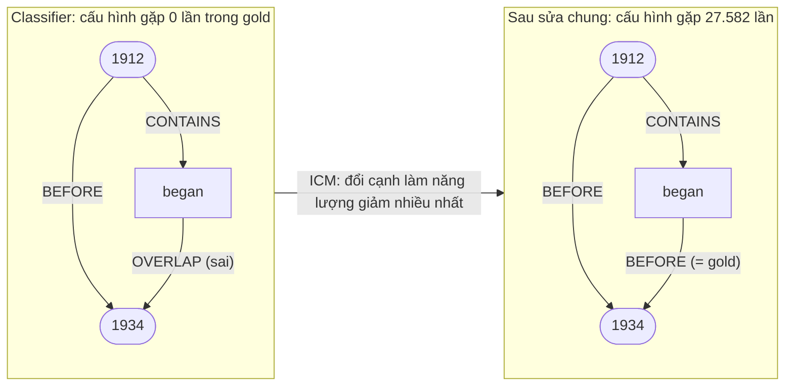

# TempEKG — Bài 2: kiểm toán đồ thị thời gian có nhiễu

**Bài toán:** cho một đồ thị thời gian *đã có nhãn* nhưng chứa cạnh sai, tìm cạnh sai và sửa lại. Khác Bài 1,
ở đây nhãn của các cạnh xung quanh là **quan sát**, nên được dùng. Đầu vào chính là đồ thị tốt nhất của Bài 1
(sau bước 2.2); ngoài ra thử trên đồ thị gold bị bơm nhiễu và trên fake_data.

Pipeline: **3.1** auditor tầng + GRAPH → **3.2** mô hình năng lượng tam giác.

## Kết quả chính

Valid (710 document). Mọi tham số (ngưỡng auditor, λ, α, cách cân) chọn theo **một mục tiêu duy nhất: macro-F1**.
Lỗi = tỷ lệ cạnh mang nhãn sai; F1 phát hiện = F1 của việc chọn đúng cạnh sai để đổi.

| Đồ thị cần kiểm toán | Phương pháp | Macro-F1: trước → sau | Lỗi: trước → sau | F1 phát hiện |
|---|---|---|---|---|
| **Đầu ra Bài 1** | 3.1 → 3.2 | 30,84% → **31,89%** | 15,31% → 12,53% | 45,9% |
| Gold bơm nhiễu 10% (4 loại cạnh) | 3.2 | 69,1% → **85,1%** | 9,94% → 1,94% | 90,2% |
| Gold bơm nhiễu 20% (4 loại cạnh) | 3.2 | 51,0% → **72,6%** | 19,89% → 4,42% | 89,1% |
| fake_data 5% (chỉ EV–EV) | 3.2 | 81,4% → **94,0%** | 4,97% → 0,96% | 90,3% |
| fake_data 10% | 3.2 | 70,2% → **84,0%** | 10,00% → 2,28% | 89,3% |
| fake_data 15% | 3.2 | 61,3% → **79,8%** | 14,98% → 2,56% | 91,6% |
| fake_data 20% | 3.2 | 52,2% → **72,7%** | 19,93% → 3,36% | 91,8% |

Đồ thị Bài 1 và nhiễu bơm tính trên cả 188.924 cạnh; fake_data tính trên 109.929 cạnh EV–EV (cạnh TIMEX giữ
gold). Các so sánh từng bước và biến thể nằm ở mục 8 (Ablation).

Kiến trúc chung ở `TEMPEKG_KIEN_TRUC.md`; luật của auditor ở `RULESET.md` §8; bản đồ cả dự án ở
`TEMPEKG_TONG_QUAN.md`.

---

## 1. Vì sao Bài 2 khác Bài 1

Ở Bài 2, đồ thị cần kiểm toán đã tồn tại: các cạnh xung quanh một cạnh là **quan sát**, không phải thứ
auditor phải đoán. Vì vậy tín hiệu bậc cao mà Bài 1 không dùng được (trần +7,78 khi biết nhãn xung
quanh) lại dùng được ở đây.

**Ba loại đồ thị cần kiểm toán:**
- **Đầu ra Bài 1:** đồ thị do classifier tầng dự đoán (lỗi 15,31%). Khó, vì lỗi tụ thành cụm và có hệ thống.
- **Gold bơm nhiễu:** đổi nhãn 10% hoặc 20% theo phân phối biên của từng loại cạnh, trên cả bốn loại cạnh.
- **fake_data:** gold valid với cạnh EV–EV bị đổi nhãn 5 / 10 / 15 / 20% (seed 0), cạnh TIMEX giữ gold.

---

## 2. Thước đo

| Thước đo | Nghĩa |
|---|---|
| P | trong các cạnh bị đổi nhãn, bao nhiêu thật sự sai |
| R | trong tổng số cạnh sai, đổi được bao nhiêu |
| F1 phát hiện | trung bình điều hoà của P và R |
| Giảm lỗi ròng | cạnh sửa đúng trừ cạnh đúng bị làm hỏng |
| Tỷ lệ lỗi | trước và sau kiểm toán |
| Macro-F1 đồ thị | macro-F1 của toàn bộ nhãn sau khi sửa — nối Bài 1 và Bài 2 bằng cùng một thước |
| Báo động giả | số cạnh đúng bị đổi khi chạy cùng tham số trên đồ thị gold sạch |

**Mục tiêu tối ưu là macro-F1**, cùng thước với Bài 1; tỷ lệ lỗi chỉ báo kèm. Lý do: cách rẻ nhất để giảm số
lỗi là lật nhãn hiếm về BEFORE, làm nhãn hiếm biến mất (cái bẫy accuracy của Bài 1, lặp lại ở Bài 2).

---

## 3. Quy trình


```mermaid
flowchart LR
    G["Đồ thị cần kiểm toán"] -->|"mỗi cạnh"| P["Chia nhóm<br/>(loại cạnh, nhãn hiện tại)"]
    P -->|"từng nhóm"| R["Luật tầng + GRAPH<br/>cạnh nào sai, đúng là gì"]
    R -->|"luật vượt ngưỡng"| S1["3.1 Ghi đè từng cạnh"]
    S1 -->|"đầu ra 3.1"| S2["3.2 Năng lượng tam giác<br/>−PMI + kênh nhiễu, ICM"]
    S2 -->|"gán chung cả document"| O["Đồ thị đã sửa"]
```

Với đầu ra Bài 1, mọi thứ học từ lỗi out-of-sample bằng **cross-fit trên valid**: valid chia 2 fold theo
hash; trong fold học chia 3 phần (mine luật / xác nhận luật / chỉnh ngưỡng, kênh nhiễu, λ, α); fold test
chấm một lần; cộng hai fold. Với nhiễu bơm và fake_data, tham số chọn trên CONFIRMATION-2 của train bị bơm
nhiễu cùng cách; valid chấm một lần.

---

## 4. Bước 3.1 — Auditor tầng + GRAPH

Dùng lại miner theo tầng của Bài 1 (ONT, ARG, DISC, LEX, TIME) và thêm tầng **GRAPH**: chữ ký các
đường đi a–x–b và a–x–y–b của cạnh trên đồ thị đang kiểm toán (loại node trung gian + nhãn trên
đường).

- **Luật học theo nhóm (loại cạnh, nhãn hiện tại):** trong các cạnh đang mang nhãn này, cạnh nào sai
  và đúng ra là gì. Mỗi nhãn có luật sửa riêng, nên nhãn hiếm không bị xoá hàng loạt về BEFORE.
- **Cổng thích ứng theo tỷ lệ nền của nhóm:** `k/n ≥ min(2·prior, (1+prior)/2)` và Wilson > prior.
  Cổng "lift ≥ 2" cũ không thể qua khi nhãn cần khôi phục là đa số của nhóm — 57% cạnh EV–EV mà
  classifier gán CONTAINS thực ra là BEFORE — nên bản đầu không sửa được cạnh EV–EV nào.
- **Ngưỡng precision theo (loại cạnh, nhãn)**, chọn theo macro-F1.

**Một luật auditor trông thế nào.** Ví dụ tầng GRAPH trên document thật *United States occupation of
Nicaragua*: cạnh *began → 1934* (classifier gán OVERLAP) có đường đi qua TIMEX "1912" với chữ ký (TIMEX,
*began ←CONTAINS– 1912*, *1912 –BEFORE→ 1934*). Luật dạng *"trong nhóm (EV→TIMEX, OVERLAP), nếu có đường qua
TIMEX với chữ ký này thì nhãn đúng là BEFORE"* được giữ nếu qua cổng và ngưỡng của nhóm.

**Số luật.** Luật mine lại trong từng fold cross-fit nên không có một bộ cố định: mỗi fold mine 1.433–1.559
luật, bật 87–111, rút gọn có chứng minh còn **42–70 luật** mà đầu ra giữ nguyên 99,993% (`RULESET.md` §8,
`bai2_compress.log`).

---

## 5. Bước 3.2 — Sửa chung theo document trên tam giác

**Tam giác** = 3 node (sự kiện hoặc TIMEX) có đủ 3 cạnh; **cấu hình** = loại node + 3 nhãn có hướng.
Tần suất cấu hình học từ gold của DISCOVERY + CONFIRMATION-1 (2.326 document): 6,31 triệu tam giác.

**Quan sát then chốt** (đo với classifier cũ): 74,6% cạnh sai của classifier và 98,4% cạnh sai do bơm nhiễu
nằm trong ít nhất một tam giác có cấu hình **chưa từng gặp trong gold**.

Ví dụ thật, *United States occupation of Nicaragua* (valid), câu 0–1: "… occupation of Nicaragua from
**1912** to 1933 … from 1898 to **1934**." / "The formal occupation **began** in 1912 …"


```mermaid
flowchart LR
    subgraph X["Classifier: cấu hình gặp 0 lần trong gold"]
        T1(["1912"]) -->|CONTAINS| E1["began"]
        T1 -->|BEFORE| T2(["1934"])
        E1 -->|"OVERLAP (sai)"| T2
    end
    subgraph Y["Sau sửa chung: cấu hình gặp 27.582 lần"]
        U1(["1912"]) -->|CONTAINS| F1["began"]
        U1 -->|BEFORE| U2(["1934"])
        F1 -->|"BEFORE (= gold)"| U2
    end
    X -->|"ICM: đổi cạnh làm năng lượng giảm nhiều nhất"| Y
```

"began" nằm trong 1912, mà 1912 kết thúc trước 1934, nên "began OVERLAP 1934" là vô lý. Sửa chung đổi
đúng cạnh đó thành BEFORE, khớp gold.

**Mô hình năng lượng** cho mỗi document:

```
E(L) = Σ_cạnh U_e(l_e) + λ · Σ_tam giác W_t · T_t(L)

U_e(l) = −(1−α)·log P(l | loại cạnh) − log P(nhãn đang thấy | nhãn thật l)     một ngôi: prior + kênh nhiễu
T_t    = −[ log p~(cấu hình t) − Σ_{cạnh ∈ t} log P(l_e | loại cạnh) ]         tam giác: trừ PMI
```

| Thành phần | Vì sao |
|---|---|
| **PMI**, không phải tần suất thô | tần suất thô thưởng cho việc đổi hết thành BEFORE (bản bỏ phiếu thô đã làm mất nhãn hiếm) |
| **α làm yếu prior** | α = 0 là hậu nghiệm Bayes, tự nó đã lật nhãn hiếm về BEFORE: P(SIMULTANEOUS thật \| thấy SIMULTANEOUS) chỉ 28,8% với classifier hiện tại (EV–EV 17,9%) |
| **Kênh nhiễu** | nhiễu bơm: bộ sinh đã biết; nhiễu classifier: ma trận nhầm lẫn ước lượng trên tập chỉnh |
| **ICM** | đổi từng cạnh nếu năng lượng giảm; chỉ xét cạnh nằm trong tam giác có PMI âm, đẩy lại hàng xóm khi có thay đổi |
| **λ, α, cách cân** | chọn bằng lưới trên tập chỉnh theo macro-F1; valid mở một lần |

---

## 6. Vì sao đầu ra Bài 1 khó sửa hơn nhiễu bơm

Đo trên EV–EV với classifier cũ (`diag_b.log`, phụ lục P.4):

1. **Gần một nửa lỗi là nhãn hiếm bị đoán thành BEFORE.** Muốn lật BEFORE (classifier hiện tại đúng 91,9% khi
   đoán BEFORE) cần bằng chứng mạnh hơn classifier ở đúng chỗ nó yếu nhất — chính là bài toán của Bài 1.
   CONTAINS → BEFORE và SIMULTANEOUS → BEFORE gần như không sửa được (0%), trong khi BEFORE → CONTAINS sửa được
   84,6%.
2. **Lỗi classifier tụ thành cụm:** quanh một cạnh sai, 32,9% cạnh kề cũng sai (nhiễu bơm: 10,1%, bằng tỷ lệ
   chung). Tam giác quanh cạnh sai vì vậy vẫn nhất quán, và mô hình kênh nhiễu (coi lỗi từng cạnh độc lập)
   không bắt được hết.

---

## 7. Các bước trước đó

| Giai đoạn | Làm gì | Bài học |
|---|---|---|
| E4: ba tầng kiểm toán | 21 luật tam giác EV–EV + closure Allen + date bridge; lỗi EV–EV 12,13% → 9,98% | closure một mình gần như im lặng (lỗi tụ cụm nên vẫn nhất quán); date bridge đúng 100% nhưng hiếm khi có đủ mốc |
| Auditor 175 luật, bối cảnh A/B | sáu họ motif; cạnh EV–TIMEX gold (A) hoặc dự đoán (B) | A gần gấp đôi E4 nhờ suy diễn qua mốc gold; B chỉ +7%; phải báo giảm lỗi ròng vì R_all không trừ phần làm hỏng |
| Macro-F1 của đồ thị | đo thêm macro-F1 sau kiểm toán | auditor chọn theo số lỗi xoá nhãn hiếm (SIMULTANEOUS F1 → 0); chia luật theo nhãn hiện tại giải quyết được |
| Đồ thị hợp nhất | pattern trên mọi sự kiện, mọi TIMEX | nhiễu bơm loại khoảng 50% lỗi; TIMEX→EV chưa sửa được cho đến khi chia theo nhãn hiện tại và dùng tam giác |

**Benchmark conflict `results/`** (mức sự kiện, mốc `time_start` bị làm giả theo bốn kiểu): bản gốc có ít
nhất 13 đường rò rỉ (chỉ so `timex_raw` với `time_start` đã đạt F1 76–90%). Trên bản trung thực, detector "dạng
ngày bị làm thô + ràng buộc điểm bắt đầu cho mọi quan hệ Allen" đạt F1 51,0 / 53,4 / 54,0 / 55,5% ở 5 / 10 / 15 /
20%; cạnh do TempEKG dự đoán kiểm toán tốt ngang cạnh gold (47,03% so với 47,23%). Chi tiết: phụ lục P.6,
`BENCHMARK_AUDIT.md`.

---

## 8. Ablation

Mọi bảng dưới đây là so sánh phụ, cùng mục tiêu macro-F1; số chính ở bảng đầu tài liệu.

### 8.1 Từng bước riêng và ghép hai bước (đầu ra Bài 1, cross-fit)

| Cấu hình | Macro-F1 | Lỗi |
|---|---|---|
| Chưa sửa | 30,84% | 15,31% |
| Chỉ 3.1 auditor | 31,53% | 13,47% |
| Chỉ 3.2 tam giác | 31,36% | 13,83% |
| **3.1 → 3.2** | **31,89%** | 12,53% |

Ghép thắng từng bước riêng. P / R / sửa / hỏng và F1 từng nhãn ở phụ lục P.3.

### 8.2 Vai trò của tầng GRAPH trong auditor (classifier cũ, chưa chạy lại)

| Auditor (đầu vào: macro-F1 30,83%, lỗi 15,11%) | Macro-F1 | Lỗi |
|---|---|---|
| Chỉ GRAPH | 32,38% | 13,11% |
| **Mọi tầng + GRAPH** | **32,44%** | 12,91% |
| Mọi tầng, không GRAPH | 31,58% | 13,07% |

Bỏ tầng GRAPH thì macro-F1 giảm 0,86 điểm (phụ lục P.1).

### 8.3 Auditor một mình và mô hình tam giác trên nhiễu bơm 10%

| | Macro-F1 | Lỗi |
|---|---|---|
| Chưa sửa | 69,4% | 9,94% |
| Chỉ 3.1 auditor | 77,1% | 4,74% |
| **Chỉ 3.2 tam giác** | **85,1%** | **1,94%** |

Theo loại cạnh ở mức 20% (3.2): EV–EV 20,0% → 4,2%, EV→TIMEX 20,0% → 2,4%, TIMEX→EV 19,5% → 6,2%,
TIMEX–TIMEX 19,9% → 4,8%.

### 8.4 Bộ luật cũ (257 luật) và bộ luật mới của Bài 1 làm đầu vào

| | Bộ cũ | Bộ mới |
|---|---|---|
| Đồ thị đầu vào | macro-F1 30,83%, lỗi 15,11% | macro-F1 30,84%, lỗi 15,31% |
| 3.1 → 3.2 | macro-F1 **32,25%**, lỗi 12,34% | macro-F1 31,89%, lỗi 12,53% |

Chưa đo dao động theo seed, nên chưa kết luận được chênh lệch 0,36 là thật hay nhiễu.

### 8.5 Bỏ toàn bộ đặc trưng MAVEN-Arg

| | Có MAVEN-Arg | Không MAVEN-Arg |
|---|---|---|
| Đồ thị đầu vào (đầu ra Bài 1) | macro-F1 30,84%, lỗi 15,31% | macro-F1 30,74%, lỗi 14,41% |
| 3.1 → 3.2 | macro-F1 31,89%, lỗi 12,53% | macro-F1 31,77%, lỗi 12,30% |

Chênh lệch nằm trong dao động do cách chia (`STATUS.md` §39).

### 8.6 fake_data chấm riêng trên các cạnh bị fake

Trước khi sửa, mọi cạnh fake đều sai nên accuracy và macro-F1 trên tập con này đều bằng 0.

| Mức | Số cạnh fake | Accuracy: 0 → | Macro-F1: 0 → | Cạnh sạch vẫn đúng | Báo động giả trên gold sạch |
|---|---|---|---|---|---|
| 5% | 5.459 | 89,3% | 24,6% | 99,6% | 401 |
| 10% | 10.993 | 93,9% | 34,0% | 98,1% | 1.603 |
| 15% | 16.468 | 91,3% | 36,0% | 98,5% | 1.102 |
| 20% | 21.906 | 91,5% | 33,4% | 97,9% | 1.323 |

Nhãn gold của cạnh fake khoảng 90% là BEFORE nên sửa về BEFORE là phần lớn công việc (F1 BEFORE 94–97).
Cạnh chưa sửa được vẫn mang nhãn fake, thường là nhãn hiếm, trong khi tập con chỉ có 33–109 cạnh SIMULTANEOUS
thật; vì vậy F1 của SIMULTANEOUS / OVERLAP dưới 25 và macro-F1 thấp. Macro-F1 trên toàn EV–EV (bảng chính) cao
vì 80–95% cạnh là gold và gần như được giữ nguyên. Log: `experiments/logs/fake_eval_subset.log`.

### 8.7 Cấu trúc lớn hơn tam giác

- **Bộ 4 dạng cụm đủ 6 cạnh** (nhiễu classifier, classifier cũ): với các lỗi mà tam giác không phát hiện được,
  cạnh sai và cạnh đúng nằm trong cụm 4 node "chưa gặp" với tỷ lệ gần như nhau (71,3% so với 75,6%, tỷ số
  0,94×): không gian cấu hình quá thưa.
- **Chuỗi 3 bước:** 99,86% cạnh đã có đường 2 bước, và 0 cạnh chỉ nối được qua 3 bước, nên không thêm gì.

---

## 9. Giới hạn và việc tiếp

- Kênh nhiễu của bước 3.2 coi lỗi từng cạnh độc lập, trong khi lỗi classifier tụ cụm → cần kênh nhiễu
  có tương quan.
- Mỗi mức nhiễu bơm mới có một seed, và một kiểu nhiễu (đổi nhãn).
- Gold MAVEN không có lỗi chú thích đo được: đánh giá dựa trên nhiễu bơm hoặc nhiễu classifier.
- So sánh auditor A / B / C (mục 8.2) mới đo trên classifier cũ.
- Chưa đo dao động theo seed của cross-fit.

---

## 10. Tái tạo

| Bước | Script (trong `tempekg/`) |
|---|---|
| Auditor tầng + GRAPH | `experiments/higher_order/bai2_layered.py` |
| Sửa chung tam giác (nhiễu bơm, nhiễu classifier) | `experiments/higher_order/joint_repair.py` |
| fake_data | `cd src; TAG=_full python ../experiments/higher_order/fake_eval.py 05 10 15 20` |
| Thăm dò tam giác, bộ 4 | `experiments/higher_order/subgraph_probe.py`, `quad_probe.py` |
| Ghép 3.1 → 3.2, cross-fit | `TAG=_full python experiments/higher_order/bai2_combo.py` (khoảng 34 phút; bỏ `TAG` để chạy trên bộ luật cũ) |
| Chẩn đoán nhiễu classifier | `experiments/higher_order/diag_b.py` |
| Rút gọn luật auditor | `TAG=_full python experiments/higher_order/bai2_compress.py` |
| Các giai đoạn trước | `bai2_auditor.py`, `fake_and_b.py`, `bayes_audit.py`, `bai2_unified.py` |
| Benchmark conflict | `experiments/benchmark_honest.py`, `benchmark_honest2.py` |

Số liệu chi tiết: `BAI2_NOISE_AWARE.md` §11–17, `BENCHMARK_AUDIT.md`, `TEMPEKG_TOAN_HOC.md` §8–9, `STATUS.md` §22–39.

---

## Phụ lục — Số liệu chi tiết

Tất cả trên valid (710 document, 188.924 cạnh trừ khi ghi khác). Nguồn: log trong `experiments/logs/`.

### P.1 Auditor tầng + GRAPH (bước 3.1): so sánh A / B / C, classifier cũ

| Nhiễu | Auditor | P | R | F1 | Sửa / hỏng / ròng | Lỗi | Macro-F1 | Lỗi EV–EV · EV→TX · TX→EV · TX–TX |
|---|---|---|---|---|---|---|---|---|
| Classifier cũ (15,11%, macro 30,83%) | A chỉ GRAPH | 70,14% | 24,20% | 35,98% | 6.730 / 2.942 / +3.788 | 13,11% | 32,38% | 9,9 · 9,7 · 23,8 · 14,4 |
| | **B mọi tầng + GRAPH** | 70,09% | 26,82% | 38,80% | 7.438 / 3.268 / +4.170 | 12,91% | **32,44%** | 9,6 · 9,7 · 23,8 · 13,7 |
| | C không GRAPH | 72,22% | 23,68% | 35,66% | 6.458 / 2.601 / +3.857 | 13,07% | 31,58% | 9,7 · 10,3 · 23,6 · 15,1 |
| Bơm 10% (9,94%, macro 69,43%) | **B** | 78,44% | 72,29% | 75,24% | 13.550 / 3.732 / +9.818 | 4,74% | **77,11%** | 4,0 · 4,6 · 6,5 · 5,8 |

Lỗi ban đầu theo loại cạnh — classifier cũ: EV–EV 12,4%, EV→TIMEX 10,5%, TIMEX→EV 25,9%, TIMEX–TIMEX
14,4%; nhiễu bơm xấp xỉ bằng mức bơm ở mọi loại.

### P.2 Sửa chung theo tam giác (bước 3.2), một mình

| Nhiễu | (cách cân, λ, α) | P | R | F1 | Sửa / hỏng / ròng | Lỗi | Macro-F1 | Lỗi EV–EV · EV→TX · TX→EV · TX–TX |
|---|---|---|---|---|---|---|---|---|
| Bơm 10% | (mean, 2,0, 0,5) | 92,32% | 88,24% | 90,23% | 16.492 / 1.379 / +15.113 | 9,94% → 1,94% | 69,08% → **85,10%** | 2,0 · 0,9 · 2,5 · 1,8 |
| Bơm 20% | (mean, 2,0, 0,5) | 89,85% | 88,38% | 89,11% | 32.987 / 3.750 / +29.237 | 19,89% → 4,42% | 50,98% → **72,63%** | 4,2 · 2,4 · 6,2 · 4,8 |
| Classifier (cross-fit) | (mean, 1,0, 0,5) | 67,89% | 22,33% | 33,60% | 5.847 / 3.054 / +2.793 | 15,31% → 13,83% | 30,84% → 31,36% | 11,1 · 9,7 · 23,3 · 16,7 |

Nhiễu bơm ở P.1 (`bai2_layered.py`) và P.2 (`joint_repair.py`) đổi nhãn đúng cùng các cạnh, nhưng chọn nhãn
thay thế hơi khác, nên macro-F1 ban đầu lệch nhẹ (69,43% và 69,08% ở mức 10%).

### P.3 Ghép 3.1 → 3.2, nhiễu classifier, cross-fit trên valid

| Cấu hình | P / R / F1 | Sửa / hỏng / ròng | Lỗi | Macro-F1 | Lỗi EV–EV · EV→TX · TX→EV · TX–TX | F1 BEFO · CONT · SIMU · OVER |
|---|---|---|---|---|---|---|
| Chỉ 3.1 | 68,00 / 23,51 / 34,94 | 6.664 / 3.199 / +3.465 | 13,47% | 31,53% | 11,2 · 10,8 · 21,2 · 14,1 | 92,5 · 55,8 · 26,0 · 14,8 |
| Chỉ 3.2 | 67,89 / 22,33 / 33,60 | 5.847 / 3.054 / +2.793 | 13,83% | 31,36% | 11,1 · 9,7 · 23,3 · 16,7 | 92,3 · 53,7 · 25,7 · 14,6 |
| **3.1 → 3.2** | 70,40 / 34,10 / 45,94 | 9.381 / 4.145 / +5.236 | 12,53% | **31,89%** | 10,3 · 9,2 · 20,4 · 14,6 | 93,1 · 56,6 · 28,4 · 13,4 |

Lỗi ban đầu của classifier mới: EV–EV 12,7% · EV→TIMEX 10,7% · TIMEX→EV 25,9% · TIMEX–TIMEX 14,5%, tổng
15,31%. Tham số tam giác chọn trên tập chỉnh của từng fold: tam giác một mình (mean, 1,0, 0,5) ở cả hai fold;
3.1 → 3.2 thì fold 0 chọn λ = 0,5, fold 1 chọn λ = 1,0.

### P.4 Loại lỗi nào sửa được (EV–EV, classifier 257 luật, luật có điều kiện cross-fit)

| Gold → classifier đoán | Số cạnh | % lỗi | Đã sửa | Nhiễu bơm 10%: số / đã sửa |
|---|---|---|---|---|
| BEFORE → CONTAINS | 5.658 | 42,4% | 84,6% | 8.380 / 83,8% |
| CONTAINS → BEFORE | 5.293 | 39,7% | 0,0% | 952 / 3,7% |
| SIMULTANEOUS → BEFORE | 738 | 5,5% | 0,0% | 94 / 0,0% |
| BEFORE → SIMULTANEOUS | 661 | 5,0% | 99,8% | 987 / 84,5% |
| OVERLAP → BEFORE | 464 | 3,5% | 0,0% | 57 / 0,0% |

Lỗi classifier tụ cụm: quanh một cạnh sai, 32,90% cạnh tam giác kề cũng sai (quanh cạnh đúng: 7,61%);
với nhiễu bơm 10% là 10,13% (bằng tỷ lệ chung). Tam giác ủng hộ nhãn sai: 10,08% so với 0,48%.

### P.5 fake_data (chỉ đổi nhãn EV–EV): mô hình tam giác, chi tiết

| Mức | Lỗi EV–EV | P / R / F1 phát hiện | Sửa / hỏng / ròng | Macro-F1 EV–EV | Báo động giả trên gold sạch |
|---|---|---|---|---|---|
| 5% | 4,97% → 0,96% | 91,2 / 89,4 / 90,3 | 4.874 / 472 / +4.402 | 81,4 → **94,0** | 401 |
| 10% | 10,00% → 2,28% | 84,9 / 94,2 / 89,3 | 10.322 / 1.837 / +8.485 | 70,2 → **84,0** | 1.603 |
| 15% | 14,98% → 2,56% | 91,6 / 91,7 / 91,6 | 15.042 / 1.391 / +13.651 | 61,3 → **79,8** | 1.102 |
| 20% | 19,93% → 3,36% | 91,7 / 91,9 / 91,8 | 20.040 / 1.826 / +18.214 | 52,2 → **72,7** | 1.323 |

Đồ thị cần kiểm toán = đúng 4 file fake_data (gold valid, đổi nhãn EV–EV ở 5/10/15/20%; cạnh TIMEX giữ gold). Phương pháp: mô hình năng lượng tam giác (bước 3.2) một mình; tham số chọn theo macro-F1 trên CONFIRMATION-2 của train bị bơm nhiễu cùng cách, valid chấm một lần. Báo động giả = số cạnh đúng bị đổi khi chạy cùng tham số trên đồ thị gold sạch. 23–106 cạnh bị đổi được lưu ngược chiều với nhãn không đối xứng nên được giữ nhãn gold; vì vậy tỷ lệ lỗi ban đầu thấp hơn file một chút.

### P.6 Benchmark conflict trung thực, mức 20% (2.191 sự kiện, 476 conflict)

| Detector | P | R | F1 | ANCHOR | ORDERING | GRANULARITY | IMPLICIT |
|---|---|---|---|---|---|---|---|
| Dạng ngày bị làm thô | 98,39% | 12,82% | 22,68% | 0/160 | 1/156 | 60/111 | 0/49 |
| Ràng buộc BEFORE, cạnh dự đoán | 73,96% | 29,83% | 42,51% | 55/160 | 54/156 | 32/111 | 1/49 |
| Ràng buộc mọi quan hệ, cạnh dự đoán | 72,17% | 34,87% | 47,03% | 69/160 | 57/156 | 38/111 | 2/49 |
| Ràng buộc mọi quan hệ, cạnh gold | 73,13% | 34,87% | 47,23% | 70/160 | 58/156 | 36/111 | 2/49 |
| Từ nối "after" (trần) | 29,10% | 19,75% | 23,53% | 21/160 | 32/156 | 11/111 | 30/49 |
| **Làm thô + mọi quan hệ** | 76,19% | 43,70% | **55,54%** | 69/160 | 57/156 | 80/111 | 2/49 |
| Làm thô + mọi quan hệ + từ nối | 71,99% | 46,43% | 56,45% | 70/160 | 59/156 | 81/111 | 11/49 |

Theo mức nhiễu (làm thô + mọi quan hệ): F1 50,98 / 53,41 / 53,99 / 55,54% ở 5 / 10 / 15 / 20%. Baseline
tầm thường trên bản gốc có rò rỉ: 76,40 / 83,82 / 87,97 / 89,69%.
