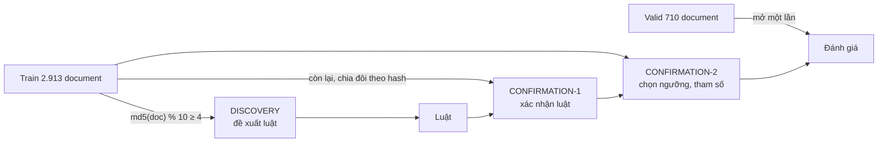
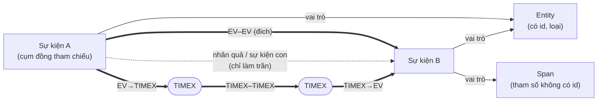
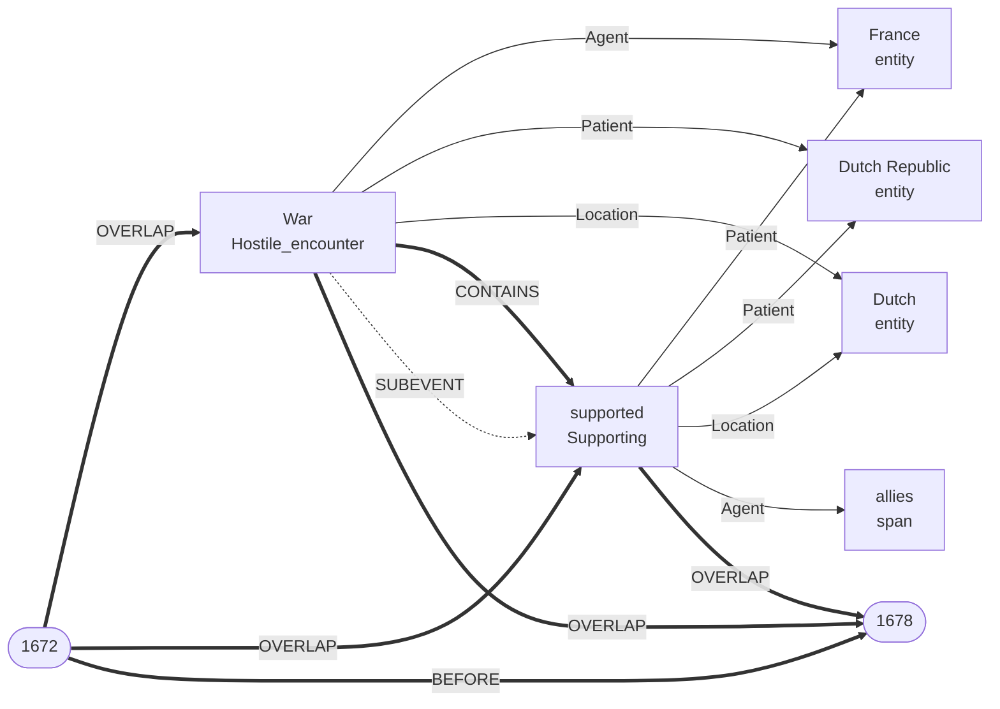
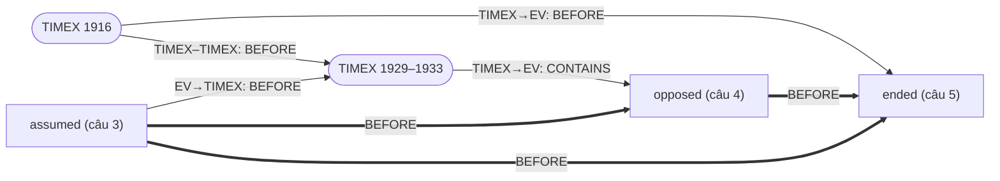
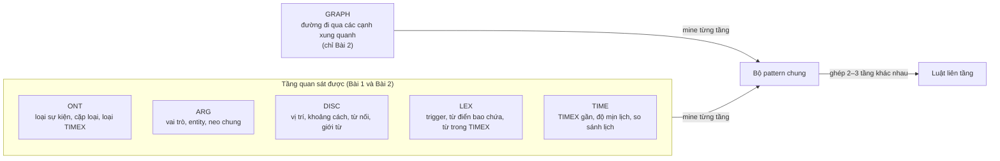
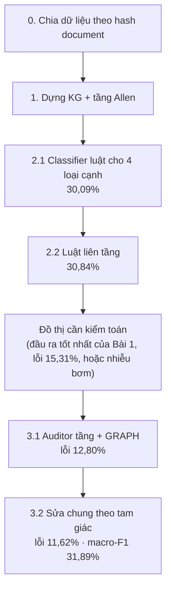

# TempEKG — Kiến trúc hệ thống

Tài liệu này mô tả kiến trúc chung dùng cho cả hai bài toán: dữ liệu, cách chia tập, đồ thị tri
thức (KG), tầng ràng buộc Allen, thiết kế theo tầng, và quy trình tổng thể. Cách giải từng bài nằm
ở `TEMPEKG_BAI1.md` và `TEMPEKG_BAI2.md`. Mọi con số đo trên MAVEN-ERE valid (710 document,
188.924 cạnh quan hệ thời gian), cập nhật 24/09/2026.

> Các sơ đồ dùng mermaid (hiển thị trong VS Code và GitHub). Bản HTML có hình vẽ tương ứng:
> `report/TEMPEKG_GIAI_THICH.html`.

---

## 1. Dữ liệu

| Nguồn | Cung cấp |
|---|---|
| **MAVEN-ERE** | sự kiện (cụm đồng tham chiếu), TIMEX, quan hệ thời gian, nhân quả, sự kiện con |
| **MAVEN-Arg** | tham số của sự kiện: ai, ở đâu, với ai (143 vai trò) |

Sáu nhãn quan hệ thời gian: BEFORE, CONTAINS, SIMULTANEOUS, OVERLAP, BEGINS-ON, ENDS-ON.

### Về BEGINS-ON và ENDS-ON

Paper MAVEN-ERE không định nghĩa hai nhãn này ("trừ SIMULTANEOUS và BEGINS-ON, các quan hệ là một chiều,
head bắt đầu trước tail"), nhưng README của repo THU-KEG/MAVEN-ERE ghi rằng quy tắc chú thích "mainly follows
RED guideline" (Richer Event Description, O'Gorman et al. 2016). RED định nghĩa:

- *"BEGINS-ON signals that the EVENT begins on the EVENT or TIMEX3 it is related to"* — ví dụ "Cramping BEGINS-ON
  January" (từ "since January"); "She was on chemo from March through July" → chemo BEGINS-ON March.
- *"ENDS-ON signals that the EVENT ends on the EVENT or TIMEX3 it is related to"* — ví dụ chemo ENDS-ON July;
  "remain ENDS-ON changes" (từ "until her condition changes").
- Bảng đại số điểm của RED: ENDS-ON là `A.end = B.start` (Allen **meets**, {m}); BEGINS-ON viết là `A+ = B-`
  (Allen {mi}).

Kiểm trên dữ liệu (`experiments/begins_ends/`, 17.353 tam giác chứa nhãn hiếm):

| Nhãn | Ý nghĩa đã chốt | Ví dụ thật |
|---|---|---|
| BEGINS-ON | hai bên bắt đầu cùng lúc (`a.s = b.s`, đối xứng; đúng câu "đối xứng" của MAVEN — cách đọc {mi} của bảng RED sinh 1.141–3.374 tam giác mâu thuẫn nên bị loại) | *Operation Mascot*: "raid … on **17 July 1944**" → `raid BEGINS-ON 17 July 1944`; *Gulf War*: "the initial **conflict** … continuing for **five weeks**" → `conflict BEGINS-ON five weeks` |
| ENDS-ON | A kết thúc **đúng lúc** B bắt đầu (Allen **meets** {m}, định nghĩa RED); dự án dùng {b, m} làm bản nới lỏng để hấp thụ 7 tam giác nhiễu trong 3 document | *Munich air disaster*: "Thain was cleared in **1968**, **ten years** after the incident" → `ten years ENDS-ON 1968` |

Cách đọc trực giác "cùng kết thúc" bị dữ liệu bác bỏ: sinh 812 bộ ba mâu thuẫn trên train, và cả 23
chuỗi ENDS-ON + ENDS-ON đều giải thành BEFORE. Ánh xạ {m} sinh 7 tam giác mâu thuẫn (42 bộ ba có
thứ tự) trong 3 document (Barbary Wars, 2007 Algiers bombings, Fulani War); {b, m} sinh 0. Nhưng đếm mâu thuẫn
không bao giờ ưu tiên được {m} vì {b, m} ⊇ {m}; phép thử phân biệt là tìm "nhân chứng" buộc có khoảng hở giữa
A.end và B.start: có ở 91–98% cạnh BEFORE nhưng chỉ 5 / 315 cạnh ENDS-ON. Vậy dữ liệu hành xử như **meets**;
{b, m} làm ENDS-ON không phân biệt được với BEFORE.

### Bốn loại cạnh thời gian (valid)

| Loại cạnh | Số cạnh | Phân bố nhãn chính |
|---|---|---|
| EV–EV (sự kiện – sự kiện) | 109.929 | BEFORE 89,9% · CONTAINS 8,5% · SIMU 1,0% · OVER 0,5% · BEGINS-ON 25 · ENDS-ON 15 |
| EV→TIMEX | 26.573 | BEFORE 91,3% · CONTAINS 6,8% · OVER 1,5% |
| TIMEX→EV | 39.935 | BEFORE 68,1% · CONTAINS 30,6% · OVER 1,2% |
| TIMEX–TIMEX | 12.487 | BEFORE 79,2% · CONTAINS 17,0% · SIMU 2,6% |
| **Tổng** | **188.924** | **BEFORE 84,8%** |

Dữ liệu cực lệch nên thước đo chính là **macro-F1** (trung bình F1 của 6 nhãn, mỗi nhãn nặng như
nhau). Luôn đoán BEFORE đạt accuracy 84,8% nhưng macro-F1 chỉ 15,30%.

---

## 2. Chia tập và chống rò rỉ

- **Chia theo document, không theo cặp**, vì các cặp trong cùng bài viết chia sẻ chủ đề và phong cách.
- **Phân quyền dữ liệu:** DISCOVERY được phép tìm luật, CONFIRMATION chỉ được phép xác nhận và chọn
  tham số. Đây là điều quyết định chất lượng bộ luật, hơn mọi cách chấm điểm tinh vi.
- **Bộ luật EV–EV mine trên toàn bộ train** theo đúng cách chia này (54.719 luật qua xác nhận, 2.794
  luật hoạt động, rút gọn có chứng minh còn 378 luật; xem `RULESET.md`). Cả Bài 1 dùng 713 luật sau rút
  gọn (từ 68.495 luật qua xác nhận).
  Bộ 257 luật cũ chỉ được chọn trên 400 document train đầu, nên khi dùng bộ cũ các bước học từ lỗi
  của classifier phải bỏ 400 document đó; với bộ mới thì không cần.
- **Cross-fit trên valid** cho các bước phải học từ lỗi out-of-sample của classifier (Bài 2): chia
  valid làm hai theo hash, học trên nửa này, chấm nửa kia, rồi đổi vai.
- **Nguyên tắc bất biến:** ở Bài 1, nhãn quan hệ thời gian không bao giờ được dùng làm đặc trưng.

---

## 3. Đồ thị tri thức (KG)

Dựng bằng `build_kg.py`, kiểm bằng `verify_kg.py` (9 bất biến, đều đạt). Build train mất 5,5 giây.

### 3.1 Node

| Loại node | Là gì | Train | Valid |
|---|---|---|---|
| event | cụm đồng tham chiếu (96,4% chỉ có một lần nhắc) | 67.984 | 16.301 |
| entity | thực thể có id | 55.421 | 12.927 |
| span | tham số không có entity id, khoá `md5(offset)`; 59,6% filler thuộc loại này | 71.485 | 17.963 |
| timex | biểu thức thời gian; DATE/TIME là `anchorable`, DURATION thì không | 16.688 | 4.139 |

Ví dụ thuộc tính một node sự kiện: `type=Hindering`, `trigger=restrain`, `sent_first=8`,
`sent_bucket=late`, `roleset=[Agent, Patient]`, `etypeset=[Organization, Person]`.

### 3.2 Ba lớp cạnh, tách vật lý

Số lượng trên valid: node sự kiện 16.301, entity 12.927, span 17.963, TIMEX 4.139; cạnh vai trò 45.978; cạnh
thời gian 188.924 (EV–EV 109.929, EV→TIMEX 26.573, TIMEX→EV 39.935, TIMEX–TIMEX 12.487); nhân quả / sự kiện con
12.524. TIMEX không có cạnh vai trò. A và B cùng trỏ tới một entity nên tạo thành một **cặp chung neo** (valid
57.959 cặp), được tính sẵn làm nguồn đặc trưng.

**Ví dụ thật**, câu đầu bài *Franco-Dutch War* (valid): "The Franco-Dutch War … was a **conflict** that lasted
**from 1672 to 1678** between the Dutch Republic and France, each **supported** by allies."

Đủ bốn loại cạnh thời gian (EV–EV, EV→TIMEX, TIMEX→EV, TIMEX–TIMEX) giữa 4 node, và War cùng supported trỏ
tới 3 entity chung nên tạo thành một cặp chung neo. Ở Bài 1, classifier chỉ thấy cạnh vai trò, loại sự kiện và
văn bản, rồi phải đoán nhãn của 6 cạnh thời gian; cạnh SUBEVENT không được dùng.

| Lớp | Nội dung | Train | Dùng làm đặc trưng? |
|---|---|---|---|
| `input_edges` | sự kiện –vai trò→ entity/span | 188.584 | có |
| `weak_edges` | CAUSE, PRECONDITION, SUBEVENT | 45.509 | chỉ làm trần: 95,2% cặp PRECONDITION đã có nhãn thời gian |
| `target_edges` | quan hệ thời gian | 792.395 | Bài 1: không bao giờ · Bài 2: là đồ thị đang kiểm toán |

Ba bất biến chống rò rỉ: `input_layer_shape`, `target_minimal`, `pairs_label_free`.

**Anchored pairs:** 244.687 cặp sự kiện chung neo (entity/span) được tính sẵn lúc build, kèm vai của
neo ở hai phía. Mining nhờ vậy thành phép *group by*, nhanh hơn 1–2 bậc.

### 3.3 Một document thật

*United States occupation of Nicaragua* (valid), nhãn gold:

- câu 3: "Nicaragua **assumed** a quasi-protectorate status under the **1916** Bryan–Chamorro Treaty."
- câu 4: "President Herbert Hoover (**1929–1933**) **opposed** the relationship."
- câu 5: "Finally in 1933 President Franklin D Roosevelt, invoking his new Good Neighbor policy **ended**
  American intervention."

Đủ bốn loại cạnh. Ba cạnh đậm giữa ba sự kiện tạo thành một **tam giác** — đơn vị suy luận của các
bước suy luận chung (Bài 2 bước 3.2).

---

## 4. Tầng ràng buộc Allen

Mỗi nhãn dịch sang tập quan hệ Allen trên hai điểm mút `(s, e)`:

| MAVEN | Allen | Bất đẳng thức |
|---|---|---|
| BEFORE | {b} | `e_a < s_b` |
| CONTAINS | {di} | `s_a < s_b ∧ e_b < e_a` |
| OVERLAP | {o} | `s_a < s_b < e_a < e_b` |
| SIMULTANEOUS | {e} | `s_a = s_b ∧ e_a = e_b` |
| BEGINS-ON | {s, si, e} | `s_a = s_b` |
| ENDS-ON | {b, m} | `e_a ≤ s_b` |

Bảng hợp thành 13×13 **sinh bằng vét cạn** trên các khoảng nguyên trong `[0,7)`, không viết tay.
Path-consistency (PC-2) chạy tới điểm bất động. Kiểm trên gold: **0 vi phạm trong 585.078 tam giác**.

---

## 5. Thiết kế theo tầng

Mọi thông tin về một cạnh được xếp vào tầng theo nguồn gốc. Luật được mine trong từng tầng, rồi ghép
pattern từ các tầng khác nhau.

- **Tầng nhãn dự đoán bị loại ở Bài 1**: luật đọc nhãn dự đoán không thể đáng tin hơn classifier sinh
  ra nhãn đó (tính vòng tròn).
- **Tầng GRAPH chỉ dùng ở Bài 2**, vì ở đó các cạnh xung quanh là đồ thị đang được kiểm toán, tức là
  quan sát chứ không phải thứ auditor phải đoán.

---

## 6. Quy trình tổng thể

| Bước | Làm gì | Học trên | Kết quả trên valid |
|---|---|---|---|
| 0 | Chia train theo hash document | — | — |
| 1 | Dựng KG, kiểm 9 bất biến | — | 0 vi phạm Allen trên gold |
| 2.1 | Classifier luật cho EV–EV, EV→TIMEX, TIMEX→EV, TIMEX–TIMEX | DISCOVERY / CONF-1 / CONF-2 | macro-F1 gộp 30,09% (EV–EV 26,99%) |
| 2.2 | Luật liên tầng ghi đè nhãn khi đủ chắc | như trên | **30,84% — kết quả Bài 1** |
| 3.1 | Auditor tầng + GRAPH | cross-fit trên valid | lỗi 15,31% → 12,80% |
| 3.2 | Sửa chung tam giác trên đầu ra 3.1 | cross-fit trên valid | lỗi → 11,62%, hoặc macro-F1 → 31,89% (một mình trên đồ thị 2.2: 31,36%) |

Nhiễu bơm 10% / 20% trên cả bốn loại cạnh: bước 3.2 đưa lỗi xuống 1,94% / 4,16%.

Với bộ 257 luật cũ, cùng quy trình cho 29,87 / 30,83% ở 2.1 / 2.2 (tam giác một mình: 31,70%), và lỗi
15,11% → 11,81% hoặc macro-F1 32,25% ở Bài 2. Bộ mới hơn ở EV–EV nhưng không hơn sau mô hình tam giác; chưa
đo dao động theo seed nên chưa kết luận được chênh lệch 0,2–0,4 là thật hay nhiễu.

---

## 7. Hạ tầng tính toán

- **Máy:** 16 lõi, 15,7 GB RAM, Python thuần (không numpy, không thư viện NLP).
- **Bitset bằng số nguyên Python:** support của một hội điều kiện = `popcount(mask_a & mask_b)`.
  Nhờ vậy vét cạn độ sâu 2 trong mọi lớp của 8 view trên toàn bộ train mất 74 giây, và cả quy
  trình (mine, 4 cổng, xác nhận, tính luật bắn, chọn combiner, đo valid) khoảng 6 phút với 4 tiến trình
  (bước xuất luật cũ `export_rules.py`, chạy beam search 8 view, mất khoảng 93 phút).
- **Song song hoá:** tiến trình chính mã hoá mọi cặp một lần thành cache số nguyên; mỗi tiến trình con
  chỉ nạp phần dữ liệu nó cần (DISCOVERY hoặc CONFIRMATION) để giữ bộ nhớ thấp.
- **Thời gian các bước sau:** luật liên tầng khoảng 8 phút; Bài 2 cross-fit (dựng motif trên 2.913
  document mất khoảng 17 phút, rồi hai fold) khoảng 34 phút.

---

## 8. Tài liệu liên quan

| Tài liệu | Nội dung |
|---|---|
| `TEMPEKG_BAI1.md` | cách giải Bài 1 từ đầu tới cuối |
| `TEMPEKG_BAI2.md` | cách giải Bài 2 từ đầu tới cuối |
| `TEMPEKG_GIAI_THICH.html` | bản HTML có hình vẽ |
| `KG_BUILD.md`, `DEFINITIONS.md` | chi tiết dựng KG và các quyết định định nghĩa |
| `RULESET.md` | năm bộ luật của pipeline: luật là gì, dựng ra sao, ví dụ luật thật và cách luật bắn trên cặp thật |
| `RULES_COMPACT.md` | bộ 378 luật gọn (cùng dự đoán với 54.719 luật), gom theo nhãn → họ → luật |
| `TEMPEKG_TOAN_HOC.md` (+ `.html`) | báo cáo toán học: định nghĩa, mệnh đề và chứng minh cho cả pipeline |
| `RULE_ALGEBRA.md` | đại số luật và ba định lý cắt tỉa (bộ cũ) |
| `STATUS.md` | toàn bộ số liệu theo mục |
